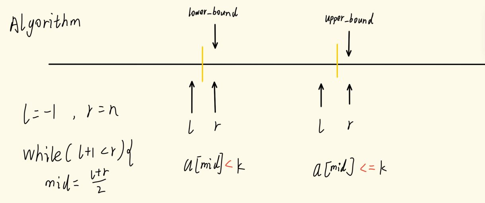

## 函数法
#### `upper_bound(begin,end,num)` `lower_bound(begin,end,num)`
* 引用头文件`algorithm`
* 必须是有序数组
* 从`begin`到`end-1`寻找目标值
* 返回值是目标值的地址
	* 可用`返回值-数组名`获得目标值下标
	* 可用`a[返回值]`获得目标值
	* 可用`*返回值`获得目标值
* `upper`找第一个==小于==`num`的数字
* `lower`找第一个==小于等于==`num`的数字
```c
#include<iostream>  
#include<algorithm>  
using namespace std;  
int a[10]={1,3,4,6,6,8};  
int main(){  
    cout<<*upper_bound(a,a+5,6)<<" ";  
    cout<<upper_bound(a,a+5,6)-a;  
    cout<<endl;  
    cout<<*lower_bound(a,a+5,6)<<" ";  
    cout<<lower_bound(a,a+5,6)-a;  
    return 0;  
}
```
运行结果
```
8 5
6 3
```

## 标准二分
```cpp
int main() {
    scanf("%d%d", &n, &m);
    for (int i = 0; i < n; i++) scanf("%d", &a[i]);
    while (m--) {
        int x; scanf("%d", &x);
        int l = 0, r = n - 1;
        while (l < r) {
            int mid = l + r >> 1;
            if (a[mid] >= x) r = mid;
            else l = mid + 1;
        }
        if (a[l] != x) cout << "-1 -1" << endl;
        else {
            printf("%d ", l);
            int l = 0, r = n - 1;
            while (l < r) {
                int mid = l + r + 1 >> 1;
                if (a[mid] <= x) l = mid;
                else r = mid - 1;
            }  
            printf("%d\n", l);
        }
    }
    return 0;
}

```
重点是`mid=(l+r+1)/2`
## 懒二分
下边界
```c
int main(){  
    int a[10]={1,3,4,6,6,8};  
    int l=-1,r=5;  
    int k=6;  
    while(l+1<r){  
        int mid=(l+r)/2;  
        if(a[mid]<k) l=mid;  
        else r=mid;  
    }  
    cout<<l<<" "<<a[l];        //2 4  
    cout<<endl;  
    cout<<r<<" "<<a[r];        //3 6  
    return 0;  
}
```
上边界
```c
int main(){  
    int a[10]={1,3,4,6,6,8};  
    int l=-1,r=5;  
    int k=6;  
    while(l+1<r){  
        int mid=(l+r)/2;  
        if(a[mid]<=k) l=mid;  
        else r=mid;  
    }  
    cout<<l<<" "<<a[l];        //4 6  
    cout<<endl;  
    cout<<r<<" "<<a[r];        //5 8  
    return 0;  
}
```

## `map`
### 说明
1. `map`是采用红黑树实现的关联容器，提供一对一的数据关系，key-value对应，且内部自动按照key排序
2. 插入、查看、删除时间复杂度O（logn）
3. 依赖头文件`<map>`

### 语法
##### `map<type,type>name`；
第一个`type`为key的数据类型
第二个`type`为value的数据类型
name为变量名

### 用法
* begin()         返回指向map头部的迭代器
* end()           返回指向map末尾的迭代器
* empty()         如果map为空则返回true
* erase()         删除元素
*  find()          查找元素
*  insert()        插入元素
*  swap()           交换两个map
* size()          返回map中元素的个数

### 实例
```cpp
#include<iostream>  
#include<map>  
#include<map>  
using namespace std;  
map<string,int>Student;  
int main(){  
    Student["Bob"]=60;  
    Student["Alice"]=59;  
    Student["zs"]=999; 
    int nSize = Student.size();   //nSize=3 
    
    for(auto iter=Student.begin();iter!=Student.end();iter++)  //指针遍历
        cout<<iter->first<<" "<<iter->second<<endl;  

	auto iter=Student.find("Bob");  
	//map<string,int>::iterator iter=Student.find("Bob");   不用auto
    if(iter!=Student.end()) cout<<"find successfully";  //寻找成功则返回一个指向该元素的指针
    else cout<<"no";
    return 0;  
}
/*out:
Alice 59
Bob 60
zs 999
*/
```

## `prioriny_queue`
### 说明
1. 优先队列是一种基于堆排序的数据结构
2. 构造队列时间复杂度O(logn)
3. 包含于头文件`<queue>`
### 语法
##### `priority_queue<Type, Container, Functional>
`Type`为数据类型
`Container`为容器类型，默认以`vector`为容器，还可用是`deque`
`Functional`为比较方式，默认大顶堆(`top`)，可传入`greater`转为小顶。可用cmp自定义排序方式
##### 关于`cmp`
```cpp
struct cmp{  
    bool operator()(const Student &x,const Student &y){  
        return x.score < y.score;  
    }  
};

priority_queue<Student,vector<Student>,cmp> q;
```
### 使用
操作和队列基本相同
- top 访问队头元素
- empty 队列是否为空
- size 返回队列内元素个数
- push 插入元素到队尾 (并排序)
- emplace 原地构造一个元素并插入队列
- pop 弹出队头元素
### 实例
```cpp
#include<iostream>  
#include<queue>  
using namespace std;  
priority_queue<int,vector<int> > q;  
  
int main(){  
    q.push(1);  
    q.push(3);  
    q.push(2);  
    q.push(6);  
    cout<<q.top();  //输出6（最大元素）
    cout<<q.size();//输出4（元素个数）
    return 0;  
}
```

### 特殊情况
排序`pair<int , int >` 时优先按照第一个数排，**如果相同再按照第二个数排**

## 卡时
```cpp
#include<ctime>
#include<stdio.h>
#include<stdlib.h>
void dfs(){
if ((double)clock() / CLOCKS_PER_SEC >= 0.985) {
	printf("%d",ans);
	exit(0);
	}
}
```