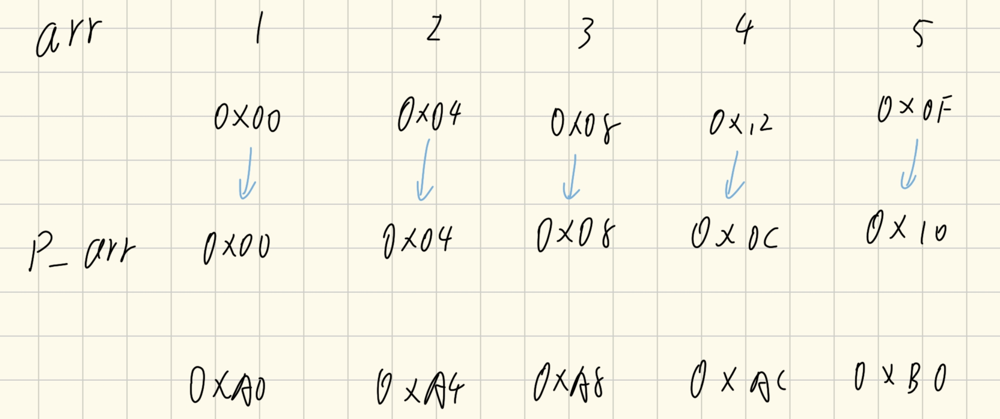

这两个声明虽然看起来很像，但它们的含义截然不同。核心区别在于 `*` 和 `[]` 的运算符优先级：数组下标 `[]` 的优先级高于指针 `*`。

因此，理解它们的关键是看哪个符号先与变量名 `p` 结合。

### 🧠 核心区别

*   **`int *p[5]`**
    *   **解读**：由于 `[]` 优先级更高，`p` 首先与 `[5]` 结合，表明 `p` 是一个**数组**。这个数组有5个元素，每个元素的类型是 `int *`（指向整型的指针）。
    *   **结论**：这是一个**指针数组** (Array of Pointers)。它的本质是**数组**，里面存放了5个指针。

*   **`int (*p)[5]`**
    *   **解读**：括号 `()` 强制改变了优先级，使得 `p` 首先与 `*` 结合，表明 `p` 是一个**指针**。这个指针指向什么呢？指向一个包含5个 `int` 类型元素的数组。
    *   **结论**：这是一个**数组指针** (Pointer to an Array)。它的本质是**指针**，它指向一个完整的数组。

---

### 🔍 详细解析

#### 指针数组 (`int *p[5]`)

这是一个包含5个 `int*` 类型元素的数组。你可以把它想象成一个可以存放5个地址的容器，每个地址都指向一个 `int` 类型的变量或数组。

*   **用途**：常用于管理多个字符串（如 `char *argv[]`）或构建不规则的二维数组（也称为“锯齿数组”），因为每一行都可以独立分配内存。

```c
int a = 1, b = 2, c = 3;
// p 是一个包含5个 int* 类型元素的数组
int *p[5]; 

p[0] = &a; // p的第一个元素指向a
p[1] = &b; // p的第二个元素指向b
p[2] = &c; // p的第三个元素指向c

// 通过指针数组访问值
printf("%d", *p[0]); // 输出: 1
```

#### 数组指针 (`int (*p)[5]`)

这是一个指针，它指向一个包含5个 `int` 的数组。当这个指针进行算术运算时（如 `p+1`），它会跳过整个数组的大小（即 `5 * sizeof(int)` 个字节）。

*   **用途**：最常见的用途是在函数中传递多维数组，因为它能保留数组的维度信息，避免退化。

```c
int arr[5] = {1, 2, 3, 4, 5};
// p 是一个指针，指向一个包含5个int的数组
// 注意这里需要取整个数组的地址 &arr
int (*p)[5] = &arr; 

// 通过数组指针访问值
printf("%d", (*p)[0]); // 输出: 1
printf("%d", *(*p + 1)); // 输出: 2
```

### 📊 总结对比

| 特性 | `int *p[5]` (指针数组) | `int (*p)[5]` (数组指针) |
| :--- | :--- | :--- |
| **本质** | 一个**数组** | 一个**指针** |
| **构成** | 包含5个 `int*` 类型的元素 | 指向一个含5个 `int` 的数组 |
| **占用空间** | `5 * sizeof(int*)` | `1 * sizeof(int(*)[5])` (通常等于一个指针的大小) |
| **典型应用** | 字符串数组、动态二维数组 | 作为函数参数传递多维数组 |


# arr和&arr

假设我们有 `int arr[5];`

| 表达式    | 值的含义 (地址)         | 表达式的类型                       | 步长 (`+1` 操作)                     |
| :----- | :---------------- | :--------------------------- | :------------------------------- |
| `arr`  | 指向 `arr[0]` (首元素) | `int*` (指向整型的指针)             | 跳过 1 个 `int` (通常是4字节)            |
| `&arr` | 指向整个数组 `arr`      | `int(*)[5]` (指向含5个int的数组的指针) | 跳过 1 个完整的数组 (通常是5*sizeof(int)字节) |


```cpp
#include "iostream"

int main() {

    int arr[5] = {1, 2, 3, 4, 5};

    int *p1 = arr;

    int (*p2)[5] = &arr;

    std::cout << "p1: " << p1 << " *p1: " << *p1 << std::endl;

    std::cout << "p2: " << p2 << " *p2: " << *p2 << std::endl;

    return 0;

}
```
的输出是否一致
这两行 `std::cout` 的输出结果在**地址数值上是一致的**，但在**类型和后续行为上完全不同**。

简单来说：
*   **`p1` 和 `p2` 打印出来的内存地址值是一样的**（都是数组首元素的地址）。
*   **`*p1` 和 `*p2` 的含义及输出截然不同**。

下面我为你详细拆解这段代码的运行逻辑。

### 🖥️ 输出结果分析

假设数组 `arr` 的起始地址是 `0x1000`。

| 输出语句 | 预期输出内容 | 解释 |
| :--- | :--- | :--- |
| `p1: ` | `0x1000` | `p1` 是 `int*`，存储的是首元素地址。 |
| `*p1: ` | `1` | `*p1` 解引用，取出地址里的值（即 `arr[0]`）。 |
| `p2: ` | `0x1000` | `p2` 是数组指针，存储的也是数组首地址。 |
| `*p2: ` | `0x1000` (或报错) | `*p2` 解引用得到的是**整个数组**。`cout` 无法直接打印“数组对象”，通常会将数组退化回首地址打印出来。 |

### 💡 深度解析：为什么会有这种区别？

#### 1. 关于地址 (`p1` vs `p2`)
虽然它们的类型不同，但它们在内存中都指向同一个起点。
*   `p1` 的类型是 `int*`（指向整型）。
*   `p2` 的类型是 `int(*)[5]`（指向包含5个整型的数组）。
*   **结论**：对于计算机来说，数组的起始位置就是第一个元素的起始位置，所以 `p1` 和 `p2` 打印出的十六进制数值是完全一样的。

#### 2. 关于解引用 (`*p1` vs `*p2`)
这是最容易混淆的地方，也是它们本质不同的体现：

*   **`*p1` (解引用普通指针)**
    *   `p1` 指向一个 `int`。
    *   `*p1` 取出这个 `int` 的值。
    *   **结果**：整数 `1`。

*   **`*p2` (解引用数组指针)**
    *   `p2` 指向一个数组 `int[5]`。
    *   `*p2` 取出这个数组本身（即取出了 `{1, 2, 3, 4, 5}` 这个整体）。
    *   **关键点**：当你在 `cout` 中使用 `*p2` 时，你实际上是在试图打印一个“数组”。在 C++ 中，数组名（或数组对象）一旦出现在表达式中，就会自动退化为指向其首元素的指针。
    *   **结果**：`*p2` 退化成了 `int*`，指向首元素，所以 `cout` 再次打印出了地址 `0x1000`。

### 🚀 进阶验证：如何正确访问 `*p2` 的元素？

既然 `*p2` 代表的是整个数组，如果你想通过 `p2` 访问数组中的具体数值（比如数字 1），你需要先解引用得到数组，再用下标访问：

```cpp
// 错误理解：*p2 直接输出 1 (这是 p1 的做法)
// 正确做法：(*p2)[i]

std::cout << (*p2)[0]; // 输出 1
std::cout << (*p2)[1]; // 输出 2
```

**总结：**
这两行代码打印的**地址部分完全一致**，但第一行输出了具体的**数值 1**，而第二行输出的仍然是**地址**（因为解引用得到的是数组，数组又被转换回了地址）。


```cpp
#include "iostream"

int main() {

    int arr[5] = {1, 2, 3, 4, 5};   //数组

    int *p_arr[5] = {&arr[0], &arr[1], &arr[2], &arr[3], &arr[4]};  //指针数组

  

    std::cout << &p_arr[0] <<std::endl;          //输出指针数组第一个元素的地址

    std::cout << p_arr[0] <<std::endl;          //输出指针数组第一个元素，即数组的首元素的地址

    std::cout << *p_arr[0] <<std::endl;          //输出指针数组第一个元素指向的值

  

    // std::cout << **p_arr <<"  "<<**(&p_arr[0])<<std::endl;

    std::cout << "--------------------------------------"<<std::endl;

  

    int *p1 = arr;     //指针，指向 数组 的首元素

    int (*p2)[5] = &arr;    //数组指针，指向 数组 的首地址  

    // std::cout << p1 <<"  " << *p1<<std::endl; //首地址   解首地址

    //std::cout << p2 <<"  " <<" "<<*p2<<" "<<**p2<<std::endl; //首地址 首地址 值

    std::cout << &arr[5] << " " << p2 + 1 << " " << p1 + 5 <<std::endl; //数组指针+1 直接跳到数组末尾，指针+1 跳下一个格子

  

    std::cout << "--------------------------------------"<<std::endl;

    std::cout << p_arr+1<<" "<<&p_arr[1]<<std::endl;

  

    return 0;

}
```

