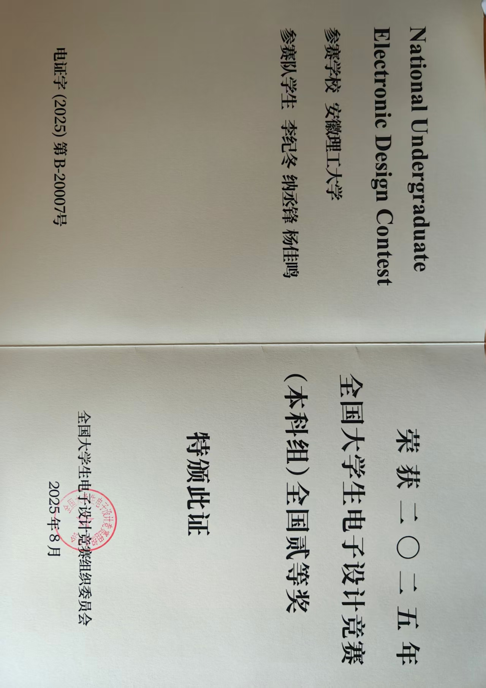
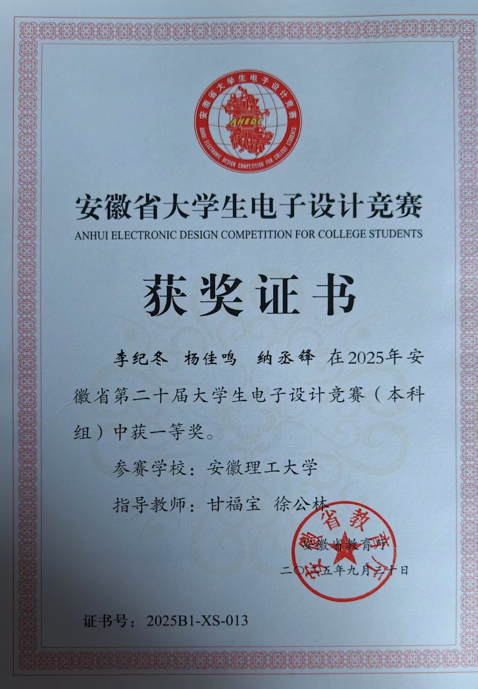
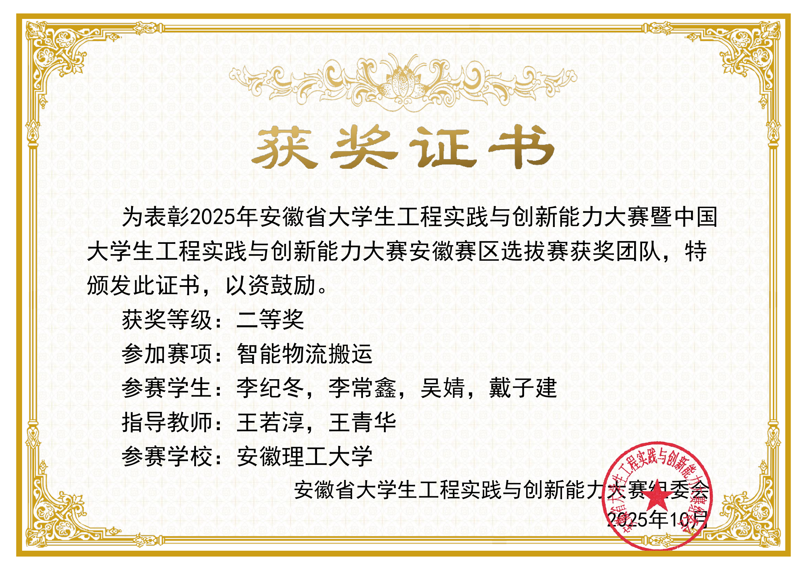
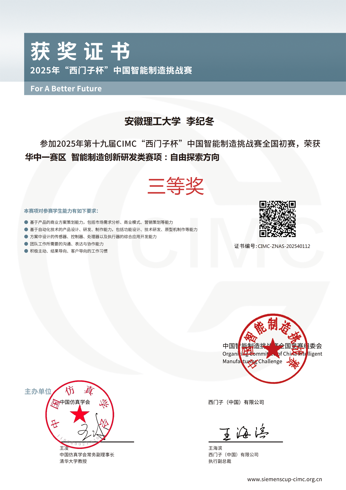
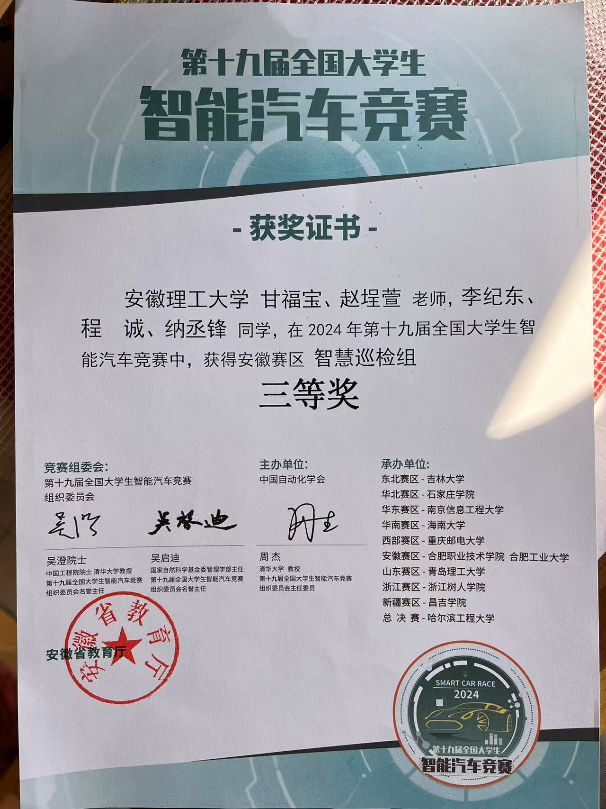
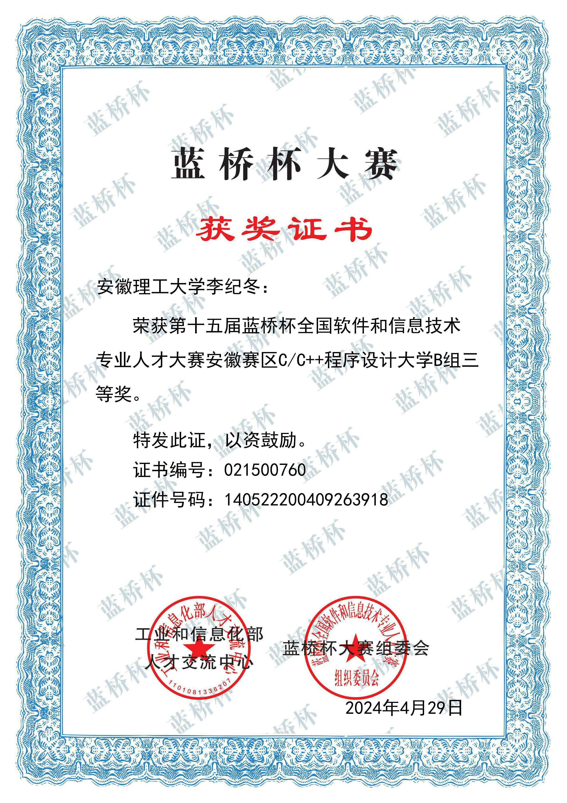
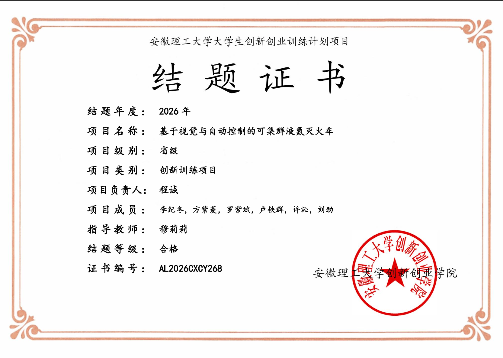

## “第二十四届全国大学生机器人大赛RoboMaster2025机甲大师高校联盟赛（山东站）” 3V3对抗赛二等奖 哨兵负责人

## “第二十五届全国大学生机器人大赛RoboMaster2025机甲大师高校联盟赛（安徽站）” 3V3对抗赛三等奖 

## 第十七届全国大学生电子设计竞赛全国二等奖

## 安徽省大学生工程实践与创新能力大赛物流搬运赛道省级二等奖

## 第十五十九届CIMC“西门子杯”中国智能制造挑战赛智能制造创新研发类赛项华中赛区三等奖

## 第十五十九届全国大学生智能汽车竞赛安徽赛区智能巡检组三等奖

## 第十五届蓝桥杯全国软件和信息技术专业人才大赛安徽赛区C/C++程序设计大学B组三等奖

## 省级大创--基于视觉与自动控制的可集群液氮灭火车 
