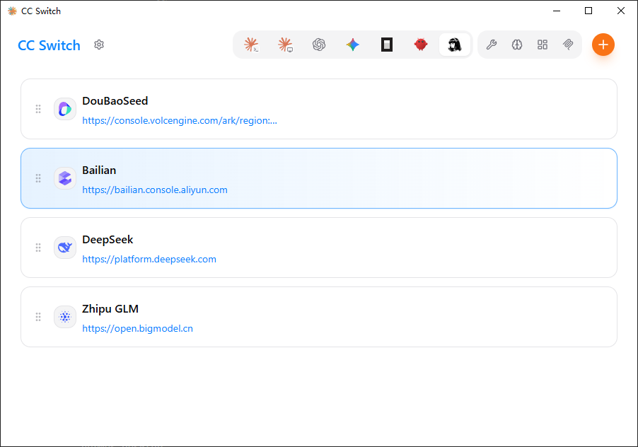
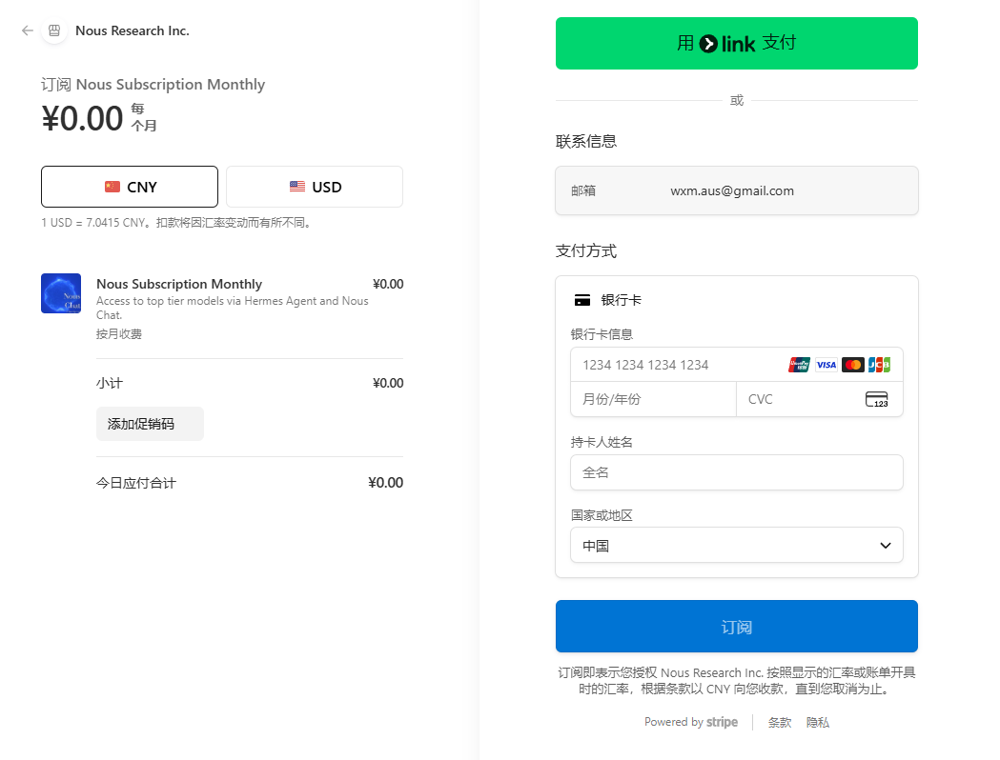
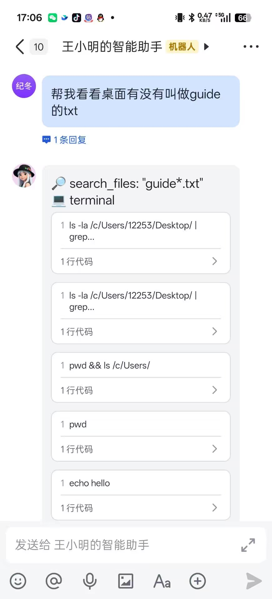
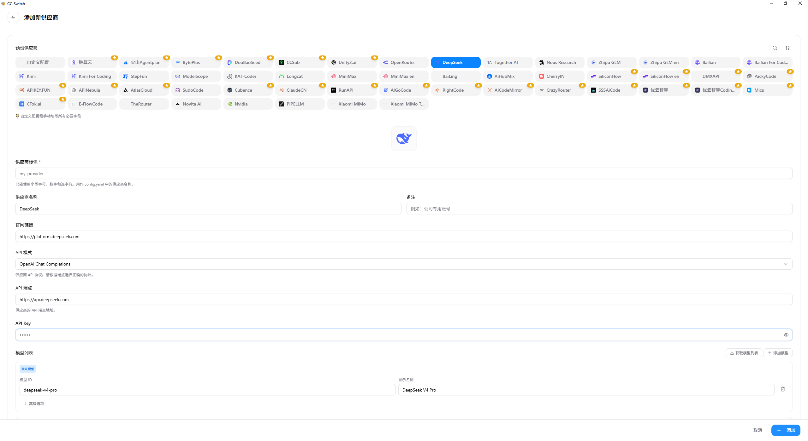

## CC Switch
[GitHub链接](https://dashscope.aliyuncs.com/compatible-mode/v1)
Windows在Release中需要点击`Show more`否则可能找很久QAQ

先点击最上面的Hermes，点击加号配置常用服务商，再选导入配置

右上角的功能可以查看画像和记忆（Hermes特色）
还有打开WebUI控制（但是下面会讲desktop界面）
## Hermes
### Windows下载
打开PowerShell（不能是cmd）
```
irm https://res1.hermesagent.org.cn/install.ps1 | iex
```
可以先打开代理，下载更迅速

### Linux下载
```
irm https://res1.hermesagent.org.cn/install.ps1 | iex
```
### 配置
运行
```
hermes setup tools
```
进入配置引导
我在此处只配置了图片识别
```
https://dashscope.aliyuncs.com/compatible-mode/v1
sk-xxxx
```
其他配置很多需要国外支付方式，遂放弃

运行如下命令打开图形化界面，在图形化界面能配置很多内容，以及更方便使用
```
hermes desktop
```
---
配置额外组件
```
cd ~\hermes\hermes-agent
uv pip install -e ".[all]"
```
### 接入飞书
```
cd ~\hermes\hermes-agent
uv venv
uv pip install lark-oapi
pip install qrcode
hermes gateway setup
::选择飞书
::扫码
```
运行效果如图



## DS
在[开放平台](https://platform.deepseek.com/usage)购买API，购买完==记得复制保存==
然后运行`hermes desktop`或者ccswitch填入
```
https://api.deepseek.com/v1
sk-xxxx
```
在cc switch右上角点击加号

导入配置后即可在命令行运行Hermes
