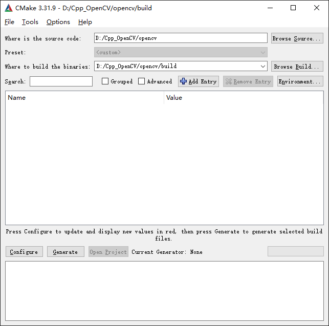
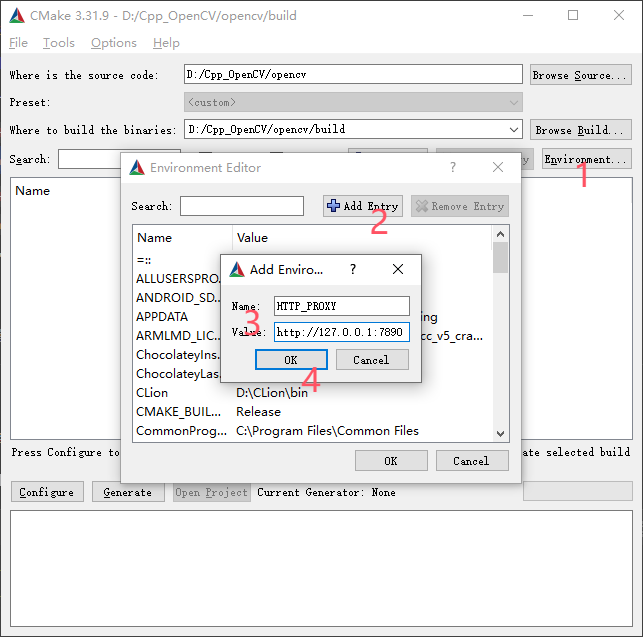
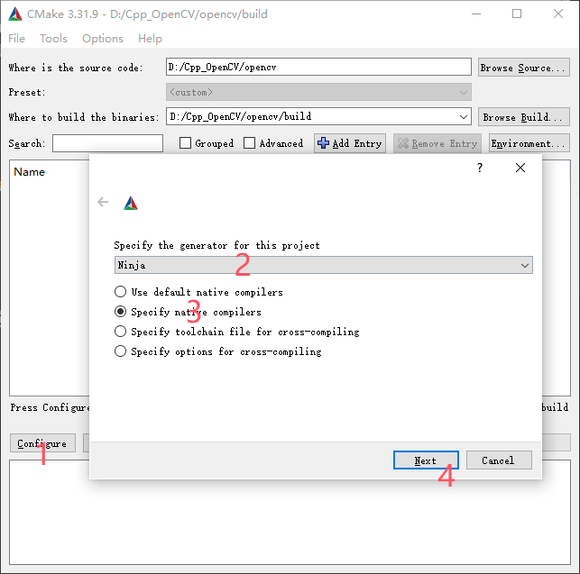
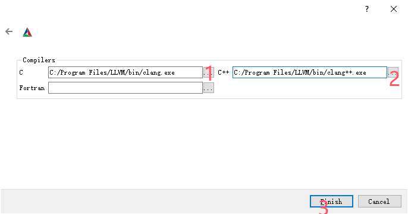

:::tip
此方案完全避开MVCS工具链
使用clang+cmake+MinGW编译OpenCV
:::
## 获取源码
在你期望存放源码的位置执行
```bash
git clone https://github.com/opencv/opencv.git
```

## 编译源码
去[下载](https://cmake.org/download/)CMake,然后按`win+s`搜索`cmake-gui`打开cmake图形化界面
另外需要[下载](https://www.mingw-w64.org/downloads/)MinGW
### 添加路径
如图添加源码路径，并且新建build文件夹，添加build路径

### 设置代理

需要设置
- **Name**: `HTTP_PROXY`  
    **Value**: `http://127.0.0.1:10809` 
- **Name**: `HTTPS_PROXY`  
    **Value**: `http://127.0.0.1:10809` 
    
或者也可以使用cmd窗口直接打开
```
set HTTP_PROXY=http://127.0.0.1:10809 
set HTTPS_PROXY=http://127.0.0.1:10809 
cmake-gui
```
### 选择构建工具

然后选择你的clang路径（可以在cmd中运行`where clang`来获取)

### 选择编译项目
~~此步忘记截图了~~总之就是选上你需要的，比如CUDA，ONNX，FFMpeg等，最后把cmake-gui下面的日志交给AI分析。
此处建议勾选`BUILD_opencv_world`方便下面检测和后续使用。只需复制一个 DLL 文件即可满足运行时依赖，无需管理数十个独立模块的 DLL。
### 添加环境变量
win+s搜索`环境变量`-环境变量-Path-编辑-新建-填写opencv的bin路径，比如我的就是`D:\Cpp_OpenCV\opencv\build\bin`。最后可以在cmd运行如下命令来检测。
```
where opencv_world480.dll
```
## 编写测试代码
```cpp
#include <opencv2/opencv.hpp>
#include <iostream>

int main() {
    // 1. 打印 OpenCV 版本信息
    std::cout << "OpenCV version: " << CV_VERSION << std::endl;

    // 2. 创建一个简单的图像（黑色背景）
    cv::Mat img(480, 640, CV_8UC3, cv::Scalar(0, 0, 0));

    // 3. 在图像上绘制一个红色矩形
    cv::rectangle(img, cv::Point(100, 100), cv::Point(500, 300), cv::Scalar(0, 0, 255), 3);

    // 4. 显示图像
    cv::imshow("Test Window", img);
    std::cout << "Press any key to close the window..." << std::endl;
    cv::waitKey(0); 

    return 0;
}
```
如果增加了模块，可以让AI帮忙修改代码，这里只测了最基础的功能。
```cmake
cmake_minimum_required(VERSION 3.10)
project(TestOpenCV)

set(CMAKE_CXX_STANDARD 17)

# 1. 自动查找 OpenCV
# 如果找不到，请取消下面注释并修改为你的 build 目录路径
# set(OpenCV_DIR "D:/Cpp_OpenCV/opencv/build")
find_package(OpenCV REQUIRED)

# 2. 包含头文件目录 
include_directories(${OpenCV_INCLUDE_DIRS})

# 3. 添加可执行文件
add_executable(test_opencv test_opencv.cpp)

# 4. 链接库 (自动处理 world 或其他分块库)
target_link_libraries(test_opencv ${OpenCV_LIBS})
```
最后在终端执行
```
mkdir build && cd build
cmake .. -G "MinGW Makefiles"
mingw32-make
./test_opencv.exe
```
