<center><h1>STM32</h1></center>

# 认识STM32

ST：意法半导体

M：微电子

32：总线宽度

STM32是意法半导体公司开发的32位的微控制器（MCU，单片机）

单片机是一种集成电路芯片，是采用超大规模集成电路技术把具有数据处理能力的中央处理器CPU、随机存储器RAM、只读存储器ROM、多种I/O口和中断系统、定时器/计数器等功能（可能还包括显示驱动电路、脉宽调制电路、模拟多路转换器、A/D转换器等电路）集成到一块硅片上构成的一个小而完善的**微型计算机系统**，在工业控制领域广泛应用。从上世纪80年代，由当时的4位、8位单片机，发展到现在的400M的高速单片机。

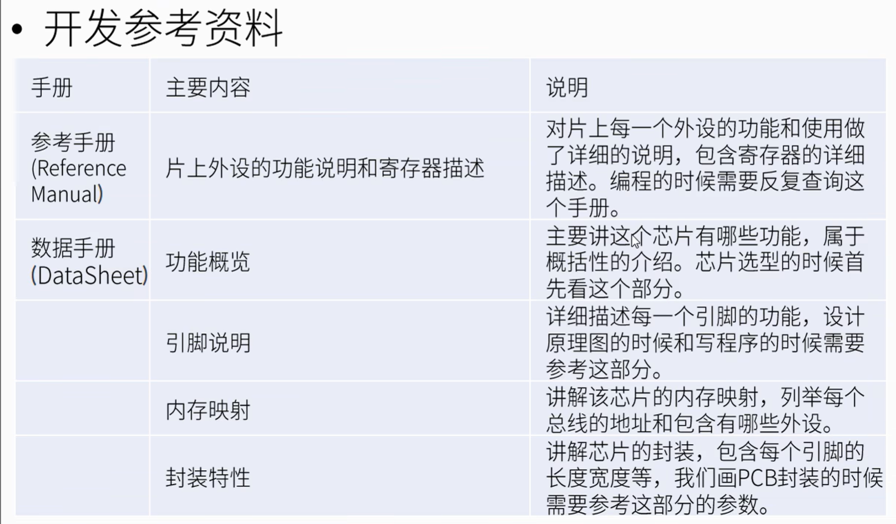

# 认识寄存器

## 什么是寄存器

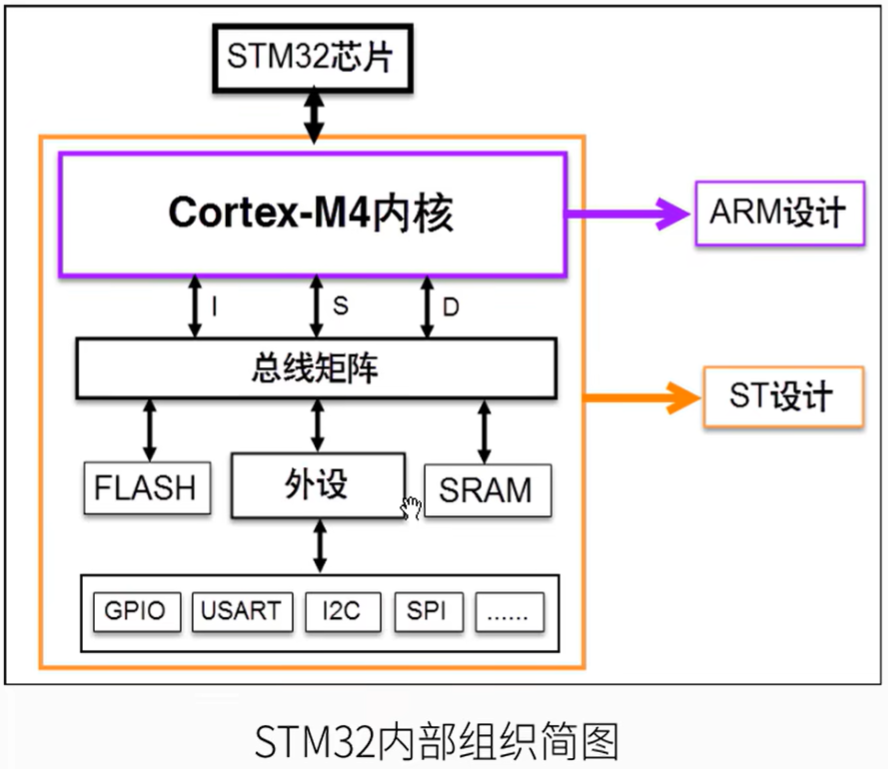

寄存器就是不同外设的地址，根据《参考手册》可以找到外设的起始地址。

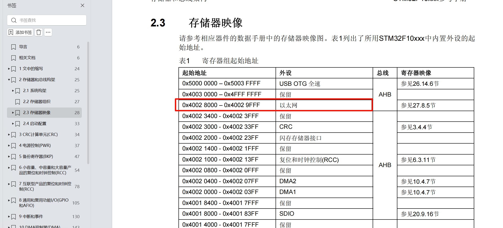

## 如何使用寄存器编程

（根据参考手册的表格找到向相应寄存器的地址）

`volatile` 关键字是为了防止编译器对程序进行优化：

```c
int main(void){
    volatile unsigned int * pointer = (unsigned int *) 0x40028000;
    *pointer = 1;
}
```

使用==宏定义==定义寄存器地址来优化程序：

```c
#define pointer (volatile unsigned int *) 0x40028000
int main(void){
    *pointer = 1;
}
```

# GPIO通用输入输出

## GPIO是什么

GPIO是通用输入输出端口的简称，简单来说就是STM32可控制的引脚，STM32芯片的GPIO引脚与外部设备连接起来，从而实现与外部通讯控制以及数据采集的功能。简单来说我们可以控制GPIO引脚的电平变化，达到我们的各种目的。

## GPIO的内部结构

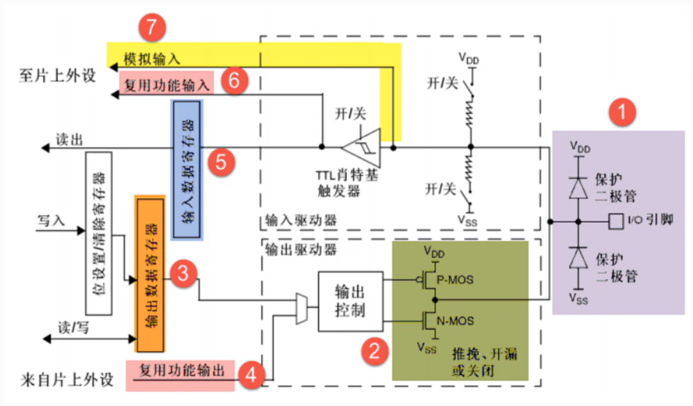

## GPIO的两种输出结构

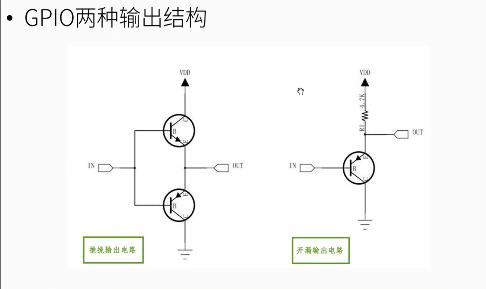

## 寄存器编程

### 了解总线

通过总线的形式，可以很好的将各种外设分离开，可以将各种外设独立开来控制它的**使能与否**。控制外设使能与否就是控制这个外设的**时钟**。

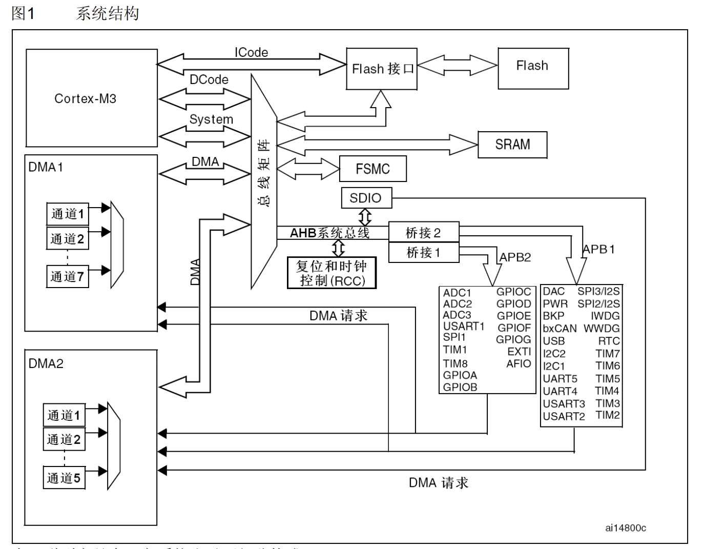

### 使用参考手册找到外设相应的总线

我的开发板的LED指示灯原理图如下，D0、D1、D2三个LED指示灯，D2常亮，D0和D1 分别由PB5和PE5两个引脚控制，即外设：GPIOB和GPIOE。

由原理图可知，我们只需要将对应引脚设置为**低电平**即可将对应的LED灯点亮。

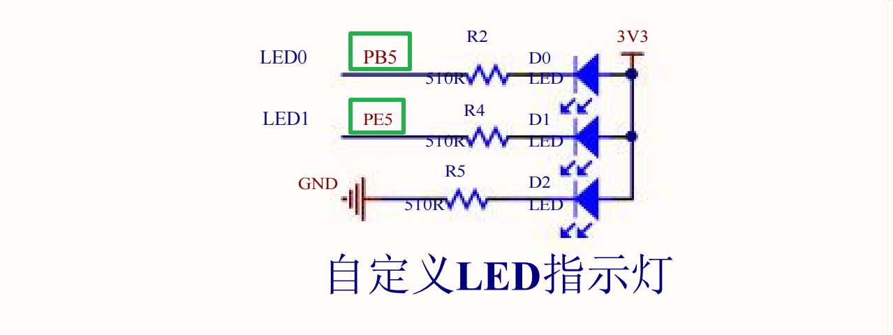

**方法一：**由总线架构图中找到GPIO外设的总线，为 ==APB2==。（如下图，参考手册P25）

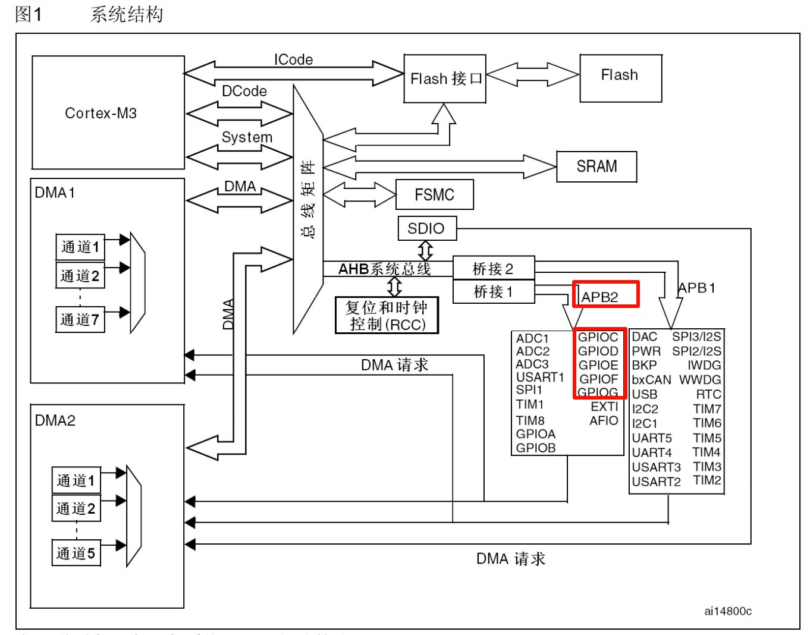

**方法二：**在“表1 寄存器组起始地址”中查找，同样为==APB2==。（见参考手册P28）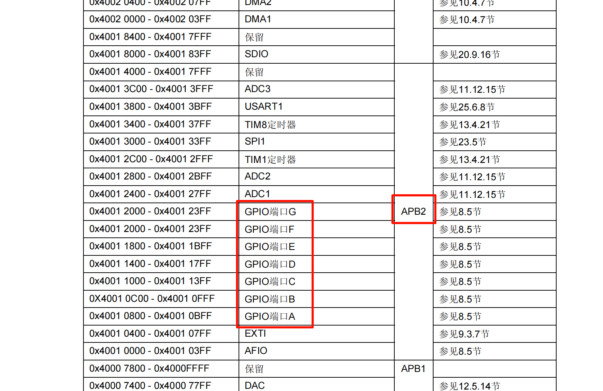

### 软件开发步骤

1. 使能GPIOB/GPIOE的外设时钟。
   
   > 外设基地址：0x4002 1000（下图1）
   > 偏移：0x18（下图2）
   > APB2外设时钟使能寄存器：PB为位3，PE为为位6

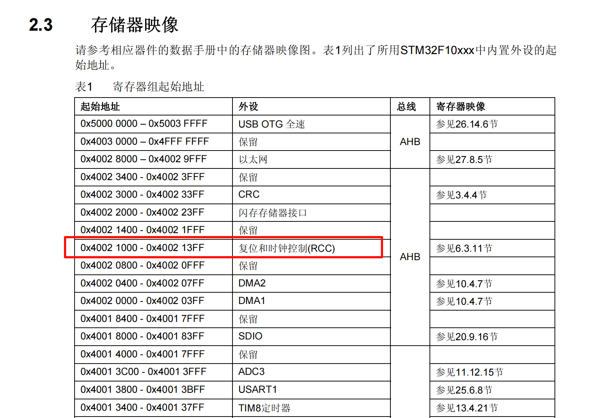

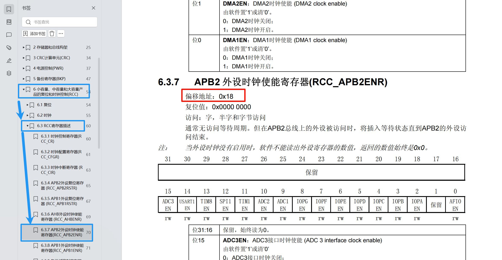

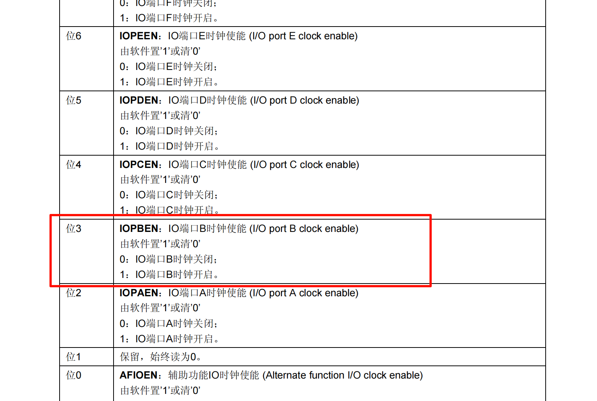


2. 通过查阅参考手册的GPIO章节，选择配置为**推挽输出模式**。通过**端口位配置表（表17）**展示的寄存器来进行配置。


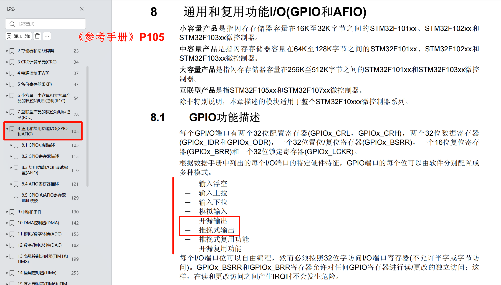

由于*开漏输出*模式输出高电平比较复杂，因此选用**推挽输出模式**。

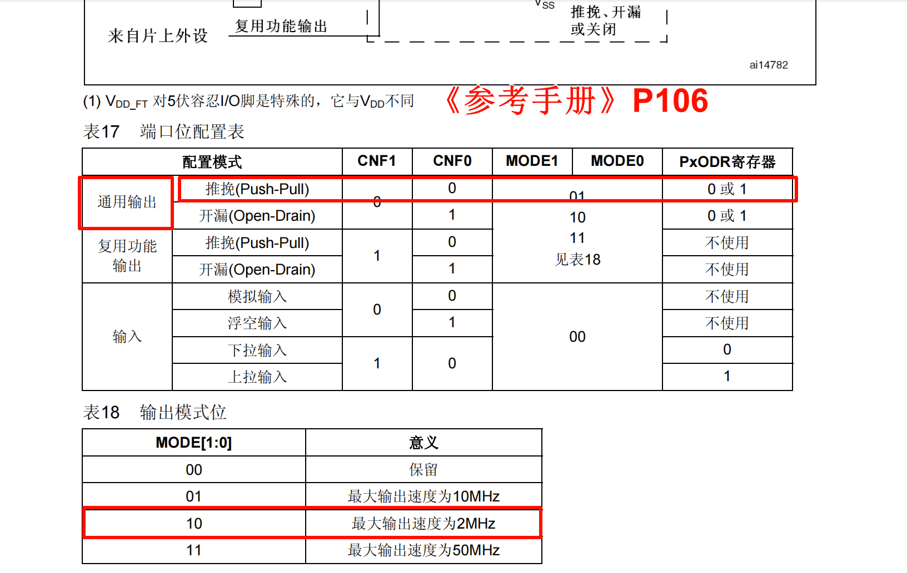

由表18，输出速度（电平翻转速度）越快功耗越高，因此仅点亮一个LED灯只需使用最低速度。

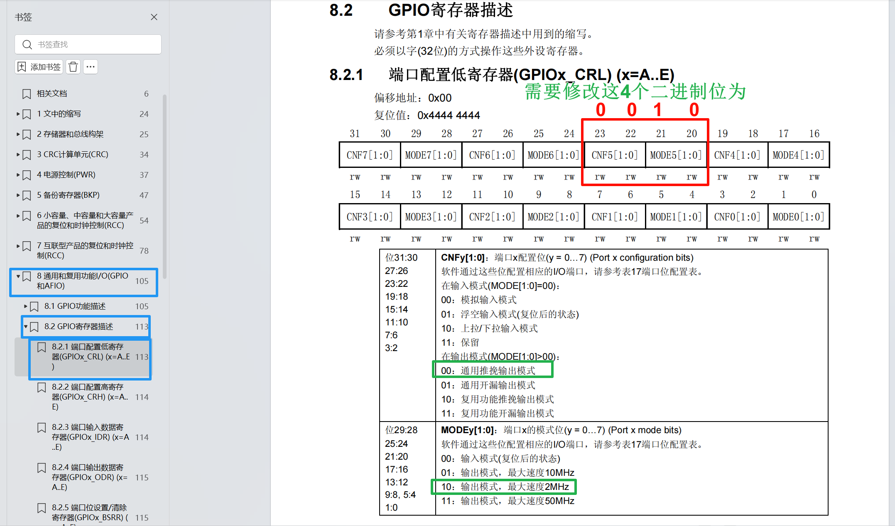

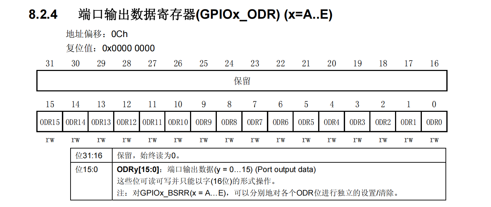

由上述数据可得出：

> GPIOB外设基地址：0x4001 0C00
> 
> GPIOE外设基地址：0x4001 1800
> 
> 端口配置低寄存器（CRL）偏移：0x00
> 
> 端口输出数据寄存器（ODR）偏移：0x0C


### 代码示例

```c
///使用寄存器编程,分别对 PB5 和 PE5 施加高低电平来控制 D0 和 D1 这两个LED灯。

#define GPIOB_CLK (*(volatile unsigned int *)(0x40021000 + 0x18))
#define GPIOB_CRL (*(volatile unsigned int *)(0x40010C00 + 0x00))
#define GPIOB_ODR (*(volatile unsigned int *)(0x40010C00 + 0x0C))

#define GPIOE_CLK (*(volatile unsigned int *)(0x40021000 + 0x18))
#define GPIOE_CRL (*(volatile unsigned int *)(0x40011800 + 0x00))
#define GPIOE_ODR (*(volatile unsigned int *)(0x40011800 + 0x0C))

int main(void){
	//点亮D0：PB5引脚
	//1、使能GPIOB外设时钟,位3
	GPIOB_CLK |= (1<<3);
	//2、GPIOB设置推挽输出模式
	GPIOB_CRL &= ~(0xf<<(4 * 5));		//清零
	GPIOB_CRL |= (2 << (4 * 5));
	
	GPIOB_ODR &= ~(0x1<<(1 * 5));		//清零
	//GPIOB_ODR |= (1<<5);				//高电平，不亮
	
	//点亮D1：PE5引脚
	//1、使能GPIOE外设时钟,位6
	GPIOE_CLK |= (1<<6);
	//2、GPIOE设置推挽输出模式
	GPIOE_CRL &= ~(0xf<<(4 * 5));		//清除低4位寄存器
	GPIOE_CRL |= (2 << (4 * 5));
	
	GPIOE_ODR &= ~(0x1<<(1 * 0));		//清除低1位寄存器
	//GPIOE_ODR |= (1<<5);				//高电平，不亮
}

```

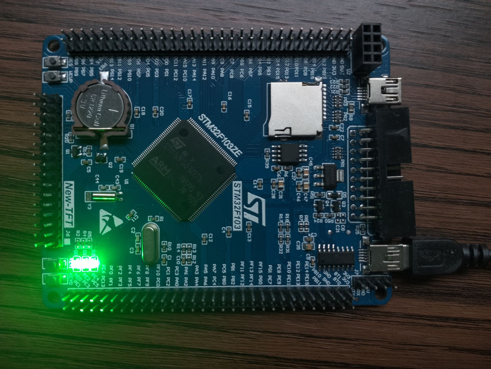


### 寄存器编程的缺点

>1.代码可读性差。
>
>2.二次开发难度大。
>
>3.每次写程序都要查手册，繁琐。


## 使用STM32CubeMX新建工程

实现两个LED灯交替闪烁，main函数中循环：

```c
  /* Infinite loop */
  /* USER CODE BEGIN WHILE */
  while (1)
  {
    /* USER CODE END WHILE */
		HAL_GPIO_WritePin(GPIOE, GPIO_PIN_5, GPIO_PIN_SET);			//关闭D1
		HAL_GPIO_WritePin(GPIOB, GPIO_PIN_5, GPIO_PIN_RESET);		//点亮D0
		HAL_Delay(500);		//延时500ms
		HAL_GPIO_WritePin(GPIOB, GPIO_PIN_5, GPIO_PIN_SET);			//关闭D0
		HAL_GPIO_WritePin(GPIOE, GPIO_PIN_5, GPIO_PIN_RESET);		//点亮D1
		HAL_Delay(500);		//延时500ms
    /* USER CODE BEGIN 3 */
  }
  /* USER CODE END 3 */
```

 

## 板级支持包

### 什么是板级支持包

**板级支持包(BSP)**(BoardSupport Package)是介于主板硬件和操作系统中驱动层程序之间的一层，一般认为它属于操作系统一部分，主要是实现对操作系统的支持，为上层的驱动程序提供访问硬件设备寄存器的函数包，使之能够更好的运行于硬件主板。

通俗的讲，就是对板上的资源功能给出实现，并且提供用户应用程序的接口。以LED灯为例，用户应用程序不需要知道GPIO的硬件特点，他只需要知道调用这个函数，就可以点亮LED灯。

### 板级支持包的构建

1. 创建板级支持包，包括.c和.h文件，放入User文件夹中。
2. 将板级支持包.c添加到工程中。（双击左侧项目树的Application/User/Core文件夹）
3. 将头文件引用上。（魔法棒，C/C++，include Path，选择User文件夹）

#### LED灯 板级支持包的示例

设计：

1. 初始化GPIO。
2. 实现基本功能：点亮，熄灭，翻转。

```c

/*-----LED的板级支持包-----*/

#include "./led/bsp_led.h"

void LED_GPIO_Init(void)
{
	//实例化一个结构体
	GPIO_InitTypeDef LED_GPIO_Structure;
	
	//使能GPIOB和GPIOE
	__HAL_RCC_GPIOB_CLK_ENABLE();
	__HAL_RCC_GPIOE_CLK_ENABLE();
	
	//初始化GPIOB的结构体
	LED_GPIO_Structure.Mode		= GPIO_MODE_OUTPUT_PP;			//设置推挽输出模式
	LED_GPIO_Structure.Pin		= GPIO_PIN_5;					//引脚为5
	LED_GPIO_Structure.Pull		= GPIO_NOPULL;					//非推非拉
	LED_GPIO_Structure.Speed	= GPIO_SPEED_FREQ_LOW;			//低速模式
	//初始化给GPIOB
	HAL_GPIO_Init(GPIOB, &LED_GPIO_Structure);					//初始化给GPIOB
	LED_D0_OFF;
	
	//初始化GPIOE的结构体
	LED_GPIO_Structure.Mode		= GPIO_MODE_OUTPUT_PP;			//设置推挽输出模式
	LED_GPIO_Structure.Pin		= GPIO_PIN_5;					//引脚为5
	LED_GPIO_Structure.Pull		= GPIO_NOPULL;					//非推非拉
	LED_GPIO_Structure.Speed	= GPIO_SPEED_FREQ_LOW;			//低速模式
	//初始化给GPIOE
	HAL_GPIO_Init(GPIOE, &LED_GPIO_Structure);					//初始化给GPIOE
	LED_D1_OFF;

}


```

```c
// 文件 bsp_led.h
/*-----LED的板级支持包-----*/

#ifndef __BSP_LED_H
#define __BSP_LED_H

#include "stm32f1xx.h"

//用宏定义实现两个LED灯的亮灭与翻转
#define LED_D0_ON 			do{HAL_GPIO_WritePin(GPIOB, GPIO_PIN_5, GPIO_PIN_SET);}while(0)			//点亮D0
#define LED_D0_OFF 			do{HAL_GPIO_WritePin(GPIOB, GPIO_PIN_5, GPIO_PIN_RESET);}while(0)		//熄灭D0
#define LED_D0_TOGGLE 		do{HAL_GPIO_TogglePin(GPIOB, GPIO_PIN_5);}while(0)						//翻转D0

#define LED_D1_ON 			do{HAL_GPIO_WritePin(GPIOE, GPIO_PIN_5, GPIO_PIN_SET);}while(0)			//点亮D1
#define LED_D1_OFF 			do{HAL_GPIO_WritePin(GPIOE, GPIO_PIN_5, GPIO_PIN_RESET);}while(0)		//熄灭D1
#define LED_D1_TOGGLE 		do{HAL_GPIO_TogglePin(GPIOE, GPIO_PIN_5);}while(0)						//翻转D1

//初始化两个LED灯对应的GPIO引脚
void LED_GPIO_Init(void);

#endif

```

```c
/* USER CODE BEGIN Header */
/**
  ******************************************************************************
  * @file           : main.c
  * @brief          : Main program body
  ******************************************************************************
  * @attention
  *
  * Copyright (c) 2024 STMicroelectronics.
  * All rights reserved.
  *
  * This software is licensed under terms that can be found in the LICENSE file
  * in the root directory of this software component.
  * If no LICENSE file comes with this software, it is provided AS-IS.
  *
  ******************************************************************************
  */
/* USER CODE END Header */
/* Includes ------------------------------------------------------------------*/
#include "main.h"
#include "gpio.h"

/* Private includes ----------------------------------------------------------*/
/* USER CODE BEGIN Includes */
#include "./led/bsp_led.h"						//包括板级支持包的头文件
/* USER CODE END Includes */

/* Private typedef -----------------------------------------------------------*/
/* USER CODE BEGIN PTD */

/* USER CODE END PTD */

/* Private define ------------------------------------------------------------*/
/* USER CODE BEGIN PD */

/* USER CODE END PD */

/* Private macro -------------------------------------------------------------*/
/* USER CODE BEGIN PM */

/* USER CODE END PM */

/* Private variables ---------------------------------------------------------*/

/* USER CODE BEGIN PV */

/* USER CODE END PV */

/* Private function prototypes -----------------------------------------------*/
void SystemClock_Config(void);
/* USER CODE BEGIN PFP */

/* USER CODE END PFP */

/* Private user code ---------------------------------------------------------*/
/* USER CODE BEGIN 0 */

/* USER CODE END 0 */

/**
  * @brief  The application entry point.
  * @retval int
  */
int main(void)
{
  /* USER CODE BEGIN 1 */

  /* USER CODE END 1 */

  /* MCU Configuration--------------------------------------------------------*/

  /* Reset of all peripherals, Initializes the Flash interface and the Systick. */
  HAL_Init();

  /* USER CODE BEGIN Init */

  /* USER CODE END Init */

  /* Configure the system clock */
  SystemClock_Config();

  /* USER CODE BEGIN SysInit */

  /* USER CODE END SysInit */

  /* Initialize all configured peripherals */
	
  /* USER CODE BEGIN 2 */
	LED_GPIO_Init();							//调用自己写的板级支持包的函数
	LED_D0_ON;
	LED_D1_OFF;
  /* USER CODE END 2 */

  /* Infinite loop */
  /* USER CODE BEGIN WHILE */
  while (1)
  {
    /* USER CODE END WHILE */
		LED_D0_TOGGLE;							//翻转D0
		LED_D1_TOGGLE;							//翻转D1
		HAL_Delay(500);							//延时500ms
    /* USER CODE BEGIN 3 */
  }
  /* USER CODE END 3 */
}
// 后面省略

```

#### KEY按键 板级支持包的示例

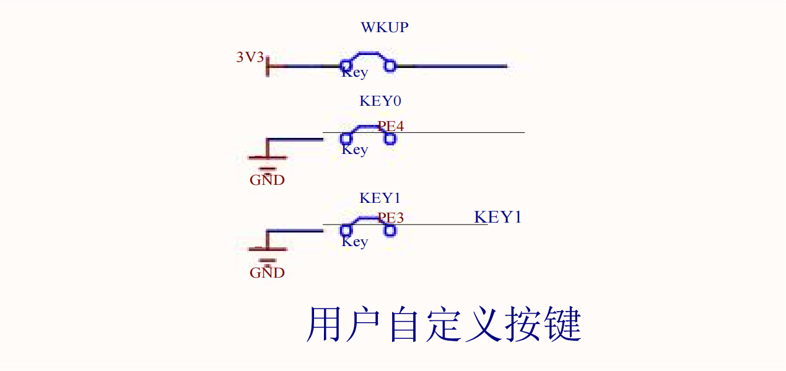

由此原理图可知， `WKUP` 按键应设置为==下拉输入==模式， `KEY0` 和 `KEY1` 应设置为==上拉输入==模式。

设计：

1. 初始化GPIO（配置为输入模式，读取GPIO引脚的电平）。
2. 读取按键是否被按下，两个状态：按下/未按下。

```c

/*-----KEY的板级支持包-----*/

#include "./key/bsp_key.h"

void KEY_GPIO_Init(void)
{
	//实例化一个结构体
	GPIO_InitTypeDef KEY_GPIO_Structure;
	
	//使能GPIO时钟
	KEY0_GPIO_CLK_ENABLE();
	KEY1_GPIO_CLK_ENABLE();
	
	//初始化KEY0_GPIO_PROT的结构体
	KEY_GPIO_Structure.Mode		= GPIO_MODE_INPUT;					//设置输入模式
	KEY_GPIO_Structure.Pin		= KEY0_PIN;							//引脚为4
	KEY_GPIO_Structure.Pull		= GPIO_PULLUP;						//上拉
	KEY_GPIO_Structure.Speed	= GPIO_SPEED_FREQ_LOW;				//低速模式
	//初始化给KEY0_GPIO_PROT
	HAL_GPIO_Init(KEY0_GPIO_PROT, &KEY_GPIO_Structure);	

	//初始化KEY1_GPIO_PROT的结构体
	KEY_GPIO_Structure.Mode		= GPIO_MODE_INPUT;					//设置输入模式
	KEY_GPIO_Structure.Pin		= KEY1_PIN;							//引脚为3
	KEY_GPIO_Structure.Pull		= GPIO_PULLUP;						//上拉
	KEY_GPIO_Structure.Speed	= GPIO_SPEED_FREQ_LOW;				//低速模式
	//初始化给KEY1_GPIO_PROT
	HAL_GPIO_Init(KEY1_GPIO_PROT, &KEY_GPIO_Structure);		
	
}

uint8_t KEY_Scan(GPIO_TypeDef *GPIOx, uint16_t GPIO_Pin)
{
	//判断按键是否被按下
	if(HAL_GPIO_ReadPin(GPIOx,GPIO_Pin) == GPIO_PIN_RESET)
	{
		//按键被按下
		while(HAL_GPIO_ReadPin(GPIOx,GPIO_Pin) == GPIO_PIN_RESET);
		return KEY_ON;
	}
	else
	{
		//按键未按下
		return KEY_OFF;
	}
}

```

```c
// 文件 bsp_key.h
/*-----LED的板级支持包-----*/

#ifndef __BSP_KEY_H
#define __BSP_KEY_H

#include "stm32f1xx.h"

#define KEY_ON 	1
#define KEY_OFF 0

#define KEY0_PIN 					GPIO_PIN_4
#define KEY0_GPIO_PROT 				GPIOE
#define KEY0_GPIO_CLK_ENABLE() 		__HAL_RCC_GPIOE_CLK_ENABLE()

#define KEY1_PIN 					GPIO_PIN_3
#define KEY1_GPIO_PROT 				GPIOE
#define KEY1_GPIO_CLK_ENABLE() 		__HAL_RCC_GPIOE_CLK_ENABLE()

//初始化两个按键对应的GPIO引脚
void KEY_GPIO_Init(void);

//判断按键的状态
uint8_t KEY_Scan(GPIO_TypeDef *GPIOx, uint16_t GPIO_Pin);

#endif

```

```c
/* USER CODE BEGIN Header */
/**
  ******************************************************************************
  * @file           : main.c
  * @brief          : Main program body
  ******************************************************************************
  * @attention
  *
  * Copyright (c) 2024 STMicroelectronics.
  * All rights reserved.
  *
  * This software is licensed under terms that can be found in the LICENSE file
  * in the root directory of this software component.
  * If no LICENSE file comes with this software, it is provided AS-IS.
  *
  ******************************************************************************
  */
/* USER CODE END Header */
/* Includes ------------------------------------------------------------------*/
#include "main.h"
#include "gpio.h"

/* Private includes ----------------------------------------------------------*/
/* USER CODE BEGIN Includes */
#include "./led/bsp_led.h"						//包括板级支持包的头文件
#include "./key/bsp_key.h"
/* USER CODE END Includes */

/* Private typedef -----------------------------------------------------------*/
/* USER CODE BEGIN PTD */

/* USER CODE END PTD */

/* Private define ------------------------------------------------------------*/
/* USER CODE BEGIN PD */

/* USER CODE END PD */

/* Private macro -------------------------------------------------------------*/
/* USER CODE BEGIN PM */

/* USER CODE END PM */

/* Private variables ---------------------------------------------------------*/

/* USER CODE BEGIN PV */

/* USER CODE END PV */

/* Private function prototypes -----------------------------------------------*/
void SystemClock_Config(void);
/* USER CODE BEGIN PFP */

/* USER CODE END PFP */

/* Private user code ---------------------------------------------------------*/
/* USER CODE BEGIN 0 */

/* USER CODE END 0 */

/**
  * @brief  The application entry point.
  * @retval int
  */
int main(void)
{
  /* USER CODE BEGIN 1 */

  /* USER CODE END 1 */

  /* MCU Configuration--------------------------------------------------------*/

  /* Reset of all peripherals, Initializes the Flash interface and the Systick. */
  HAL_Init();

  /* USER CODE BEGIN Init */

  /* USER CODE END Init */

  /* Configure the system clock */
  SystemClock_Config();

  /* USER CODE BEGIN SysInit */

  /* USER CODE END SysInit */

  /* Initialize all configured peripherals */
	
  /* USER CODE BEGIN 2 */
	LED_GPIO_Init();							//调用自己写的板级支持包的函数
	KEY_GPIO_Init();
  /* USER CODE END 2 */

  /* Infinite loop */
  /* USER CODE BEGIN WHILE */
  while (1)
  {
    /* USER CODE END WHILE */
		if(KEY_Scan(KEY0_GPIO_PROT,KEY0_PIN) == KEY_ON)
		{
			LED_D0_TOGGLE;
		}
		if(KEY_Scan(KEY1_GPIO_PROT,KEY1_PIN) == KEY_ON)
		{
			LED_D1_TOGGLE;
		}
    /* USER CODE BEGIN 3 */
  }
  /* USER CODE END 3 */
}
// 后面省略

```


# STM32程序的启动过程

## 程序启动流程

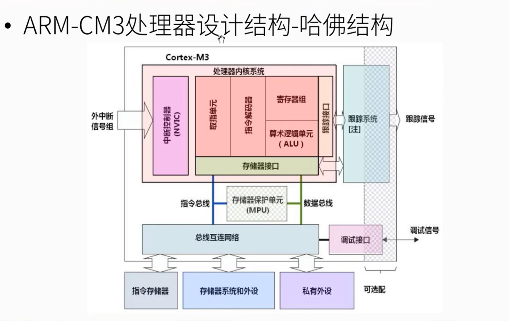

编译工具链（ToolChains）

芯片上电后会触发**中断异常**，并且会跳转到**中断向量表**的特定**偏移**位置，获取里面的内容执行。

>  触发异常 --> 中断向量表 --> 用户程序.

修改复位异常内的内容，就可以让处理器去执行我们指定的操作。


.s文件是**启动文件**

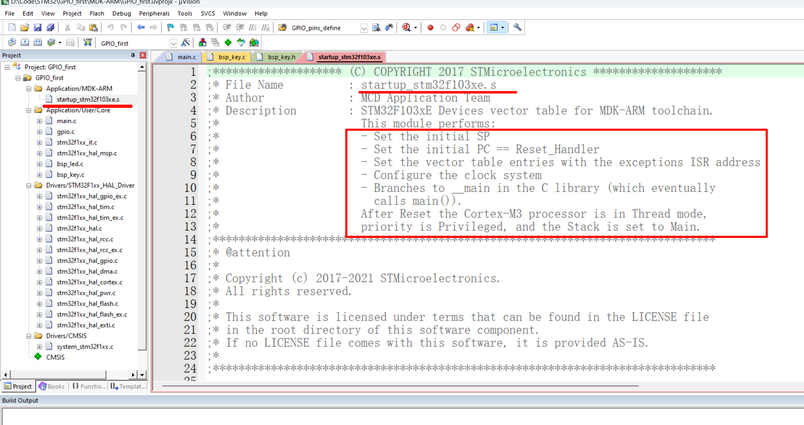

1. 初始化堆栈指针
2. 设置PC指针的值
3. 设置中断向量表
4. 配置系统时钟  
5. 调用C库函数__main初始化堆栈的工作，最终会跳转到我们自己编写的main


# STM32的复位和时钟控制（RCC）

## STM32 RCC知识

### STM32的复位功能（参见《参考手册》7.1章节）

- 系统复位：系统复位将复位除*时钟控制寄存器CSR中的复位标志*和*备份区域中的寄存器*以外的所有寄存器为它们的复位数值。

- 电源复位：电源复位将复位除了备份区域外的所有寄存器。

- 后备域复位：备份区域拥有两个专门的复位，它们只影响备份区域。

### STM32的时钟

**时钟是什么**

时钟可以简单理解为==“心跳”==。对于电子器件来说，时钟就是它的心跳。

STM32芯片，会根据程序给定它的时钟节拍来工作。常说的72Mhz、480Mhz，就是指STM32的主时钟（系统时钟）频率。STM32芯片就以这样的频率，在芯片内部做着各种器件的同步工作。

**STM32的时钟来源**

1. 三种不同的时钟源可被用来驱动系统时钟（SYSCLK）：
   - HSI振荡器时钟（高速内部时钟）
   - HSE振荡器时钟（高速外部时钟）
   - PLL时钟（锁相环倍频时钟）
2. 两种时钟源：
   - 40kHz低速内部RC（LSI RC）振荡器
   - 32.768kHz低速外部晶体（LSE晶体）


## 时钟相关代码

1、在RCC选项卡里选择晶振。

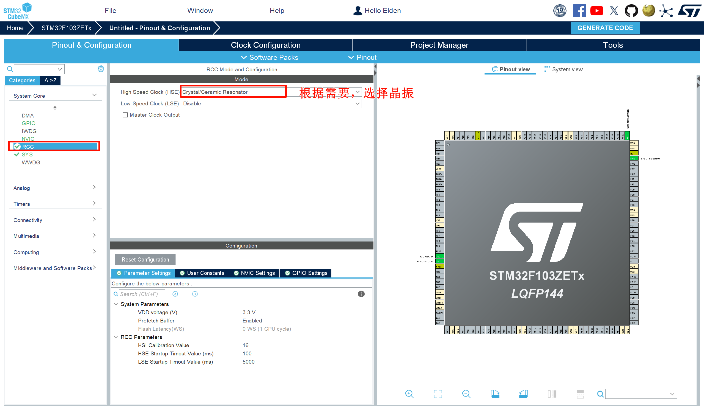

2、系统时钟有三种来源，选择倍频时钟。

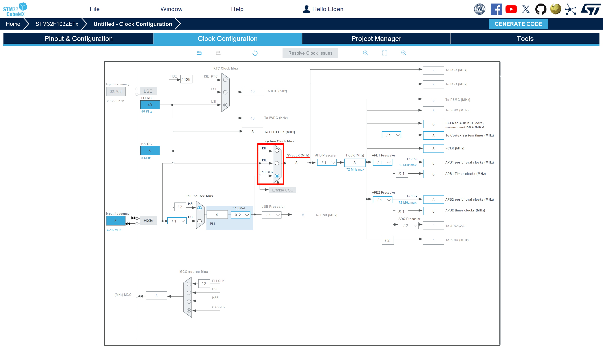

3、查阅《数据手册》5.3.1通用工作条件来配置时钟。

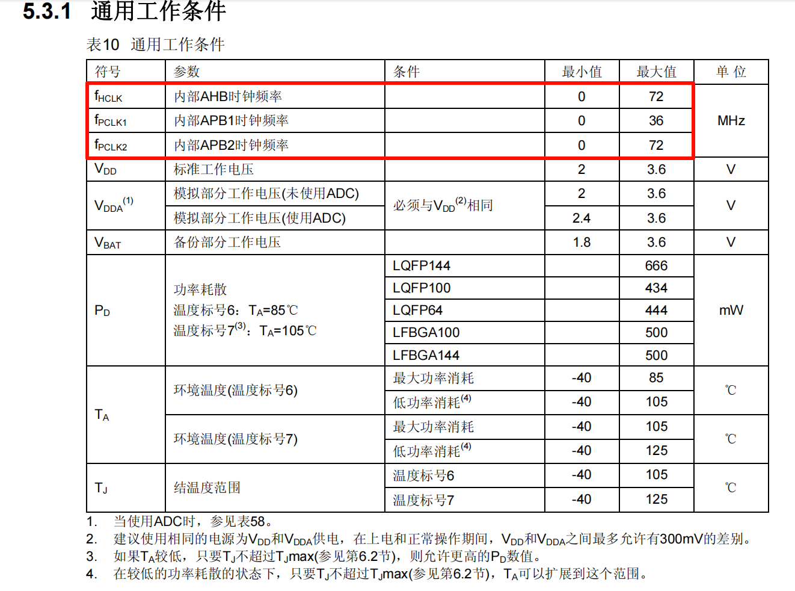

对STM32上的时钟，具体怎么配置，根据需求决定。

**时钟频率选取越高，功耗也会越高。另一方面也要考虑芯片的工作条件，根据芯片运行的工资条件选取时钟频率。**

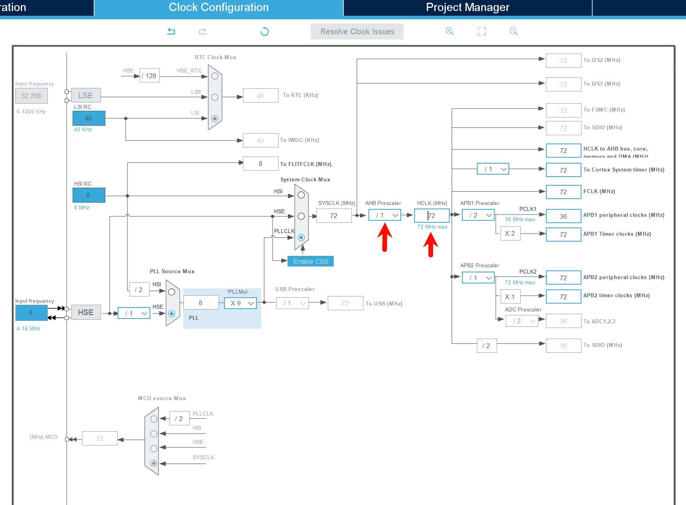

AHB Prescaler 分频因子 选择 `/1` “1分频”，HCLK选择 72Mhz，回车，CubeMX会自动计算并配置好相应的时钟频率。

4、生成代码后即可在main.c中找到系统时钟配置函数。

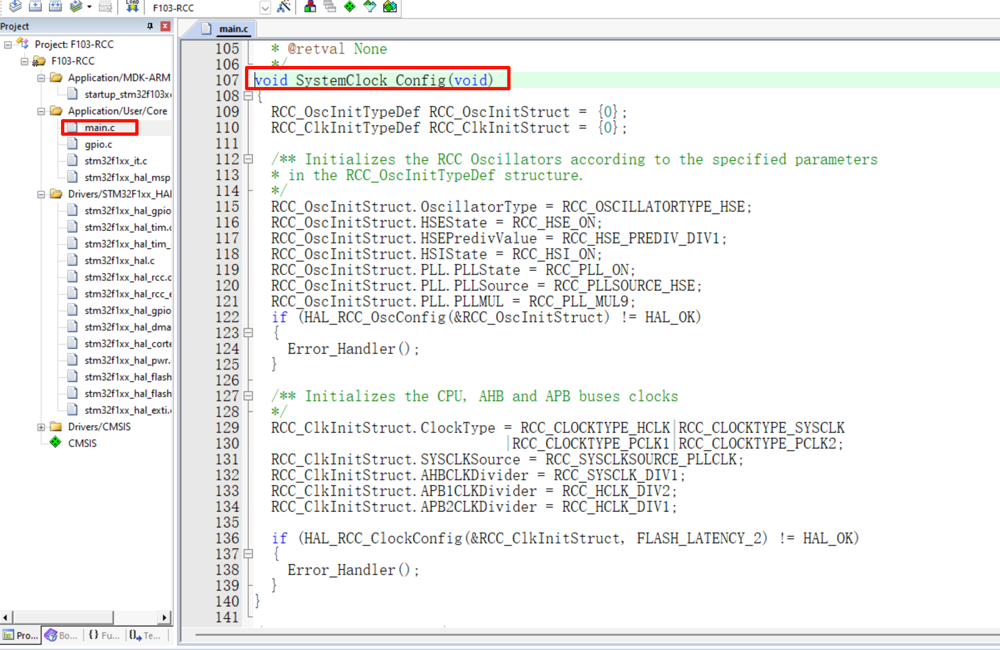


# STM32的异常和中断

## 异常和中断的概念

**中断**是指计算机运行过程中，出现某些意外情况需主机干预时，机器能自动停止正在运行的程序并转入处理新情况的程序，处理完毕后又返回原被暂停的程序继续运行。 

异常和中断的概念相近，异常可以说是内核活动产生（比如执行指令出错）。中断一般是指，由连接到内核的外部器件（外设）产生（比如**外设产生中断**，提示数据传输完成）。它们的触发或者说处理方式相同。使用中一般并不严格区分异常和中断。

如果没有特殊说明，后面所叙的异常，特指**系统异常**，中断特指**外中断**，也就是**外设中断**。

## 中断响应及中断优先级

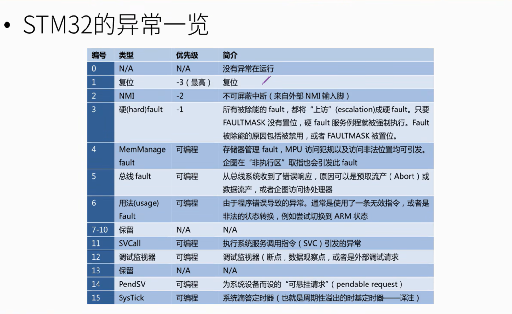

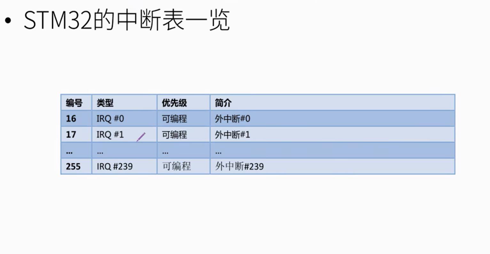


- 分为*可编程*和*不可编程*两种
- 决定着先响应谁的中断请求
- **小值优先原则**：优先记数字小就优先响应。
- 中断优先级按照优先级**分组配置**。


在F103中，STM32上只使用了M3内核支持的8bit优先级中的**高4位bit**，即STM32**只支持 $2^4$ 个优先级**。


### 中断的分组配置

在F103中，使用4个bit组织成五个优先级分组。每组分为1个抢占优先级组和1个子优先级组。（如下图）

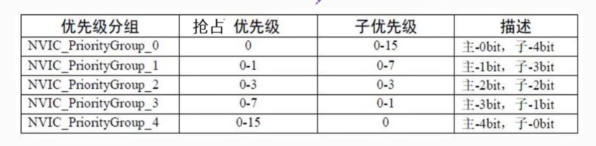

通过优先级分组可以管理**中断的响应顺序**，规则如下：

1. 只有抢占优先级有抢占中断权限，发生中断嵌套。数值小的抢占中断。
   （即：B中断正在执行，A（抢占优先级数值小）中断后发生，则A中断抢过B中断的使用权，响应A的中断服务函数，A中断执行完毕后再交会B）
2. 如果中断抢占优先级相同，不发生抢占行为，中断挂起。
3. 对于多个挂起的中断：（以下均为数值**小**的先响应）
   1. ==一看抢占优先级==
   2. ==二看子优先级==
   3. ==三看IQR编号==


### 嵌套向量中断控制器（NVIC）

可编程的优先级，通过**嵌套向量中断控制器（NVIC）**实现。

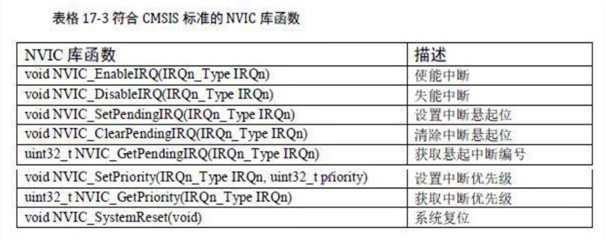

*设置中断悬起位* 函数一般不通过软件编程来实现，而是通过外设设置。

一般不单独使用 *设置中断优先级* 函数，因为它不能实现优先级的分组。


# EXTI扩展中断和事件控制器

## 介绍

EXTI外设功能：

- 捕获外部输入等事件
- 生成EXTI中断等中断请求

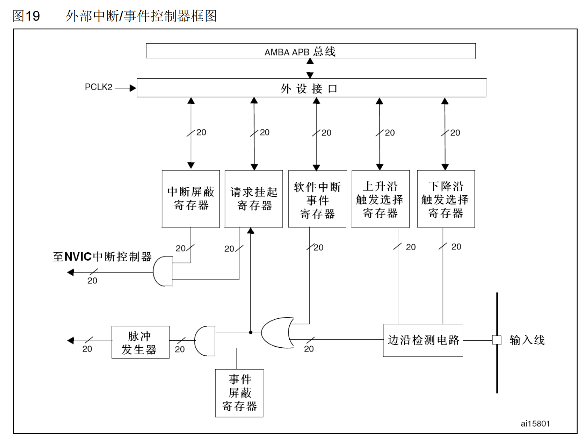


## 使用CubeMX来生成代码

1. 设置SYS选项卡中的 `Serial Wire` 。
2. 配置时钟，选择 `HSE` 和 `PLLCLK` 。
3. 设置EXTI外设。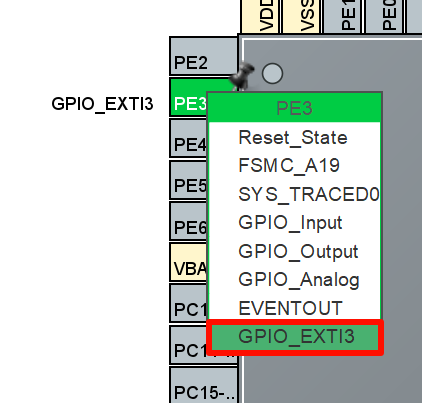
4. 配置GPIO选项卡。 选择检测下边沿的外部中断 `External Interrupt Mode with Falling edge trigger detection` 和上拉模式 `Pull_UP` 。
5. 配置NVIC选项卡。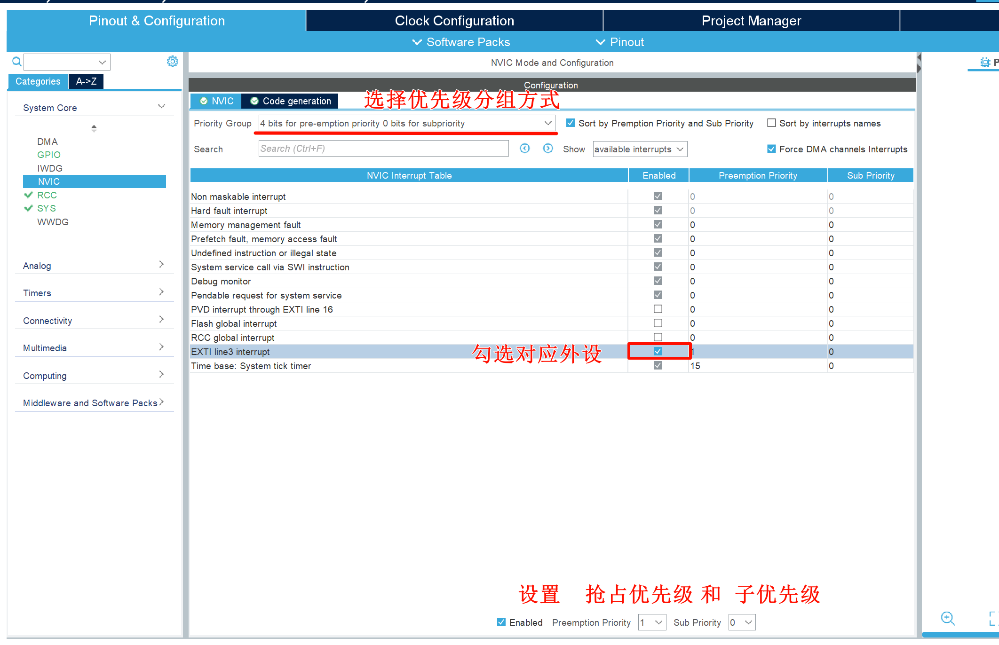
6. 生成代码。

### 主函数：

```c
/**
  * @brief  The application entry point.
  * @retval int
  */
int main(void)
{
  /* USER CODE BEGIN 1 */

  /* USER CODE END 1 */

  /* MCU Configuration--------------------------------------------------------*/

  /* Reset of all peripherals, Initializes the Flash interface and the Systick. */
  HAL_Init();

  /* USER CODE BEGIN Init */

  /* USER CODE END Init */

  /* Configure the system clock */
  SystemClock_Config();

  /* USER CODE BEGIN SysInit */

  /* USER CODE END SysInit */

  /* Initialize all configured peripherals */
  MX_GPIO_Init();
  /* USER CODE BEGIN 2 */
	LED_GPIO_Init();
  /* USER CODE END 2 */

  /* Infinite loop */
  /* USER CODE BEGIN WHILE */
  while (1)
  {
		LED_D0_TOGGLE;
		HAL_Delay(500);
    /* USER CODE END WHILE */
    /* USER CODE BEGIN 3 */
  }
  /* USER CODE END 3 */
}


/* USER CODE BEGIN 4 */
void HAL_GPIO_EXTI_Callback(uint16_t GPIO_Pin)			//中断回调函数
{
	if(GPIO_Pin == KEY1_PIN)

	{
		// LED1 取反		
		LED_D1_TOGGLE;  
	}  
}
/* USER CODE END 4 */
```


# 系统定时器（SysTick）

## 说明

- SysTick系统定时器是属于Cortex-M内核中的一个外设，内嵌在NVIC中。
- SysTick系统定时器含有一个计数宽度为24bit的向下递减的自动重装载计数器，计数器每计数一次的时间为1/CLKSource。一般我们设置CLKSource为系统时钟。以F103为例，CLKSource可以配置为72MHz。
- 当重装载数值寄存器的值递减到0的时候，SysTick系统定时器可以配置产生一次中断，以此循环往复。
- SysTick系统定时器是属于Cortex-M内核的外设，所以一般基于Cortex-M内核的单片机都具有这个系统定时器。这使得软件在Cortex-M单片机中可以很容易的移植。

### 解释：

   计数宽度：24 bit来存储数据，$2^{24} = 16,777,216$ .

   向下递减：计数器的工作模式

   计数器的工作周期：1/CLKSource，F103可配置为1/72Mhz.

   当 $2^{24}$ 递减到 0 时，系统经历了 $\frac{1}{72 \times 10^6} \times 2^{24}$ 秒的时间。（约0.233秒）


## 功能

- SysTick系统定时器可以用于操作系统，用于产生时基，维持操作系统的心跳。一般操作系统都需要一个时基，进行**任务的调度**、**同步**等功能实现。
- SysTick系统定时器最常用的功能还是计数。比如用来进行微妙、毫秒**延时**，以此产生特定**时序**。


## SysTick定时器寄存器介绍

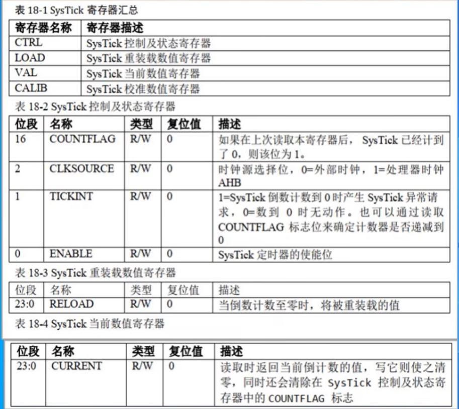


## 在CubeMX软件中的配置

**选择使用 SysTick 作为时钟源（时基）**

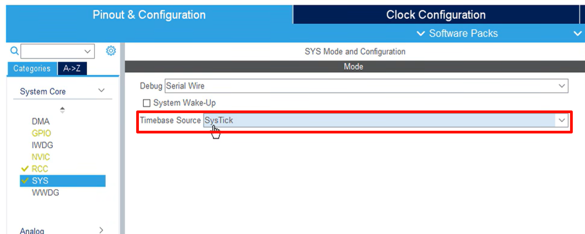


**配置定时器的频率（只有两个分频因子可选）**

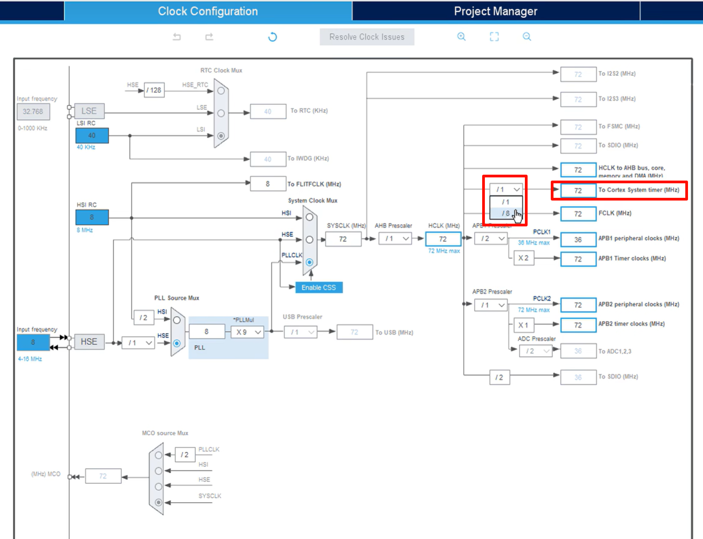


之前使用过的 `HAL_Delay(ms)`  函数就是基于这个定时器实现的。

==在中断中强烈不推荐使用延时函数==，因为如果SysTick的中断优先级没有配置正确的话，就会导致死循环。


## 代码示例

### 主函数：

```c
int main(void)
{
  /* USER CODE BEGIN 1 */

  /* USER CODE END 1 */

  /* MCU Configuration--------------------------------------------------------*/

  /* Reset of all peripherals, Initializes the Flash interface and the Systick. */
  HAL_Init();

  /* USER CODE BEGIN Init */

  /* USER CODE END Init */

  /* Configure the system clock */
  SystemClock_Config();

  /* USER CODE BEGIN SysInit */

  /* USER CODE END SysInit */

  /* Initialize all configured peripherals */
  MX_GPIO_Init();
  /* USER CODE BEGIN 2 */
	LED_GPIO_Init();
	SysTick_Init();					//此处加入初始化函数
  /* USER CODE END 2 */

  /* Infinite loop */
  /* USER CODE BEGIN WHILE */
  while (1)
  {
		LED_D0_ON;
		Delay_ms(1000);				//1000ms = 1s
		LED_D0_OFF;
		Delay_10us(100000);			// 100000 * 10us = 1000000us = 1000ms = 1s
		
    /* USER CODE END WHILE */
		
    /* USER CODE BEGIN 3 */
  }
  /* USER CODE END 3 */
}

```

### 板级支持包

```c

/*-----SysTick的板级支持包-----*/

#ifndef __BSP_SYSTICK_H
#define __BSP_SYSTICK_H

#include "stm32f1xx.h"

void SysTick_Init(void);
void Delay_10us(__IO uint32_t nTime);				//单位10us
void TimingDelay_Decrement(void);

#define Delay_ms(x) Delay_10us(100 * x)	 			//单位ms

#endif  /* __BSP_SYSTICK_H */

```

```c

/*-----SysTick的板级支持包-----*/

#include "./systick/bsp_SysTick.h"

static __IO uint32_t TimingDelay;
 
/**
  * @brief  启动系统滴答定时器 SysTick
  * @param  无
  * @retval 无
  */
void SysTick_Init(void)
{
	/* SystemFrequency / 1000    1ms中断一次
	 * SystemFrequency / 100000	 10us中断一次
	 * SystemFrequency / 1000000 1us中断一次
	 */
	if (HAL_SYSTICK_Config(SystemCoreClock / 100000))
	{ 
		/* Capture error */ 
		while (1);
	}
}

/**
  * @brief		us延时程序,10us为一个单位
  * @param
  *		@arg	nTime: Delay_10us( 1 ) 则实现的延时为 1 * 10us = 10us
  * @retval 	无
  */
void Delay_10us(__IO uint32_t nTime)
{ 
	TimingDelay = nTime;	

	while(TimingDelay != 0);
}

/**
  * @brief  获取节拍程序
  * @param  无
  * @retval 无
  * @attention  在 SysTick 中断函数 SysTick_Handler()调用
  */
void TimingDelay_Decrement(void)
{
	if (TimingDelay != 0x00)
	{ 
		TimingDelay--;
	}
}

```

### 在stm32f1xx_it.c中加入：

```c
/**
  * @brief This function handles System tick timer.
  */
void SysTick_Handler(void)
{
  /* USER CODE BEGIN SysTick_IRQn 0 */

  /* USER CODE END SysTick_IRQn 0 */
    HAL_IncTick();
  /* USER CODE BEGIN SysTick_IRQn 1 */
	TimingDelay_Decrement();
  /* USER CODE END SysTick_IRQn 1 */
}
```


# HAL库驱动框架

## 对外设的封装

### xx_HandleTypeDef 

**xx外设句柄结构体：**xx 表示任意外设名，如GPIO、UART等

- Instance 成员（xx_TypeDef 类型）：具体的一个外设对象，如 GPIOB、ADC1等。
- Init 成员（xx_InitTypeDef 类型）：用于配置外设如何工作。
- Hdma* 成员（DMA_HandleTypeDef 类型，可能一个句柄结构体中有多个）：如果外设支持DMA功能，此成员来链接至一个具体的DMA通道。
- 其他资源
  - LOCK 锁（HAL_LockTypeDef 类型）：防止资源竞争，在对外设进行操作的时候，有些操作是不可重入的，保证操作的完整性。
  - STATUS 状态（HAL_xx_StateTypeDef 类型）：指示外设的状态。
  - ……


## 外设初始化使用方法

- HAL_xx_Init()：参数一般为外设的句柄结构体。

- HAL_xx_MspInit()：参数一般为外设的句柄结构体。

- ……其他：参考  `### How To Use This Driver ###`  的注释。


## 外设的使用逻辑 

  ### 阻塞轮询（Polling）

- xx_start()
- xx_read\write()
- ……等等函数。特征：传入参数需要一个 Timeout 参数。

### 中断（It）

- xx_start_IT()
  - HAL_XX_IRQHandler : 各种HAL_XX_xxCallback
- xx_read\write_IT()

### DMA

- xx_start_DMA()
- xx_read\write_DMA()
- xx_xx_dma……等等DMA启动函数。特征：函数名以DMA结尾。

### 其他功能

标志查询、清除、中断使能/失能、时钟使能/失能……

- __HAL_xx_ENABLE_IT()
- __HAL_xx_GET_FLAG()
- ……其他：参考  `### How To Use This Driver ###`  的注释。


## 总结

1. 定义并填充xxx外设句柄结构体。

2. 果遵循HAL库规范，通过 `HAL_xxx_Msplnit()` 函数，实现外设底层资源的初始化，包括但不限于GPIO、时钟、DMA、中断等资源的初始化。

3. 用HAL库的对应外设初始化函数，形如： `HAL_xxx_Init()` 。

4. 初始化完成，开始使用外设。

5. 用方法具体查看对应外设的HAL库驱动包中的说明： `### How To Use This Driver ###` 

# Debug 功能及方法

## 硬件调试

通过LED灯、蜂鸣器等，能使调试人员感知到的器件，利用其交互性，进行调试。

## 打印调试

使用串口等，能将数据信息发送出来的方式，追踪程序运行状态。

## 调试器调试

如果设备支持硬件内部运行状态追踪，优先选择使用调试器调试。大多数的单片机都支持调试器调试，如STM32，可以使用野火推出的 fireDAP 工具调试或ST-Link等调试工具。

 

# 通讯的基本概念

## 通信方式

### 串行通讯与并行通讯

**串行通讯**是指设备之间通过少量数据信号线(一般是8根以下)，地线以及控制信号线，按数据位形式**一位一位**地传输数据的通讯方式。

**并行通讯**一般是指使用8、16、32及64根或更多的数据线进行传输的通讯方式。

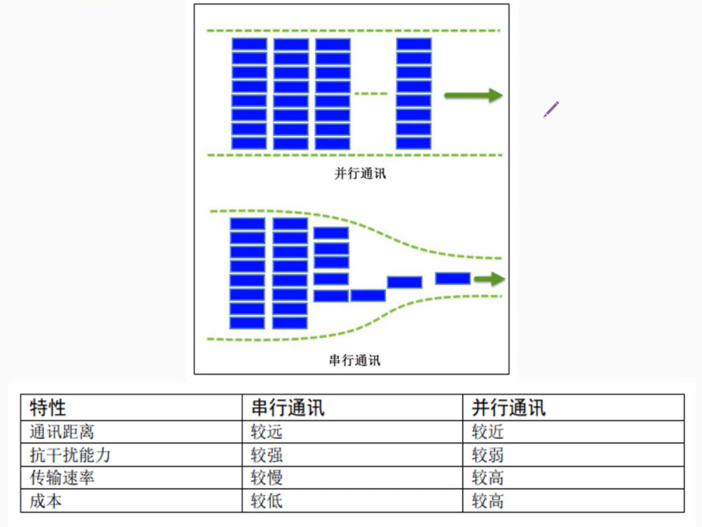

### 全双工、半双工及单工通讯

- 根据数据通讯的方向，通讯又分为：

  - 全双工

  - 半双工

  - 单工通讯

- 它们主要以**信道的方向**来区分。

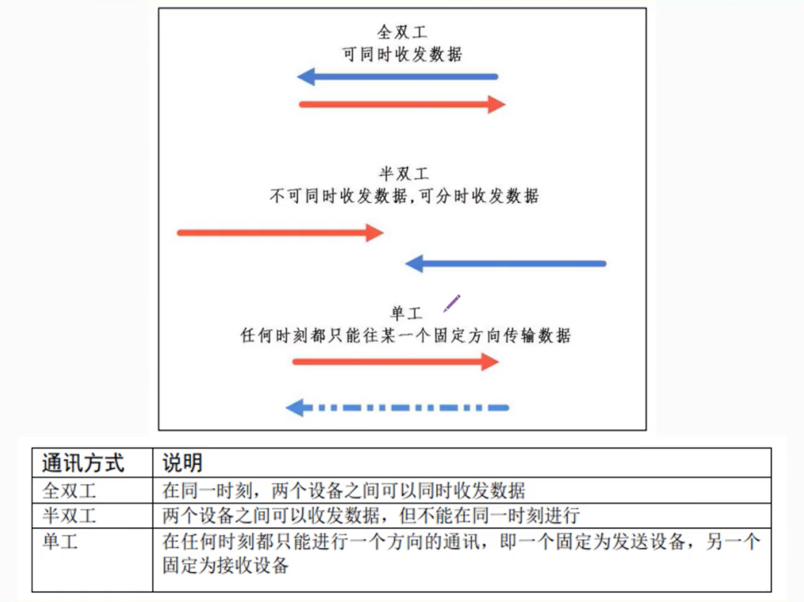

###  同步通讯与异步通讯

根据通讯的数据同步方式，又分为：

- 同步通讯
- 异步通讯

一般可以根据通讯过程中**是否有使用到时钟信号**进行简单的区分通信方式是同步通讯还是异步通讯。

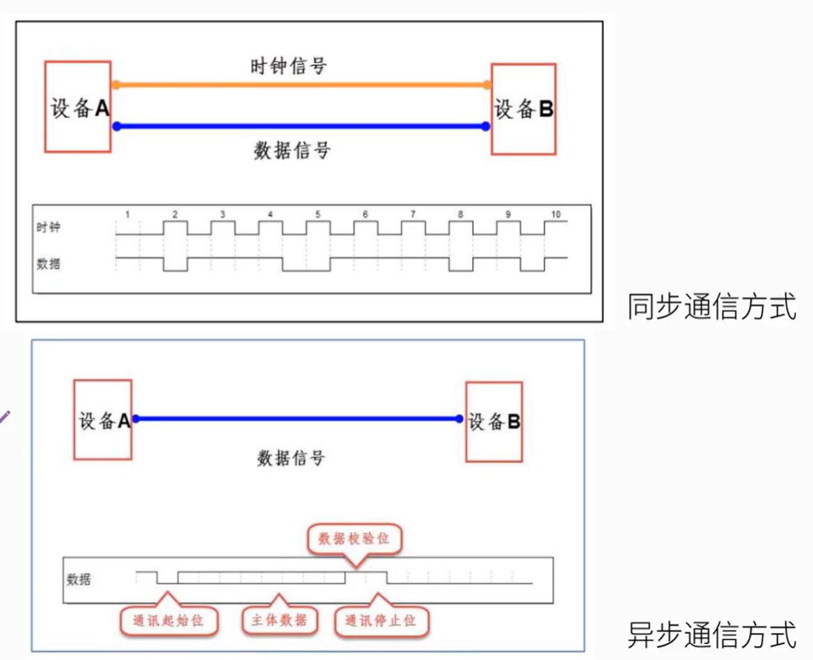


## 通讯速率

衡量通讯性能的一个非常重要的参数就是通讯速率，通常以比特率(Bitrate)来表示，即每秒钟传输的二进制位数，单位为比特每秒(bit/s)。

**注意：**

比特率容易与“波特率”(Baudrate)混淆。波特率”它表示每秒钟传输了多少个码元，单位是baud/so码元是通讯信号调制的概念，一个码可以由多个二进制位表示。

总结：1“波特”可以含由多个bit。当我们把“比特率”和“波特率”等价时，默认一个码元用一个bit表示，即 1 “波特” = 1 “比特“。


# USART 通用同步异步收发传输器

  

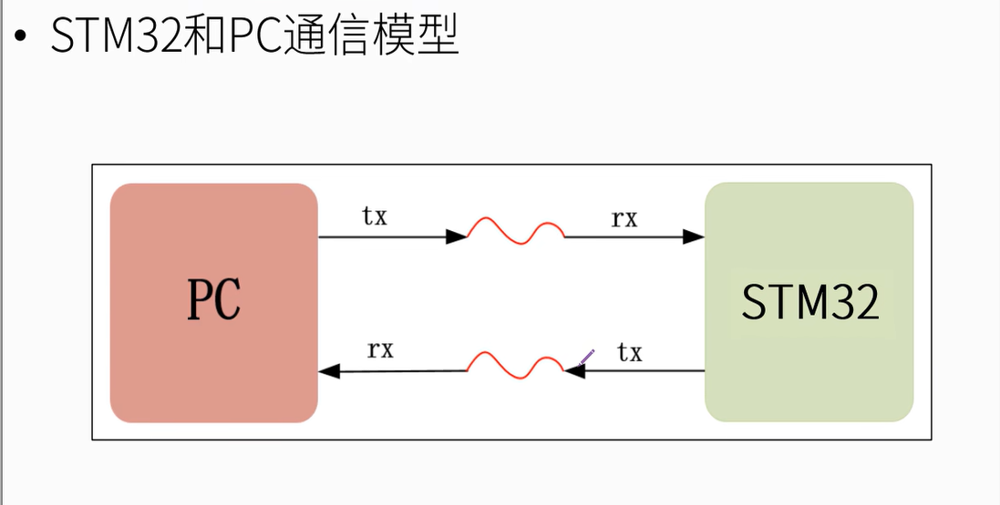


## 协议概念

### 波特率

本章中主要讲解的是**串口异步通讯**，异步通讯中由于**没有时钟信号**，所以两个通讯设备之间需要约定好波特率，即每个码元的长度，以便对信号进行解码。常见的波特率为4800、9600、115200等。

### 通讯的起始和停止信号

串口通讯的一个数据包从起始信号开始，直到停止信号结束。数据包的起始信号由 1 个逻辑 0 的数据位表示，而数据包的停止信号可由 0.5、1、1.5 或 2 个逻辑 1 的数据位表示，只要双方约定一致即可。

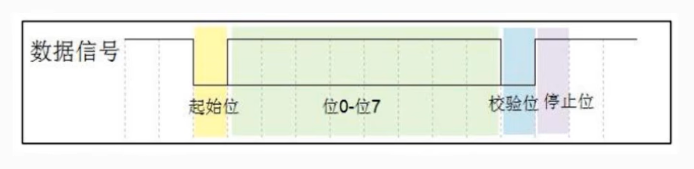

### 有效数据

在数据包的起始位之后紧接着的就是要传输的主体数据内容，也称为有效数据，有效数据的长度常被约定为 5、6、7 或 8 位长。（如上图，有效数据为 8 位长）

### 数据校验

在有效数据之后，有一个**可选**的数据校验位。由于数据通信相对更容易受到外部干扰导致传输数据出现偏差，可以在传输过程加上校验位来解决这个问题。通常有：有奇校验(odd)、偶校验(even)、0 校验(space)、1 校验(mark)以及无校验(noparity)。


## 代码编写

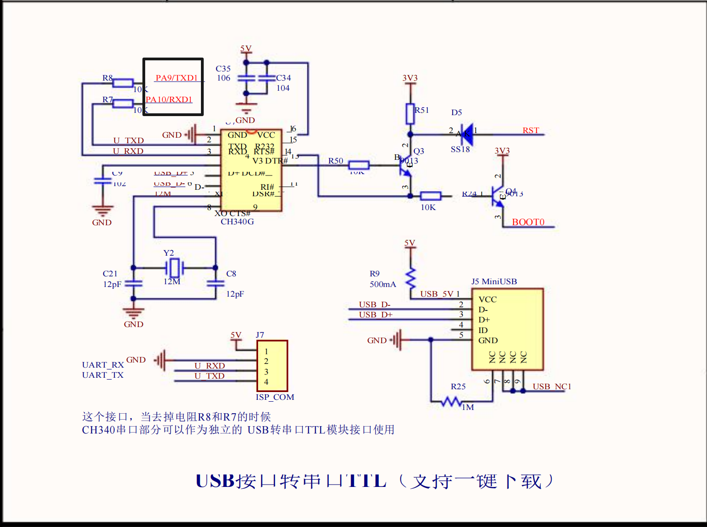

由原理图黑框所示，应选用 PA9 和 PA10 引脚。

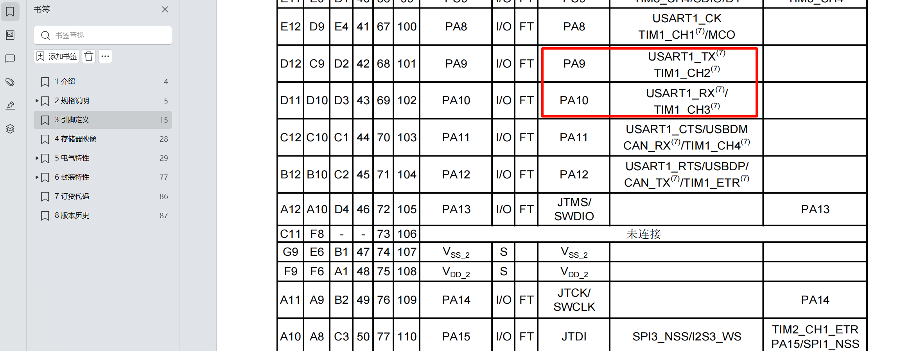

由《数据手册》的引脚定义章节可知，PA9 和 PA10 的默认复用功能为 **USART1** 的发送（TX）和接收（RX）。


### 使用CubeMX进行外设的初始化：

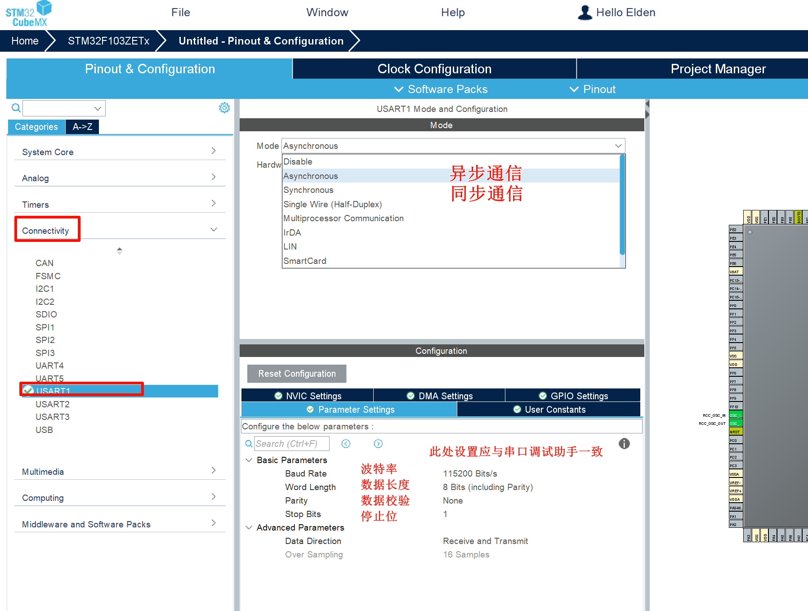

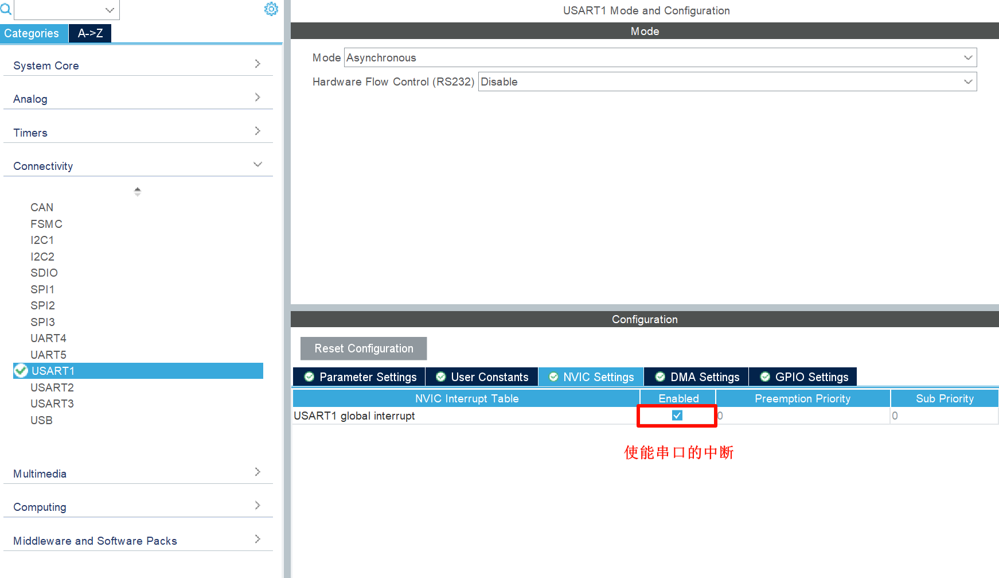

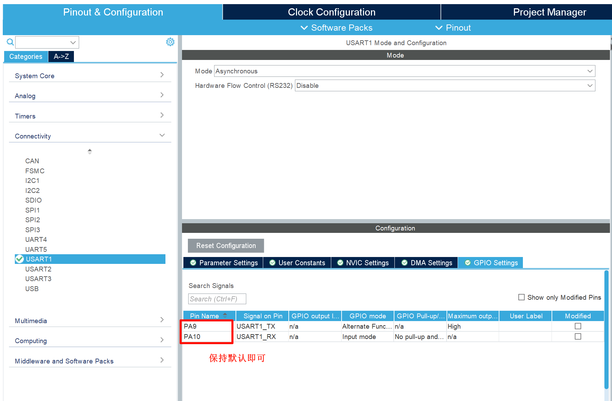

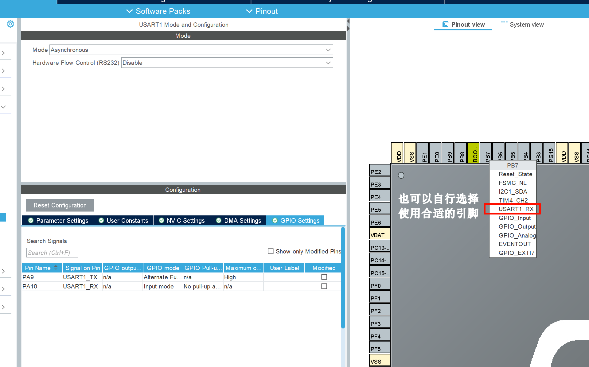

### 代码1

在CubeMX生成的 usart.h 文件中写入：

```c
/* USER CODE BEGIN Includes */
#include <stdio.h>
/* USER CODE END Includes */

/* USER CODE BEGIN Prototypes */
int fputc(int ch, FILE *f);
int fgetc(FILE *f);
void Usart_SendString(uint8_t *str);
/* USER CODE END Prototypes */
```

在CubeMX生成的 usart.c 文件中写入：

```c
/* USER CODE BEGIN 1 */

/**
  * @brief  发送字符串。用法 Usart_SendString("Hello World!");
  * @prarm  *str  字符串首地址
  * @retval 无
  */
void Usart_SendString(uint8_t *str)
{
	unsigned int k=0;
  do 
  {
      HAL_UART_Transmit(&huart1,(uint8_t *)(str + k) ,1,1000);
      k++;
  } while(*(str + k)!='\0');
  
}


/**
  * @brief  重定向 c 库函数printf到串口USART，重定向后可使用printf函数
  */
int fputc(int ch, FILE *f)
{
	/* 发送一个字节数据到串口USART */
	HAL_UART_Transmit(&huart1, (uint8_t *)&ch, 1, 1000);	
	
	return (ch);
}

/**
  * @brief  重定向c库函数scanf到串口USART，重写向后可使用scanf、getchar等函数
  */
int fgetc(FILE *f)
{		
	int ch;
	HAL_UART_Receive(&huart1, (uint8_t *)&ch, 1, 1000);	
	return (ch);
}
/* USER CODE END 1 */

```

在main函数中加入：

```c
  /* USER CODE BEGIN 2 */
	
	/*调用printf函数，因为重定向了fputc，printf的内容会输出到串口*/
	printf("这是使用printf输出的\n");

	/*自定义函数方式*/
	Usart_SendString( (uint8_t *)"自定义函数输出：输出一个字符串\n" );
	
  /* USER CODE END 2 */
```

注意一定记得勾选 `use MicroLIB` 

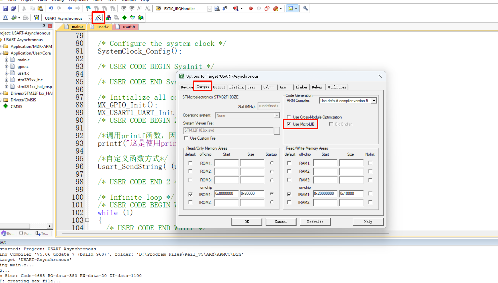


由此在串口调试助手中可以看到由单片机发送过来的文字。


### 代码2

用串口调试助手输入相应的编号，从而控制相应LED灯的亮灭。

```c
/**
  * @brief  The application entry point.
  * @retval int
  */
int main(void)
{
  /* USER CODE BEGIN 1 */

  /* USER CODE END 1 */

  /* MCU Configuration--------------------------------------------------------*/

  /* Reset of all peripherals, Initializes the Flash interface and the Systick. */
  HAL_Init();

  /* USER CODE BEGIN Init */

  /* USER CODE END Init */

  /* Configure the system clock */
  SystemClock_Config();

  /* USER CODE BEGIN SysInit */

  /* USER CODE END SysInit */

  /* Initialize all configured peripherals */
  MX_GPIO_Init();
	LED_GPIO_Init();
  MX_USART1_UART_Init();
  /* USER CODE BEGIN 2 */
	LED_Brief();
  /* USER CODE END 2 */

  /* Infinite loop */
  /* USER CODE BEGIN WHILE */
  while (1)
  {
    /* USER CODE END WHILE */
		char ch = getchar();
		switch(ch)
		{
			case '0':
				LED_D0_TOGGLE;
				printf("输入：%c\t已翻转D0\n",ch);
				LED_Brief();
				break;
			case '1':
				LED_D1_TOGGLE;
				printf("输入：%c\t已翻转D1\n",ch);
				LED_Brief();
				break;
			case '2':
				LED_D0_ON;
				LED_D1_ON;
				printf("输入：%c\t已开启两个LED灯\n",ch);
				LED_Brief();
				break;
			case '3':
				LED_D0_OFF;
				LED_D1_OFF;
				printf("输入：%c\t已关闭两个LED灯\n",ch);
				LED_Brief();
				break;
		}
    /* USER CODE BEGIN 3 */
  }
  /* USER CODE END 3 */
}


/* USER CODE BEGIN 4 */
/**
  * @brief 串口控制LED灯的规则说明函数
  * @param None
  * @retval None
  */
void LED_Brief(void)
{
	printf("\n规则说明：\n");
	printf("0 -> 翻转D0\n");
	printf("1 -> 翻转D1\n");
	printf("2 -> 打开两个灯\n");
	printf("3 -> 关闭两个灯\n");
	printf("等待输入中……\n");
}
/* USER CODE END 4 */
```


# 基本定时器

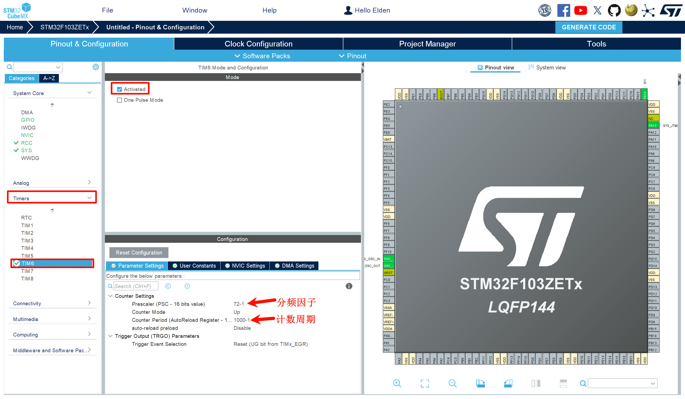

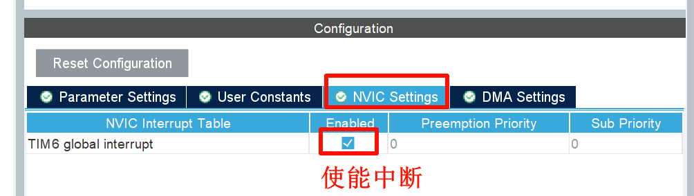


## 代码实现

### 方法一

main.c文件中加入

```c
/* USER CODE BEGIN PV */

extern TIM_HandleTypeDef htim6;
/* USER CODE END PV */

/**
  * @brief  The application entry point.
  * @retval int
  */
int main(void)
{
  /* USER CODE BEGIN 1 */

  /* USER CODE END 1 */

  /* MCU Configuration--------------------------------------------------------*/

  /* Reset of all peripherals, Initializes the Flash interface and the Systick. */
  HAL_Init();

  /* USER CODE BEGIN Init */
	LED_GPIO_Init();
  /* USER CODE END Init */

  /* Configure the system clock */
  SystemClock_Config();

  /* USER CODE BEGIN SysInit */

  /* USER CODE END SysInit */

  /* Initialize all configured peripherals */
  MX_GPIO_Init();
  MX_TIM6_Init();
  MX_USART1_UART_Init();
  /* USER CODE BEGIN 2 */
	HAL_TIM_Base_Start_IT(&htim6);			//在中断模式下启动定时器
	uint8_t LED_Open = (uint8_t)0;			//灯处于关闭状态
  /* USER CODE END 2 */

  /* Infinite loop */
  /* USER CODE BEGIN WHILE */
  while (1)
  {
		/* LED0 取反 */      
		LED_D0_TOGGLE;
		LED_Open ^= (uint8_t)1;				//更新灯的状态
		if(LED_Open)
			printf("已打开LED灯\n");
		else
			printf("已关闭LED灯\n");
		Tim6_Delay(1000);					//使用自己写的延时函数
    /* USER CODE END WHILE */

    /* USER CODE BEGIN 3 */
  }
  /* USER CODE END 3 */
}

```

在tim.h文件中加入

```c
/* USER CODE BEGIN Prototypes */
void Tim6_Delay(__IO uint32_t nTime);
/* USER CODE END Prototypes */
```

在tim.c文件中加入

```c
/* USER CODE BEGIN 0 */

static __IO uint32_t Tim6_Delaytime;
/* USER CODE END 0 */

/* USER CODE BEGIN 1 */
void HAL_TIM_PeriodElapsedCallback(TIM_HandleTypeDef *htim)			//重写回调函数
{
	Tim6_Delaytime++;
}

void Tim6_Delay(__IO uint32_t nTime)					//自己写的延时函数
{ 
	Tim6_Delaytime = 0;	

	while(Tim6_Delaytime != nTime);
}
/* USER CODE END 1 */
```

### 方法二

==计数周期 65535==

在tim.c文件中加入

```c

/* USER CODE BEGIN 1 */

/**
  * @brief  微秒级延时
  * @param  nus   	延伸的微秒数，最大为 65535
  * @retval 无
  */
void Tim6_Delay_us(uint16_t nus)
{
	__HAL_TIM_SetCounter(&htim6,0);
	__HAL_TIM_ENABLE(&htim6);
	
	while(__HAL_TIM_GetCounter(&htim6)<nus);
	
	__HAL_TIM_DISABLE(&htim6);
}

/* USER CODE END 1 */

```


# 高级定时器-PWM输出

CubeMX配置

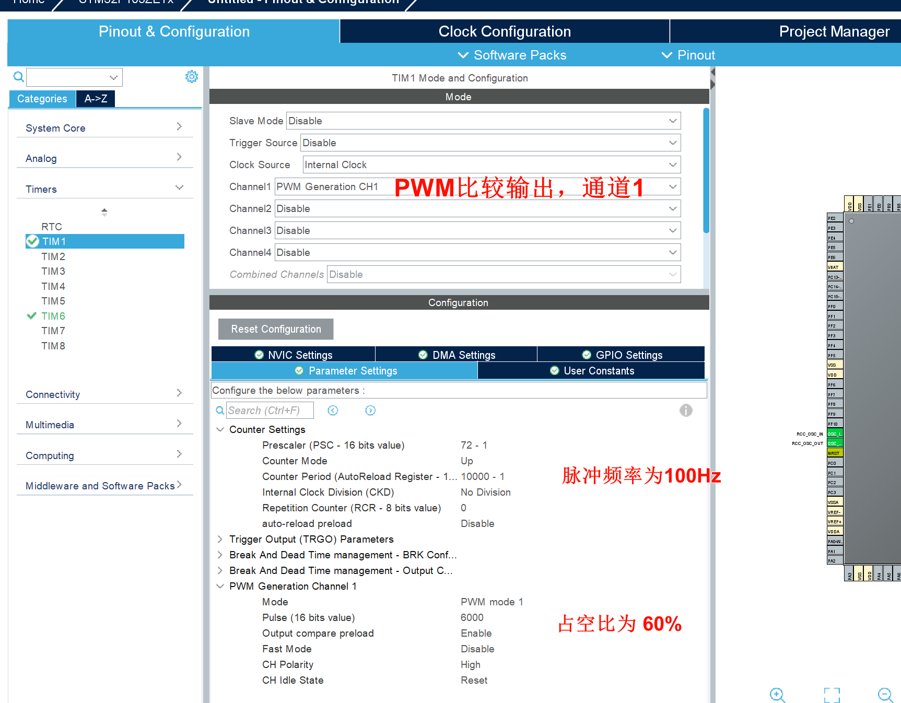


在主函数中加入：

```c
	HAL_TIM_PWM_Start(&htim1,TIM_CHANNEL_1);			//开启定时器1的通道1的PWM输出
```


# 舵机

舵机属于**伺服电机**的一种，有 90度舵机，180度舵机，360度舵机等多种。

180度舵机可以进行角度的控制，控制范围为0-180度。

360度舵机没有角度限制，可以转动任意圈，只可调节速度而不可调节具体角度。

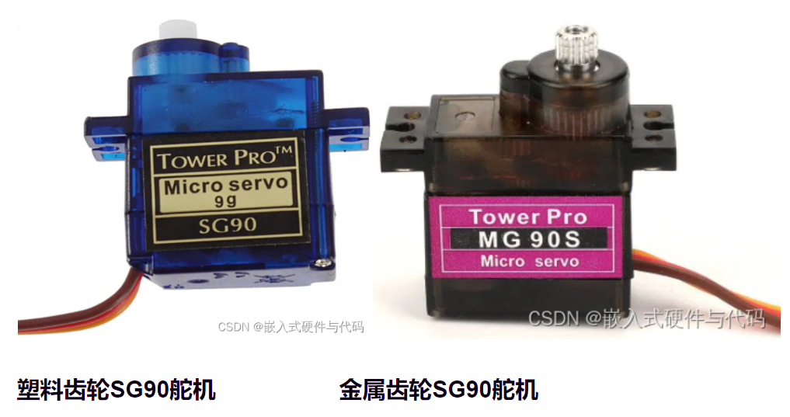

舵机一般引出三条线，==棕色为接地线，中间红色为正极5V输入线，橙色为PWM比较输出信号线。==

一般来讲**最好不要用开发板直接供电，而是外接电源供电**，电机的反电动势会使电流不稳，也可能会烧坏芯片。


## SG90舵机工作原理

控制信号由接收机的通道进入信号调制芯片，获得直流偏置电压。它内部有一个基准电路，产生周期为20ms，宽度为1.5ms 的基准信号，将获得的直流偏置电压与电位器的电压比较，获得电压差输出。最后，电压差的正负输出到电机驱动芯片决定电机的正反转。当电机转速一定时，通过级联减速齿轮带动电位器旋转，使得电压差为0，电机停止转动。


## SG90舵机舵机的控制

舵机的控制一般需要一个 **20ms**  左右的时基脉冲，该脉冲的高电平部分一般为 **0.5ms~2.5ms** 范围内的角度控制脉冲部分。以180 度角度伺服为例，那么对应的控制关系是这样的：

| 0.5ms | 0 度   |
| ----- | ------ |
| 1.0ms | 45 度  |
| 1.5ms | 90 度  |
| 2.0ms | 135 度 |
| 2.5ms | 180 度 |

对于 360 度舵机来说，控制原理相同，只是角度的改变换成了舵机运动速度的改变。


## 代码实例

在main.c文件中

```c
/* USER CODE BEGIN PV */
static uint8_t SG90_1_Open;				//两个舵机是否为开启的状态
static uint8_t SG90_2_Open;
/* USER CODE END PV */


/* USER CODE BEGIN 4 */
void HAL_GPIO_EXTI_Callback(uint16_t GPIO_Pin)
{
	if(GPIO_Pin == GPIO_PIN_3)
	{
		if(SG90_1_Open)
		{
			HAL_TIM_PWM_Stop(&htim1,TIM_CHANNEL_1);						//关闭定时器1的通道1的PWM输出
			LED_D0_OFF;
			printf("关闭定时器1的通道1的PWM输出，关闭D0\n");
		}
		else
		{
			HAL_TIM_PWM_Start(&htim1,TIM_CHANNEL_1);					//开启定时器1的通道1的PWM输出
			LED_D0_ON;
			printf("开启定时器1的通道1的PWM输出，打开D0\n");
			
		}
		
		SG90_1_Open ^= (uint8_t)1;
	}
	
	if(GPIO_Pin == GPIO_PIN_4)
	{
		if(SG90_2_Open)
		{
			HAL_TIM_PWM_Stop(&htim8,TIM_CHANNEL_1);						//关闭定时器8的通道1的PWM输出
			LED_D1_OFF;
			printf("关闭定时器8的通道1的PWM输出，关闭D1\n");
		}
		else
		{
			HAL_TIM_PWM_Start(&htim8,TIM_CHANNEL_1);					//开启定时器8的通道1的PWM输出
			LED_D1_ON;
			printf("开启定时器8的通道1的PWM输出，打开D1\n");
		}
		
		SG90_2_Open ^= (uint8_t)1;
	}
}
```

在tim.c文件中：
```c
void MX_TIM1_Init(void)
{

  /* USER CODE BEGIN TIM1_Init 0 */

  /* USER CODE END TIM1_Init 0 */

  TIM_ClockConfigTypeDef sClockSourceConfig = {0};
  TIM_MasterConfigTypeDef sMasterConfig = {0};
  TIM_OC_InitTypeDef sConfigOC = {0};
  TIM_BreakDeadTimeConfigTypeDef sBreakDeadTimeConfig = {0};

  /* USER CODE BEGIN TIM1_Init 1 */

  /* USER CODE END TIM1_Init 1 */
  htim1.Instance = TIM1;
  htim1.Init.Prescaler = 72-1;
  htim1.Init.CounterMode = TIM_COUNTERMODE_UP;
  htim1.Init.Period = 20000-1;								//注意此处设置
  htim1.Init.ClockDivision = TIM_CLOCKDIVISION_DIV1;
  htim1.Init.RepetitionCounter = 0;
  htim1.Init.AutoReloadPreload = TIM_AUTORELOAD_PRELOAD_ENABLE;
  if (HAL_TIM_Base_Init(&htim1) != HAL_OK)
  {
    Error_Handler();
  }
  sClockSourceConfig.ClockSource = TIM_CLOCKSOURCE_INTERNAL;
  if (HAL_TIM_ConfigClockSource(&htim1, &sClockSourceConfig) != HAL_OK)
  {
    Error_Handler();
  }
  if (HAL_TIM_PWM_Init(&htim1) != HAL_OK)
  {
    Error_Handler();
  }
  sMasterConfig.MasterOutputTrigger = TIM_TRGO_RESET;
  sMasterConfig.MasterSlaveMode = TIM_MASTERSLAVEMODE_DISABLE;
  if (HAL_TIMEx_MasterConfigSynchronization(&htim1, &sMasterConfig) != HAL_OK)
  {
    Error_Handler();
  }
  sConfigOC.OCMode = TIM_OCMODE_PWM1;
  sConfigOC.Pulse = 500;									//0.5ms
  sConfigOC.OCPolarity = TIM_OCPOLARITY_HIGH;
  sConfigOC.OCNPolarity = TIM_OCNPOLARITY_HIGH;
  sConfigOC.OCFastMode = TIM_OCFAST_DISABLE;
  sConfigOC.OCIdleState = TIM_OCIDLESTATE_RESET;
  sConfigOC.OCNIdleState = TIM_OCNIDLESTATE_RESET;
  if (HAL_TIM_PWM_ConfigChannel(&htim1, &sConfigOC, TIM_CHANNEL_1) != HAL_OK)
  {
    Error_Handler();
  }
  sBreakDeadTimeConfig.OffStateRunMode = TIM_OSSR_DISABLE;
  sBreakDeadTimeConfig.OffStateIDLEMode = TIM_OSSI_DISABLE;
  sBreakDeadTimeConfig.LockLevel = TIM_LOCKLEVEL_OFF;
  sBreakDeadTimeConfig.DeadTime = 0;
  sBreakDeadTimeConfig.BreakState = TIM_BREAK_DISABLE;
  sBreakDeadTimeConfig.BreakPolarity = TIM_BREAKPOLARITY_HIGH;
  sBreakDeadTimeConfig.AutomaticOutput = TIM_AUTOMATICOUTPUT_DISABLE;
  if (HAL_TIMEx_ConfigBreakDeadTime(&htim1, &sBreakDeadTimeConfig) != HAL_OK)
  {
    Error_Handler();
  }
  /* USER CODE BEGIN TIM1_Init 2 */

  /* USER CODE END TIM1_Init 2 */
  HAL_TIM_MspPostInit(&htim1);

}
```


# 直流减速电机

## 硬件设计

直流减速电机需要外加 L298N 电机驱动模块。一个此模块可同时控制两个直流减速电机。每个电机分配有三个输入端口和两个输出端口。

三个输入端口，其中两个为pwm输入口，第三个为使能端口，直接用跳线帽与板载5V相连即可。

两个输出端口，与电机的两个输入线相连。

## 软件设计

本质就是输出两个PWM波来控制电机的正反转和转速。

在main.c文件中：

```c
/* USER CODE BEGIN Header */
/**
  ******************************************************************************
  * @file           : main.c
  * @brief          : Main program body
  ******************************************************************************
  * @attention
  *
  * Copyright (c) 2024 STMicroelectronics.
  * All rights reserved.
  *
  * This software is licensed under terms that can be found in the LICENSE file
  * in the root directory of this software component.
  * If no LICENSE file comes with this software, it is provided AS-IS.
  *
  ******************************************************************************
  */
/* USER CODE END Header */
/* Includes ------------------------------------------------------------------*/
#include "main.h"
#include "tim.h"
#include "usart.h"
#include "gpio.h"

/* Private includes ----------------------------------------------------------*/
/* USER CODE BEGIN Includes */

/* USER CODE END Includes */

/* Private typedef -----------------------------------------------------------*/
/* USER CODE BEGIN PTD */

/* USER CODE END PTD */

/* Private define ------------------------------------------------------------*/
/* USER CODE BEGIN PD */

/* USER CODE END PD */

/* Private macro -------------------------------------------------------------*/
/* USER CODE BEGIN PM */

/* USER CODE END PM */

/* Private variables ---------------------------------------------------------*/

/* USER CODE BEGIN PV */
static uint8_t dir;
/* USER CODE END PV */

/* Private function prototypes -----------------------------------------------*/
void SystemClock_Config(void);
/* USER CODE BEGIN PFP */
void ttMotor_Brief(void);
/* USER CODE END PFP */

/* Private user code ---------------------------------------------------------*/
/* USER CODE BEGIN 0 */

/* USER CODE END 0 */

/**
  * @brief  The application entry point.
  * @retval int
  */
int main(void)
{
  /* USER CODE BEGIN 1 */

  /* USER CODE END 1 */

  /* MCU Configuration--------------------------------------------------------*/

  /* Reset of all peripherals, Initializes the Flash interface and the Systick. */
  HAL_Init();

  /* USER CODE BEGIN Init */

  /* USER CODE END Init */

  /* Configure the system clock */
  SystemClock_Config();

  /* USER CODE BEGIN SysInit */

  /* USER CODE END SysInit */

  /* Initialize all configured peripherals */
  MX_GPIO_Init();
  MX_TIM1_Init();
  MX_USART1_UART_Init();
  /* USER CODE BEGIN 2 */
	HAL_TIM_PWM_Start(&htim1,TIM_CHANNEL_1);				//开启定时器1的通道1的PWM输出
	HAL_TIM_PWM_Start(&htim1,TIM_CHANNEL_2);				//开启定时器1的通道2的PWM输出
	printf("初始化完成，开始程序\n");
	ttMotor_Brief();
  /* USER CODE END 2 */

  /* Infinite loop */
  /* USER CODE BEGIN WHILE */
  while (1)
  {

    /* USER CODE END WHILE */
		char ch = getchar();
		switch(ch)
		{
			case '0':
				__HAL_TIM_SET_COMPARE(&htim1, TIM_CHANNEL_1, 0);
				__HAL_TIM_SET_COMPARE(&htim1, TIM_CHANNEL_2, 0);
				printf("指令：%c\t已停止转动\n",ch);
				break;
			case '1':
				__HAL_TIM_SET_COMPARE(&htim1, TIM_CHANNEL_1, 2000);				//PWM占空比20%
				__HAL_TIM_SET_COMPARE(&htim1, TIM_CHANNEL_2, 0);
				printf("指令：%c\t设置为慢速正转\n",ch);
				break;
			case '2':
				__HAL_TIM_SET_COMPARE(&htim1, TIM_CHANNEL_1, 5000);				//PWM占空比50%
				__HAL_TIM_SET_COMPARE(&htim1, TIM_CHANNEL_2, 0);
				printf("指令：%c\t设置为中速正转\n",ch);
				break;
			case '3':
				__HAL_TIM_SET_COMPARE(&htim1, TIM_CHANNEL_1, 8000);				//PWM占空比80%
				__HAL_TIM_SET_COMPARE(&htim1, TIM_CHANNEL_2, 0);
				printf("指令：%c\t设置为快速正转\n",ch);
				break;
			case '4':
				__HAL_TIM_SET_COMPARE(&htim1, TIM_CHANNEL_1, 0);				//PWM占空比20%
				__HAL_TIM_SET_COMPARE(&htim1, TIM_CHANNEL_2, 2000);
				printf("指令：%c\t设置为慢速反转\n",ch);
				break;
			case '5':
				__HAL_TIM_SET_COMPARE(&htim1, TIM_CHANNEL_1, 0);				//PWM占空比50%
				__HAL_TIM_SET_COMPARE(&htim1, TIM_CHANNEL_2, 5000);
				printf("指令：%c\t设置为中速反转\n",ch);
				break;
			case '6':
				__HAL_TIM_SET_COMPARE(&htim1, TIM_CHANNEL_1, 0);				//PWM占空比80%
				__HAL_TIM_SET_COMPARE(&htim1, TIM_CHANNEL_2, 8000);
				printf("指令：%c\t设置为快速反转\n",ch);
				break;
		}
    /* USER CODE BEGIN 3 */
  }
  /* USER CODE END 3 */
}

/**
  * @brief System Clock Configuration
  * @retval None
  */
void SystemClock_Config(void)
{
  RCC_OscInitTypeDef RCC_OscInitStruct = {0};
  RCC_ClkInitTypeDef RCC_ClkInitStruct = {0};

  /** Initializes the RCC Oscillators according to the specified parameters
  * in the RCC_OscInitTypeDef structure.
  */
  RCC_OscInitStruct.OscillatorType = RCC_OSCILLATORTYPE_HSE;
  RCC_OscInitStruct.HSEState = RCC_HSE_ON;
  RCC_OscInitStruct.HSEPredivValue = RCC_HSE_PREDIV_DIV1;
  RCC_OscInitStruct.HSIState = RCC_HSI_ON;
  RCC_OscInitStruct.PLL.PLLState = RCC_PLL_ON;
  RCC_OscInitStruct.PLL.PLLSource = RCC_PLLSOURCE_HSE;
  RCC_OscInitStruct.PLL.PLLMUL = RCC_PLL_MUL9;
  if (HAL_RCC_OscConfig(&RCC_OscInitStruct) != HAL_OK)
  {
    Error_Handler();
  }

  /** Initializes the CPU, AHB and APB buses clocks
  */
  RCC_ClkInitStruct.ClockType = RCC_CLOCKTYPE_HCLK|RCC_CLOCKTYPE_SYSCLK
                              |RCC_CLOCKTYPE_PCLK1|RCC_CLOCKTYPE_PCLK2;
  RCC_ClkInitStruct.SYSCLKSource = RCC_SYSCLKSOURCE_PLLCLK;
  RCC_ClkInitStruct.AHBCLKDivider = RCC_SYSCLK_DIV1;
  RCC_ClkInitStruct.APB1CLKDivider = RCC_HCLK_DIV2;
  RCC_ClkInitStruct.APB2CLKDivider = RCC_HCLK_DIV1;

  if (HAL_RCC_ClockConfig(&RCC_ClkInitStruct, FLASH_LATENCY_2) != HAL_OK)
  {
    Error_Handler();
  }
}

/* USER CODE BEGIN 4 */

/**
  * @brief  KEY_0和KEY_1两个按键的中断服务函数
	* @param	按键对应的引脚
  * @retval None
  */
void HAL_GPIO_EXTI_Callback(uint16_t GPIO_Pin)
{
	if(GPIO_Pin == KEY_0_Pin)
	{
		dir ^= (uint8_t)1; 
		if(dir)
		{
			__HAL_TIM_SET_COMPARE(&htim1, TIM_CHANNEL_1, 5000);
			__HAL_TIM_SET_COMPARE(&htim1, TIM_CHANNEL_2, 0);
			printf("按下按键KEY_0\t正快转\n");
		}
		else
		{
			__HAL_TIM_SET_COMPARE(&htim1, TIM_CHANNEL_1, 2000);
			__HAL_TIM_SET_COMPARE(&htim1, TIM_CHANNEL_2, 0);
			printf("按下按键KEY_0\t正慢转\n");
		}
		
	}
	if(GPIO_Pin == KEY_1_Pin)
	{
		__HAL_TIM_SET_COMPARE(&htim1, TIM_CHANNEL_1, 0);
		__HAL_TIM_SET_COMPARE(&htim1, TIM_CHANNEL_2, 0);
		printf("按下按键KEY_1\t不转\n");
	}
}

/**
  * @brief  tt马达串口指令的简介函数
	* @param	None
  * @retval None
  */
void ttMotor_Brief(void)
{
	printf("\n规则说明：\n");
	printf("0 -> 停止转动\n");
	printf("1 -> 设置为慢速正转\n");
	printf("2 -> 设置为中速正转\n");
	printf("3 -> 设置为快速正转\n");
	printf("4 -> 设置为慢速反转\n");
	printf("5 -> 设置为中速反转\n");
	printf("6 -> 设置为快速反转\n");
	printf("等待输入中……\n");
}
/* USER CODE END 4 */

/**
  * @brief  This function is executed in case of error occurrence.
  * @retval None
  */
void Error_Handler(void)
{
  /* USER CODE BEGIN Error_Handler_Debug */
  /* User can add his own implementation to report the HAL error return state */
  __disable_irq();
  while (1)
  {
  }
  /* USER CODE END Error_Handler_Debug */
}

#ifdef  USE_FULL_ASSERT
/**
  * @brief  Reports the name of the source file and the source line number
  *         where the assert_param error has occurred.
  * @param  file: pointer to the source file name
  * @param  line: assert_param error line source number
  * @retval None
  */
void assert_failed(uint8_t *file, uint32_t line)
{
  /* USER CODE BEGIN 6 */
  /* User can add his own implementation to report the file name and line number,
     ex: printf("Wrong parameters value: file %s on line %d\r\n", file, line) */
  /* USER CODE END 6 */
}
#endif /* USE_FULL_ASSERT */

```


# 步进电机

## 介绍

步进电机是一种将**电脉冲信号**转换成相应**角位移**或**线位移**的电动机。每输入一个脉冲信号，转子就转动一个角度或前进一步，其输出的角位移或线位移与输入的脉冲数成正比，转速与脉冲频率成正比。因此，步进电动机又称**脉冲电动机。**

### 分类

按**相数**可分为单相、二相、三相、四相、五相步进电机。

按**励磁方式**分为磁阻式、永磁式和混磁式三种。

相数：电机内部的线圈组数。

#### 五线四相 步进电机

无根线总共构成了四个回路。图中电流方向是固定的，又被称为**单极性步进电机**。

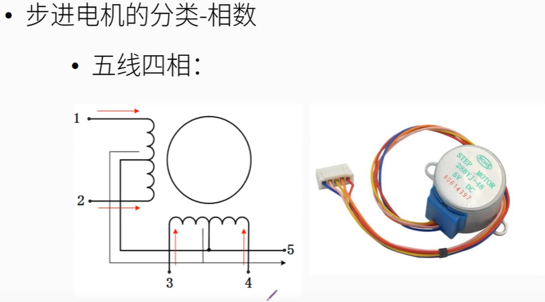

#### 四线二相 步进电机

图中电流方向是不固定的，又被称为**双极性步进电机**。

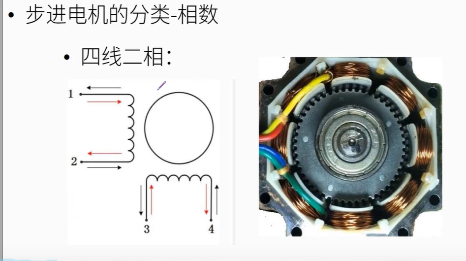

#### 永磁式步进电机

永磁式步进电机又被称为 **PM步进电机**。转子使用永磁性材料，通过改变定子线圈的磁极来驱动转子。其一般为**两相**，扭矩和体积都比较小。步距角一般为 3.75度，7.5度，15度，18度这四种。

特点：

- 步距角较大
- 转矩较小
- 精度较低
- 发热较小
- 体积较小
- 结构简单
- 价格低廉

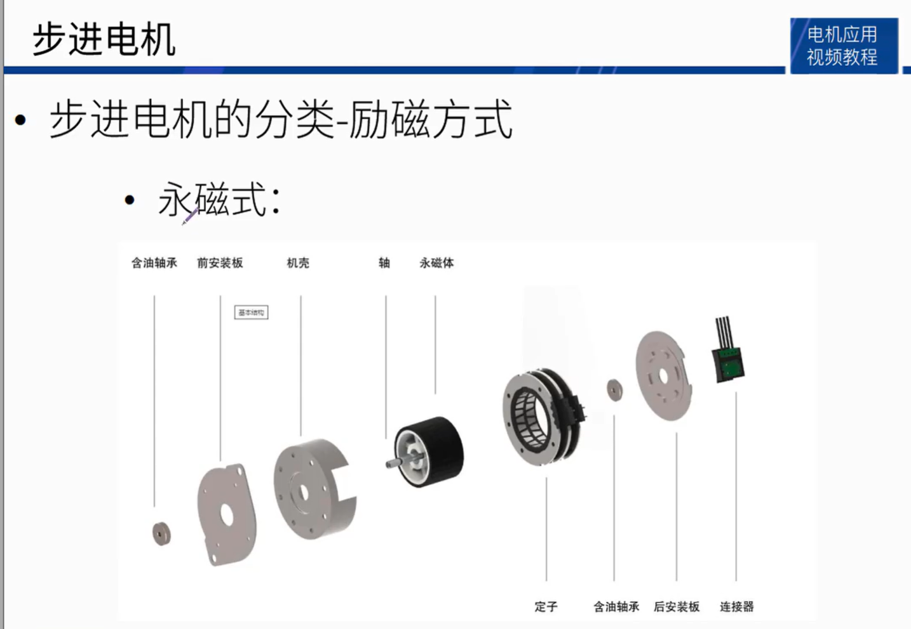


#### 磁阻式步进电机

磁阻式步进电机又被称为**反应式步进电机**。

优点：

- 结构简单
- 成本极低
- 步距角可达到1.2度

缺点：

- 效率低，发热量极大
- 可靠性低

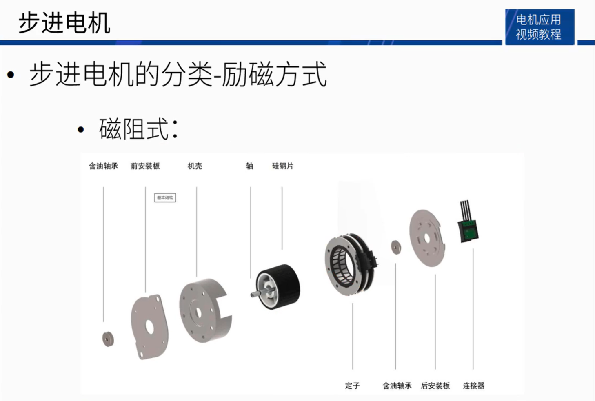


#### 混合式步进电机

综合了上述两种步进电机的优点。

步距角：两相：1.8度；三相：1.2度；五相：0.72度

优点：

- 输出转矩大
- 转速相对较高
- 发热相对较小
- 噪音较低
- 效率高

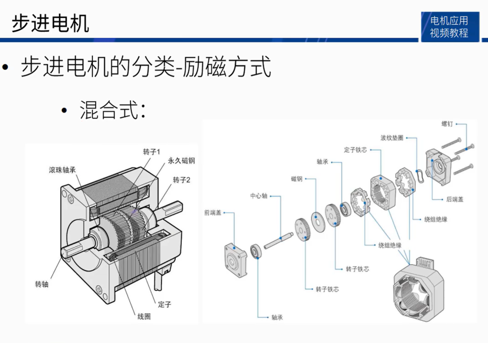


### 工作原理

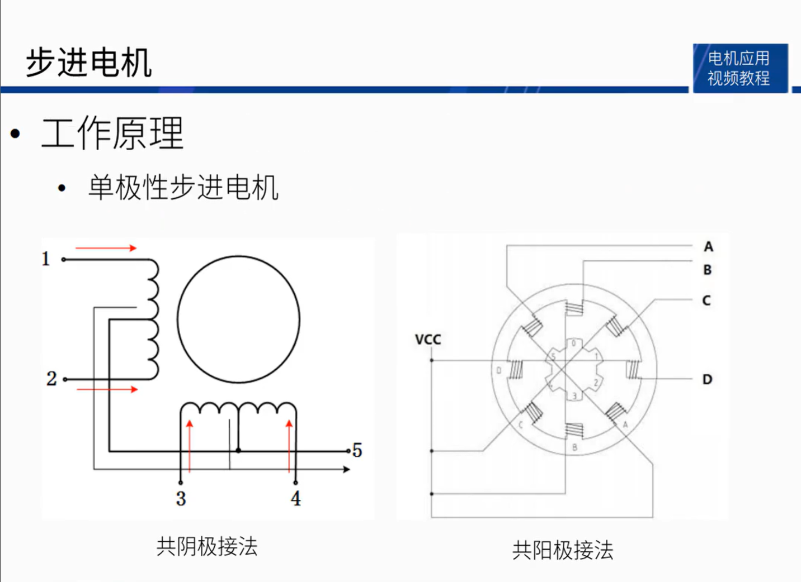

以下原理讲解均为共阴极接法

#### 单极性步进电机-单相整步驱动

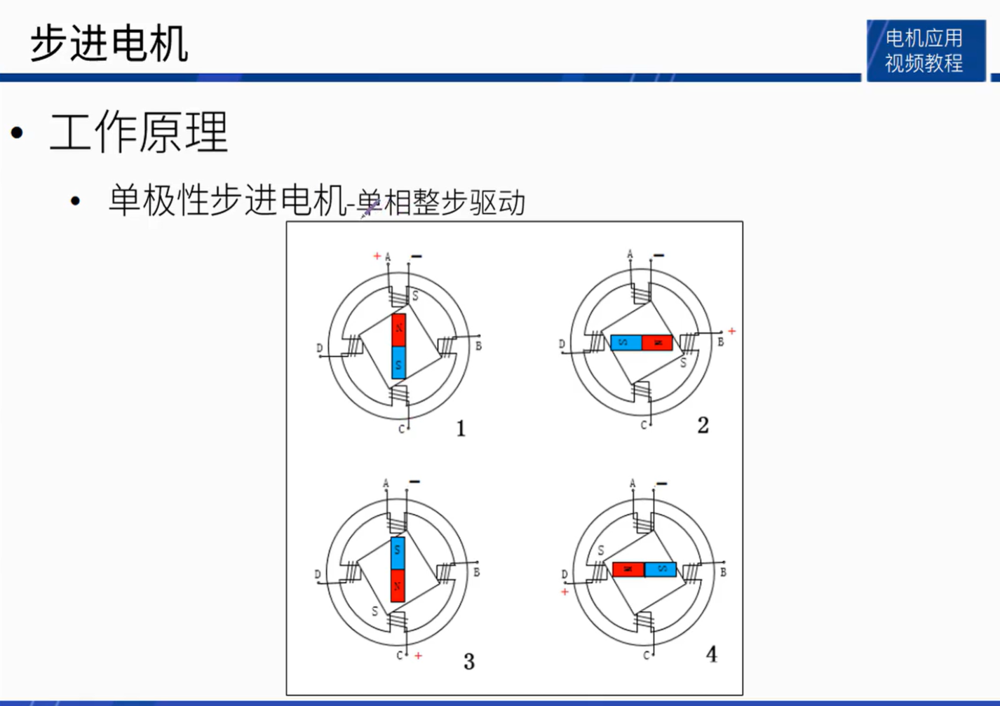

由上图，单相整步就是**同一时刻只有一相被接通**，上图步距角为90度。又称==四相四拍驱动==。

#### 单极性步进电机-两相整步驱动

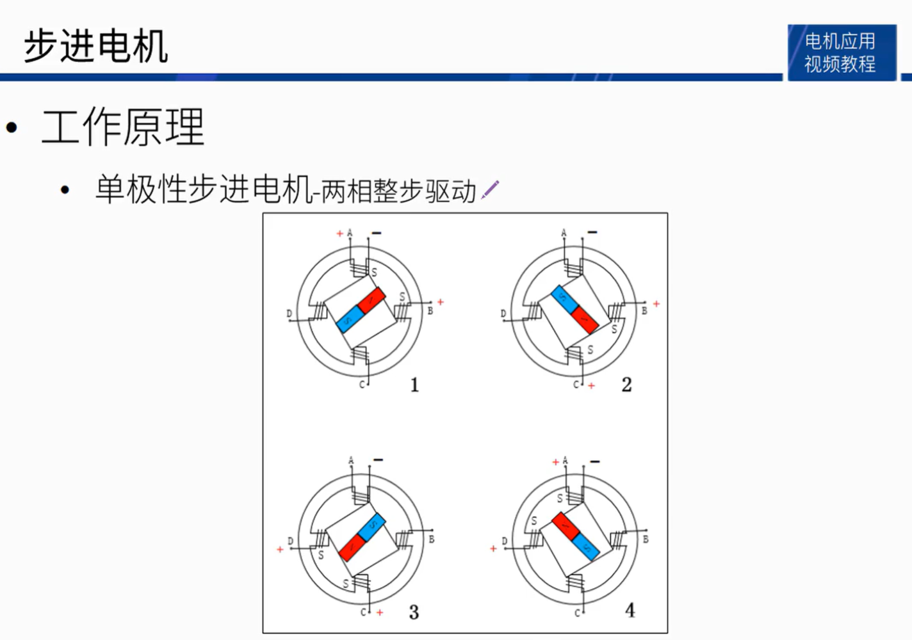

由上图，两相整步就是**同一时刻有两相被接通**，上图步距角为90度。这样设计比上一个图示的好处是相同电流下扭矩为上一个的 $\sqrt{2}$ 倍。又称==四相四拍驱动==。

#### 单极性步进电机-半步驱动

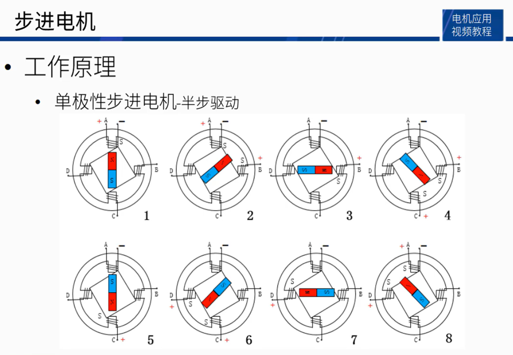

将上述两种混合，步距角为45度，但是每次转动的扭矩不同，扭矩不稳定。又称==四相八拍驱动==。

#### 双极性步进电机-单相整步驱动

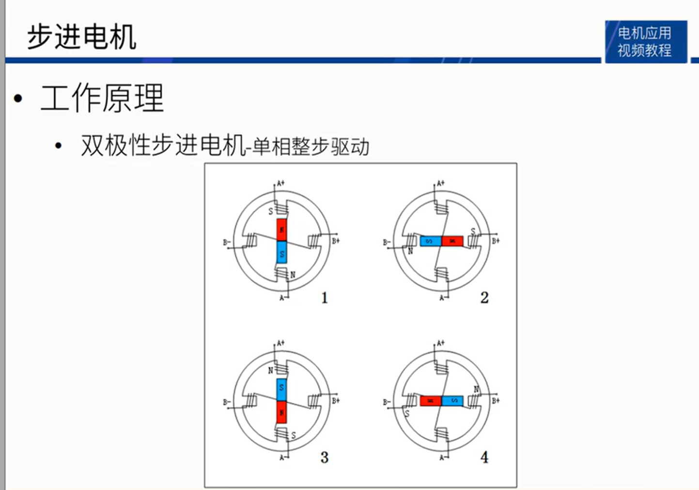

双极性的电流方向可以改变，每次只有两个A端通电或者两个B端通电，原理类似。又称==四相四拍驱动==。

#### 双极性步进电机-两相整步驱动

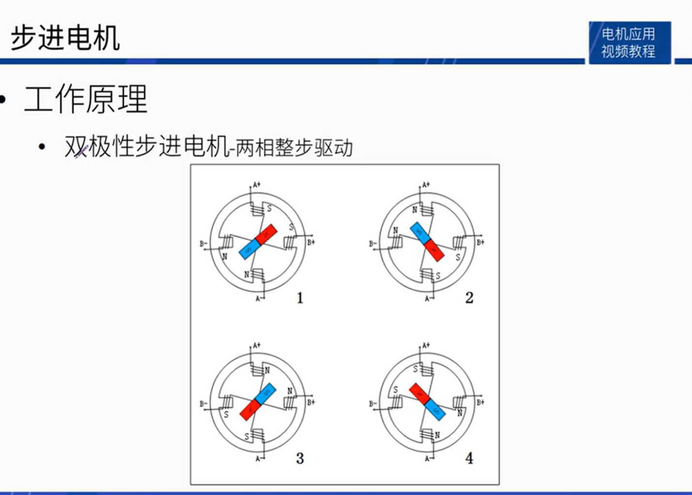

双极性的电流方向可以改变，每次四个端口均通电，原理类似。又称==四相四拍驱动==。

#### 双极性步进电机-半步驱动

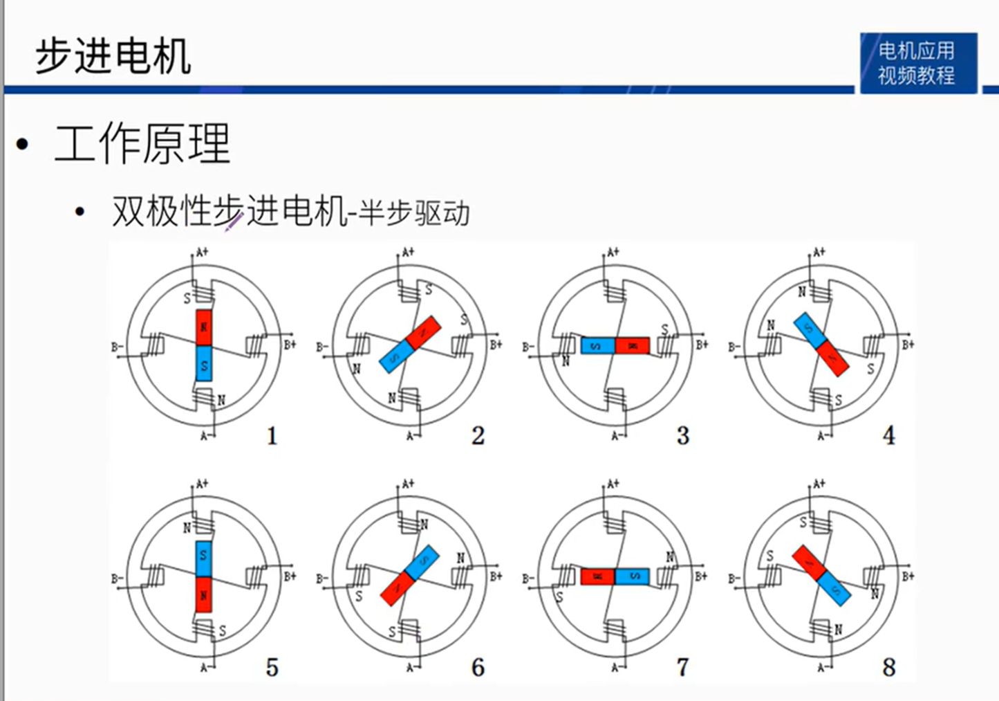

依然存在扭矩不稳定的问题。又称==四相八拍驱动==。

#### 细分驱动器

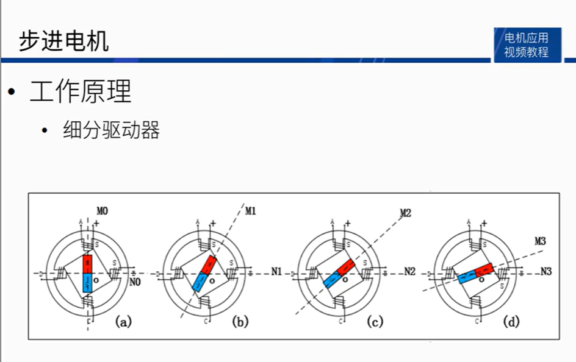

想要实现更小角度的步距角，增多相数是不现实的。

- 可以通过改变输入电流的大小来改变力的大小，进而通过力的平行四边形法则使得转子停在不同的**角度**。
- 同时也可以调整分力的大小来调整合力的大小，进而解决**扭矩不稳定**的问题。

因此==步进电机驱动器==就是集成了实现这些复杂计算的硬件电路的装置。

## 参数指标

### 静态参数

- 相数：步进电机中线圈的组数
- 拍数：完成一个磁场周期性变化所需脉冲数或导电状态
- 步距角：一个脉冲信号所对应的电机转动的角度
- 定位转矩：电机在不通电状态下，电机转子自身的锁定力矩
- 静转矩：电机在额定静态电压作用下，电机不作旋转运动时，电机转轴的锁定力矩

### 动态参数

- 步距角精度：步进电机转动一个步距角度的理论值与实际值的误差。（ $\frac{\text{误差}}{\text{步距角}} \times 100 \%$ ）
- 失步：电机运转时移动的步数，不等于接收到的脉冲数。（一般是因为负载过大或频率过快导致转子走过的步数大于或小于电动机接收到的脉冲数）
- 失调角：转子齿轴线偏移定子齿轴线的角度。（必然存在，且此误差无法解决，只能尽量提高加工精度来减小）
- 最大空载启动频率：在不加负载的情况下，能够直接起动的最大频率。（超过此频率，步进电机就会失步或者堵转）
- 最大空载运行频率：电机不带负载的最高转速频率。
- 运行转矩特征：电机运行时扭矩的动态变化。（电流越大力矩就越大，但是发热就越大）
- 电机正反转控制：通过改变通电顺序而改变电机的正反转。


## 硬件设计

使用两相四线混合式步进电机，和 TB6600 步进电机驱动模块。

电机驱动模块外接 12V 电源供电。四个接口与步进电机相连。

采用共阴极接法，驱动模块上的 ENA+ PUL+ DIR+ 分别接三个单片机的引脚，其他三个均接单片机的 GND。

## 软件设计

采用GPIO模拟脉冲的方式来控制步进电机转动特定的角度。

```c

/*-----STEPPER 步进电机的板级支持包-----*/

#ifndef __BSP_STEPPER_H
#define __BSP_STEPPER_H

#include "stm32f1xx.h"
#include "main.h"
#include "tim.h"


#define MOTOR_ENA_Pin 					GPIO_PIN_14			//使能引脚
#define MOTOR_ENA_GPIO_Port 		GPIOF
#define MOTOR_PUL_Pin 					GPIO_PIN_11			//脉冲引脚
#define MOTOR_PUL_GPIO_Port 		GPIOE
#define MOTOR_DIR_Pin 					GPIO_PIN_12			//方向引脚
#define MOTOR_DIR_GPIO_Port 		GPIOE

#define CLOCKWISE 		0				//顺时针方向转动
#define ANTICLOCKWISE 1				//逆时针方向转动
#define PULSE_PERIOD	200			//脉冲周期，单位	us, 步进电机转速为 6.4 * PULSE_PERIOD ms/r
#define SUBDIV				32			//步进电机驱动器的细分数

#define MOTOR_DISABLE 		HAL_GPIO_WritePin(MOTOR_ENA_GPIO_Port,MOTOR_ENA_Pin, GPIO_PIN_SET)				//使能步进电机
#define MOTOR_ENABLE 			HAL_GPIO_WritePin(MOTOR_ENA_GPIO_Port,MOTOR_ENA_Pin, GPIO_PIN_RESET)			//失能步进电机

#define MOTOR_DIR_ACW			HAL_GPIO_WritePin(MOTOR_DIR_GPIO_Port,MOTOR_DIR_Pin, GPIO_PIN_SET)				//设置顺时针转动
#define MOTOR_DIR_CW			HAL_GPIO_WritePin(MOTOR_DIR_GPIO_Port,MOTOR_DIR_Pin, GPIO_PIN_RESET)			//设置逆时针转动

#define MOTOR_PUL_HIGH		HAL_GPIO_WritePin(MOTOR_PUL_GPIO_Port,MOTOR_PUL_Pin, GPIO_PIN_SET)				//设置脉冲为高电平
#define MOTOR_PUL_LOW			HAL_GPIO_WritePin(MOTOR_PUL_GPIO_Port,MOTOR_PUL_Pin, GPIO_PIN_RESET)			//设置脉冲为低电平

void Stepper_GPIO_Init(void);												//配置步进电机的GPIO
void Stepper_Turn(uint8_t dir, float angle);				//转动步进电机

#endif

```


```c

/*-----STEPPER 步进电机的板级支持包-----*/

#include "./stepper/bsp_stepper.h"

/**
  * @brief  配置步进电机的GPIO
  * @param  无
  * @note   无
  * @retval 无
  */
void Stepper_GPIO_Init(void)
{

  GPIO_InitTypeDef GPIO_InitStruct = {0};

  /* GPIO Ports Clock Enable */
  __HAL_RCC_GPIOF_CLK_ENABLE();
  __HAL_RCC_GPIOE_CLK_ENABLE();
  __HAL_RCC_GPIOA_CLK_ENABLE();

  /*Configure GPIO pin Output Level */
  HAL_GPIO_WritePin(MOTOR_ENA_GPIO_Port, MOTOR_ENA_Pin, GPIO_PIN_SET);

  /*Configure GPIO pin Output Level */
  HAL_GPIO_WritePin(GPIOE, MOTOR_PUL_Pin|MOTOR_DIR_Pin, GPIO_PIN_RESET);

  /*Configure GPIO pin : PtPin */
  GPIO_InitStruct.Pin = MOTOR_ENA_Pin;
  GPIO_InitStruct.Mode = GPIO_MODE_OUTPUT_PP;
  GPIO_InitStruct.Pull = GPIO_NOPULL;
  GPIO_InitStruct.Speed = GPIO_SPEED_FREQ_LOW;
  HAL_GPIO_Init(MOTOR_ENA_GPIO_Port, &GPIO_InitStruct);

  /*Configure GPIO pins : PEPin PEPin */
  GPIO_InitStruct.Pin = MOTOR_PUL_Pin|MOTOR_DIR_Pin;
  GPIO_InitStruct.Mode = GPIO_MODE_OUTPUT_PP;
  GPIO_InitStruct.Pull = GPIO_NOPULL;
  GPIO_InitStruct.Speed = GPIO_SPEED_FREQ_LOW;
  HAL_GPIO_Init(GPIOE, &GPIO_InitStruct);
	
}

/**
  * @brief  步进电机旋转
  * @param  dir   	选择正反转 (CLOCKWISE / ANTICLOCKWISE [1,0]) 
  * @param  angle  	需要转动的角度 (角度制)
  * @note   无
  * @retval 无
  */
void Stepper_Turn(uint8_t dir, float angle)  
{
  int n,i;
  /* 求出总共需要多少个脉冲信号 */
  n = angle / 1.8 * SUBDIV;
  if(dir == CLOCKWISE) 							//顺时针
  {
    MOTOR_DIR_CW;
  }
  else											//逆时针
  {
    MOTOR_DIR_ACW;
  }
	
  /* 使能步进电机 */
  //MOTOR_ENABLE;
	Tim6_Delay_us(10);
	
  /* 模拟方波 */
  for(i = 0;i < n; i++)
  {
	//一个脉冲周期，占空比50%
	MOTOR_PUL_HIGH;
    Tim6_Delay_us(PULSE_PERIOD / 2);
    MOTOR_PUL_LOW;
    Tim6_Delay_us(PULSE_PERIOD / 2);
  }
	
  /* 失能步进电机 */
  //MOTOR_DISABLE;
}

```


# 超声波传感器HC-SR04

使用定时器的输入捕获功能，一个定时器的两个通道进行输入捕获，通道1捕获上升沿，通道2捕获下降沿。利用时间差和声速来测量距离。

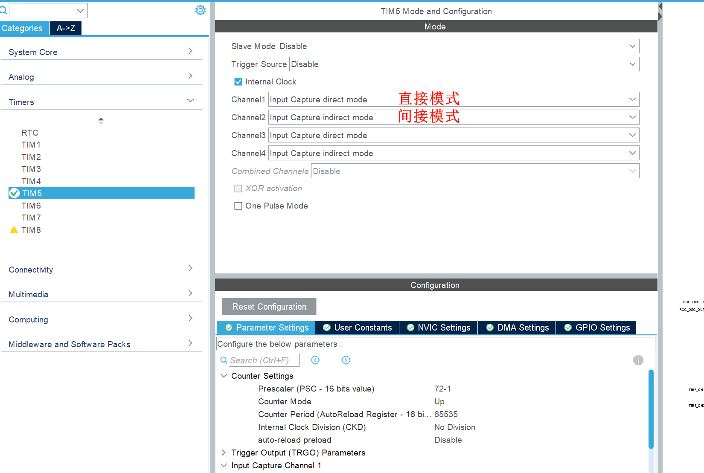

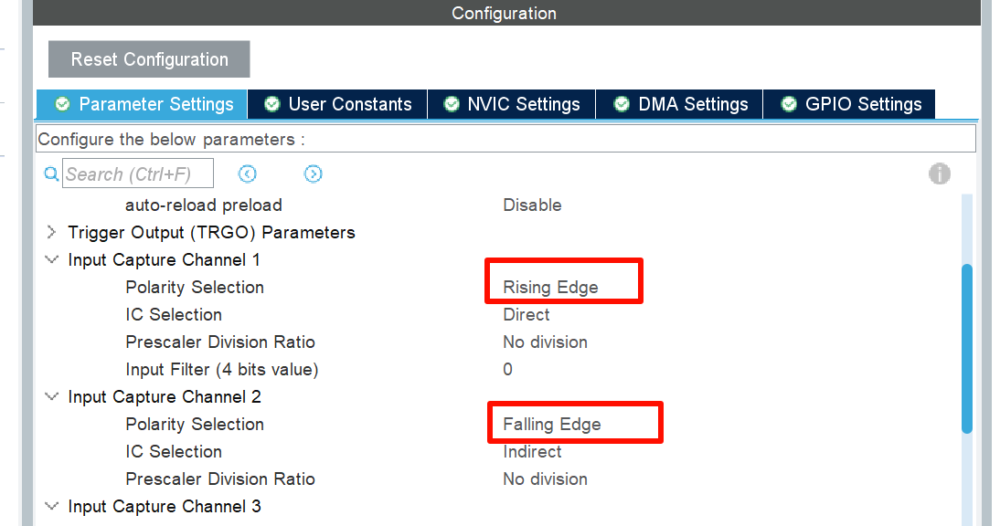

可以在GPIO Setting界面看到使用的GPIO口，也就是超声波测距的Echo接口，定时器5的通道1和3。

打开定时器5的中断。

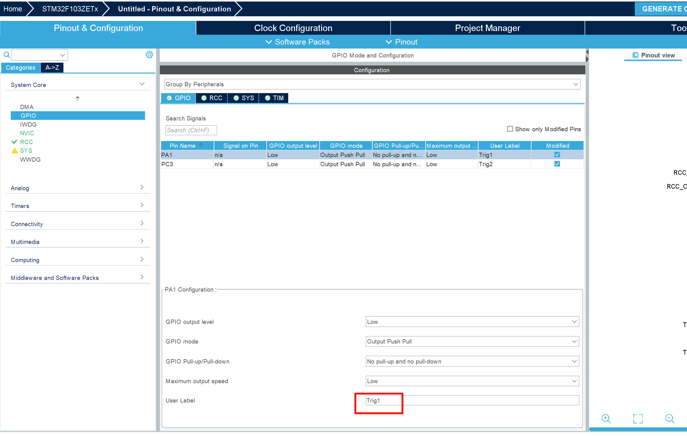

设置输出GPIO口，定义为Trig
