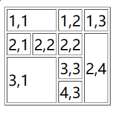

`<table>`表格主标签
	`border`表格边框，传入123表示第123种边框类型
	`width`表格宽度，单位px
	`height`表格高度，单位px
`<tr>`行标签
`<td>`列标签（单元格标签）
	`colspan=""`水平合并单元格，保留左边删除右边
	`rowspan=""`垂直合并单元格，保留上边删除下边
### 例子
```html
     <table border="1">
    <tr>
        <td colspan="2">1,1</td>
        <td>1,2</td>
        <td>1,3</td>
    </tr>
    <tr>
        <td>2,1</td>
        <td>2,2</td>
        <td>2,2</td>
        <td rowspan="3">2,4</td>
    </tr>
    <tr>
        <td colspan="2" rowspan="2">3,1</td>
        <td>3,3</td>
    </tr>
    <tr>
        <td>4,3</td>
    </tr>
</table>
```
##### 运行结果



