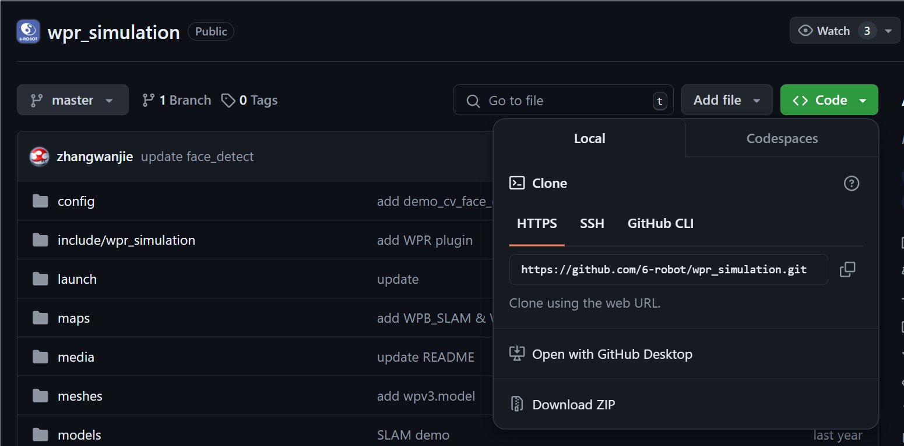

鱼香大佬
[鱼香ROS机器人 (fishros.com)](http://fishros.com/)

## 从ros商店获取
[(Ros index)](https://index.ros.org/)

*ROS Index is the entry point for searching ROS and ROS 2 resources, including packages, repositories, system dependencies and documentation.
ROS索引是搜索ROS和ROS 2资源的入口，包括软件包、源码库、系统依赖项和相关文档。
NOETIC直达链接[ROS NOETIC Packages](https://index.ros.org/packages/#noetic)

找到以后直接在终端使用命令` sudo apt install ros-noetic-rqt-robot-steering`安装
使用命令`rosrun rqt_robot_steering rqt_robot_steering`运行


### 从GitHub获取
#### 建立工作空间
```sh
mkdir -p ~/catkin_ws/src
```
因为源代码需要放在src下才能编译

#### 获取项目
在GitHub上复制项目链接

在src目录下执行
```sh
git clone https://github.com/6-robot/wpr_simulation.git
```

一般来说上述方法并行不通 ~~该死的GFW~~

可以下载ZIP解压复制到Windows再复制到Linux Ubuntu的src下

文件结构 
* ***script** :放脚本文件 ~~或者python程序~~ 完成一些使用频率不是很高的操作，如安装依赖包，为实体机器人映射端口，一般要先编译script下的.sh创建程序运行环境
* **script**:12356

#### 运行
在工作空间根目录（此处是catkin_ws）下运行catkin_make编译
运行setup.bash配置终端环境
使用 `roslaunch wpr_simulation wpb_simple.launch`


rosrun rqt_robot_steering rqt_robot_steering   控制台
roslaunch wpr_simulation wpb_simple.launch   仿真环境
rviz				            数据处理端

==========猫猫使用方法===========
设置代理`export http_proxy=http://127.0.0.1:7890 && export https_proxy=http://127.0.0.1:7890`
取消代理`unset http_proxy &&  unset https_proxy`
查看代理状态`env | grep http `


执行devel下的setup.bash   roslaunch wpr_simulation wpb_simple.launch


