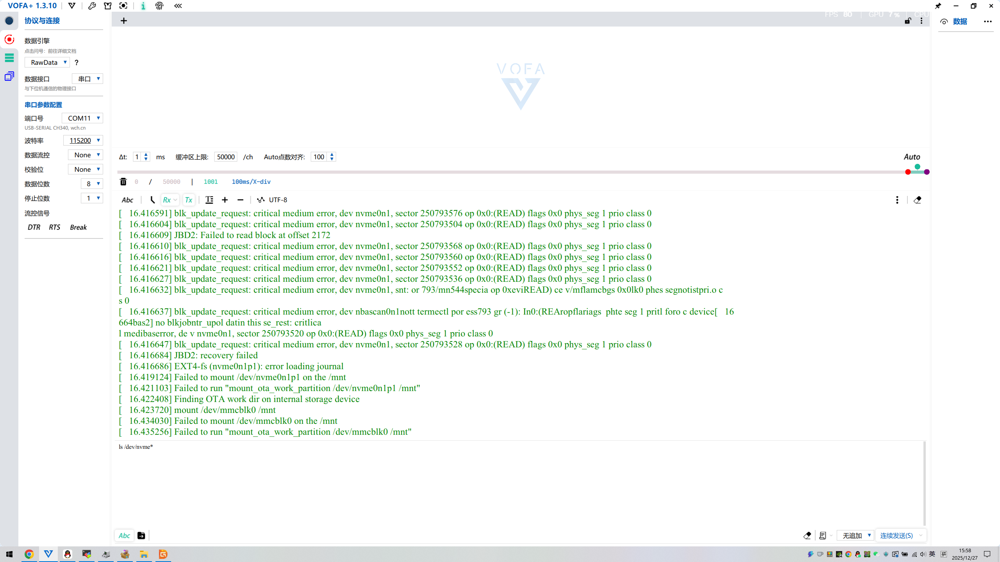
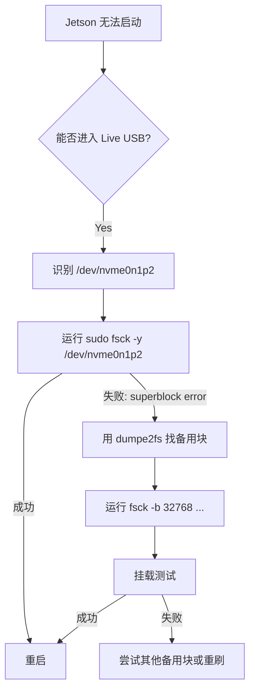

当出现nuc或者jetson异常断电，后续无法正常启动时，可以考虑修复ext4文件系统取代重装系统。
通过串口连接到jetson可以确认ext4文件系统是否损坏。

==警示后人==jetson电源一定要插到底
以下是AI聊天记录和修复方法：

---
太好了！你已经确认：

> ✅ **NVMe SSD 本身是健康的**（`media_errors: 0`，`available_spare: 100%`，`percentage_used: 0%`）  
> ❌ 之前的问题 **不是硬件故障**，而是 **软件/文件系统/异常关机导致的逻辑损坏**

---

## 🔍 根本原因分析

从你最初日志中的关键错误：
```
blk_update_request: critical medium error
JBD2: Failed to read block at offset 2172
EXT4-fs (nvme0n1p1): error loading journal
mount: can't read superblock
```

结合现在 SSD 健康的事实，可以确定：

> 📌 **问题是由“不安全关机”（unsafe shutdown）导致 ext4 日志（journal）或超级块（superblock）损坏引起的。**

你的 `nvme smart-log` 中也印证了这一点：
```
unsafe_shutdowns                        : 136   ← 非常高！
```

这说明 Jetson **被强制断电 136 次**（比如直接拔电源、电池耗尽、看门狗复位等），而 Linux 的 ext4 文件系统在未正常卸载时，**journal 可能处于不一致状态**，导致下次启动无法挂载。

---

## ✅ 如何避免再次发生？

### 1. **杜绝异常断电**
- **永远不要直接拔电源！**
- 使用 `sudo shutdown -h now` 或 `sudo poweroff` 关机。
- 如果用电池供电，确保低电量时有**自动关机脚本**。
- 考虑使用带 **掉电保护（Power Loss Protection, PLP）** 的工业级 NVMe SSD（如 Samsung PRO Endurance、WD Red SN700）。

### 2. **启用只读根文件系统（推荐用于部署）**
如果你的 Jetson 用于边缘设备/机器人，**将 root 分区设为只读**可极大减少写入和损坏风险：
```bash
# 安装 overlayroot（Ubuntu/Debian）
sudo apt install overlayroot
sudo nano /etc/overlayroot.conf
# 设置 overlayroot="device:tmpfs"
```
> 这样所有写入都在内存中，重启即还原，SSD 几乎不会磨损。

### 3. **调整文件系统挂载选项**
编辑 `/etc/fstab`，为 root 和 boot 分区添加更安全的选项：
```text
/dev/nvme0n1p2  /  ext4  defaults,noatime,commit=60,errors=remount-ro  0 1
```
- `noatime`：减少元数据写入
- `commit=60`：每 60 秒同步一次（默认 5 秒），降低频繁写盘
- `errors=remount-ro`：出错时自动 remount 为只读，防止进一步损坏

### 4. **定期手动 sync + safe shutdown 脚本**
在 ROS2 或应用退出时，加入：
```bash
ros2 lifecycle set ...  # 如果用了生命周期
sync
sleep 2
sudo poweroff
```

---

## 🔧 除了重刷镜像，如何修复（下次遇到时）？

如果再次出现 `can't read superblock`，**无需重刷整个系统**！只需修复文件系统：

### ✅ 方法：使用 **备用超级块（backup superblock）** 修复 ext4

#### 步骤（需从 Live USB 或 Recovery Shell 操作）：

1. **不要挂载损坏的分区！**
2. 查找备用超级块位置：
   ```bash
   sudo dumpe2fs /dev/nvme0n1p2 | grep -i superblock
   ```
   输出示例：
   ```
   Primary superblock at 0, Group descriptors at 1-1
   Backup superblock at 32768, Group descriptors at 32769-32769
   Backup superblock at 98304, ...
   ```

3. **用第一个备用块修复**：
   ```bash
   sudo fsck -b 32768 /dev/nvme0n1p2
   ```
   > `-b` 指定备用超级块位置（单位是 block，通常是 32768）

4. 修复完成后，正常启动即可。

> 💡 大多数情况下，`fsck -y /dev/nvme0n1p2` 就能自动修复 journal 问题，但前提是 **不能在挂载状态下运行**！

---

## 🛡️ 额外建议：监控 unsafe_shutdowns

你可以定期检查：
```bash
sudo nvme smart-log /dev/nvme0 | grep unsafe_shutdowns
```
如果这个数字持续增长，说明你的关机流程有问题，需要排查。

---

## ✅ 总结：预防 > 修复

| 措施 | 作用 |
|------|------|
| **禁止直接断电** | 避免 journal 不一致 |
| **使用 `shutdown` 命令** | 确保文件系统正常卸载 |
| **启用只读根文件系统** | 彻底避免写入损坏（适合部署） |
| **调整 fstab 挂载选项** | 减少写入频率，增强容错 |
| **学会用 `fsck -b` 修复** | 下次无需重刷镜像 |

---

你现在系统已恢复，建议立即：
1. 设置一个安全的关机按钮（物理或软件）
2. 在 `/etc/fstab` 中加上 `noatime,commit=60`
3. 考虑是否需要只读根文件系统（对 ROS2 机器人很实用）

如果你需要我帮你写一个 **安全关机脚本** 或 **配置只读根文件系统**，请告诉我你的 JetPack 版本和使用场景（开发 or 部署）！

当然！下面我将**详细、逐步地说明**：  
> **当你的 Jetson Orin Nano 因异常断电导致无法启动（报 `can't read superblock` 或 `JBD2: recovery failed`）时，如何在不重刷整个系统镜像的前提下，仅修复文件系统并恢复系统。**

---

## 🎯 适用场景

- Jetson 启动失败，卡在 initramfs 或 recovery shell
- 日志中出现：
  ```
  EXT4-fs (nvme0n1p2): error loading journal
  mount: can't read superblock on /dev/nvme0n1p2
  JBD2: Failed to read block ...
  ```
- **但 SSD 硬件是健康的**（如你已验证 `media_errors: 0`）

---

## 🔧 修复原理

Linux ext4 文件系统在磁盘上保存了**多个备份超级块（backup superblocks）**。  
即使主超级块损坏，我们仍可用备用块重建文件系统结构。

工具：`fsck.ext4` + `dumpe2fs`

---

## ✅ 修复步骤（完整操作指南）

### ▶ 第一步：获得一个可操作的 Linux 环境

因为你无法从原系统启动，需要**从外部启动一个临时 Linux 系统**：

#### 方法 A：使用 Ubuntu Live USB/SD 卡（推荐）
1. 准备一个 Ubuntu 22.04 Live USB（用 Rufus/Ventoy 制作）
2. 插入 Jetson 的 USB 口或 microSD 卡槽
3. **强制从外部介质启动**：
   - 断电
   - 按住 **RECOVERY 按钮**
   - 短按 **RESET 按钮**
   - 松开 RECOVERY（此时进入 USB Recovery 模式）
   - 系统会从 Live USB 启动（如果 BIOS 设置允许）

> 💡 如果 Jetson 默认不从 USB 启动，可先拔掉 NVMe SSD，让系统 fallback 到 SD/USB。

#### 方法 B：通过 UART 进入 initramfs shell（高级）
如果你的启动日志停在：
```
OTA work directory is not found...
(initramfs)
```
说明你已在 initramfs shell 中，可直接操作（但需手动加载驱动）。

> ⚠️ 本文以 **方法 A（Live USB）** 为主，更可靠。

---

### ▶ 第二步：识别你的 Jetson 系统分区

在 Live Ubuntu 中打开终端：

```bash
# 列出所有磁盘
lsblk
```

你应该看到类似：
```
NAME        MAJ:MIN RM   SIZE RO TYPE MOUNTPOINT
sda           8:0    1  58.6G  0 disk          ← Live USB
└─sda1        8:1    1  58.6G  0 part /cdrom
nvme0n1     259:0    0 238.5G  0 disk          ← Jetson 的 NVMe SSD
├─nvme0n1p1 259:1    0   512M  0 part          ← EFI/boot 分区
└─nvme0n1p2 259:2    0 238.0G  0 part          ← root 分区（我们要修它！）
```

> ✅ 记下 root 分区设备名，通常是 `/dev/nvme0n1p2`

---

### ▶ 第三步：检查是否能自动修复（简单情况）

先尝试自动修复 journal（很多情况下有效）：

```bash
# 卸载（确保未挂载）
sudo umount /dev/nvme0n1p2 2>/dev/null

# 自动修复
sudo fsck -y /dev/nvme0n1p2
```

- `-y`：自动回答 "yes" 到所有修复问题
- 如果成功，你会看到：
  ```
  /dev/nvme0n1p2: ***** FILE SYSTEM WAS MODIFIED *****
  /dev/nvme0n1p2: 123456/1000000 files, 2345678/4000000 blocks
  ```

✅ **如果成功，跳到第 6 步重启即可！**

---

### ▶ 第四步：如果 fsck 失败（报“找不到 superblock”）

这时需要使用**备用超级块**。

#### 1. 安装 e2fsprogs（通常已预装）
```bash
sudo apt update && sudo apt install e2fsprogs -y
```

#### 2. 查找备用超级块位置
```bash
sudo dumpe2fs /dev/nvme0n1p2 | grep -i "superblock"
```

输出示例：
```
Primary superblock at 0, Group descriptors at 1-1
Backup superblock at 32768, Group descriptors at 32769-32769
Backup superblock at 98304, Group descriptors at 98305-98305
Backup superblock at 163840, ...
```

> ✅ 记下第一个备用块：**32768**

> 💡 注意：这个数字是 **block number**，不是字节偏移！

#### 3. 使用备用超级块运行 fsck
```bash
sudo fsck -b 32768 /dev/nvme0n1p2
```

- 系统会提示你确认修复，输入 `y` 或加 `-y` 自动确认：
  ```bash
  sudo fsck -y -b 32768 /dev/nvme0n1p2
  ```

> 📌 如果 32768 不行，依次尝试 98304、163840……

---

### ▶ 第五步：验证修复结果

修复完成后，尝试挂载看是否正常：

```bash
sudo mkdir -p /mnt/jetson
sudo mount /dev/nvme0n1p2 /mnt/jetson

# 查看关键目录
ls /mnt/jetson/etc/os-release
ls /mnt/jetson/home

# 卸载
sudo umount /mnt/jetson
```

如果能列出文件，说明修复成功！

---

### ▶ 第六步：重启 Jetson，从原 SSD 启动

1. 关机：
   ```bash
   sudo shutdown -h now
   ```
2. 拔掉 Live USB
3. 给 Jetson 重新上电

✅ 系统应该能正常启动！

---

## 🛡️ 额外技巧：预防未来损坏

### 1. 创建一个“安全关机”脚本（例如用于 ROS2 节点退出后）
```bash
#!/bin/bash
# /usr/local/bin/safe-shutdown.sh
echo "Syncing disks..."
sync
sleep 2
echo "Shutting down safely..."
sudo poweroff
```

### 2. 在 `/etc/fstab` 中优化挂载选项
编辑原系统的 fstab（在 Live 环境中）：
```bash
sudo nano /mnt/jetson/etc/fstab
```
修改 root 行为：
```text
/dev/nvme0n1p2  /  ext4  defaults,noatime,commit=60,errors=remount-ro  0 1
```

### 3. 监控 unsafe_shutdowns
定期运行：
```bash
sudo nvme smart-log /dev/nvme0 | grep unsafe_shutdowns
```
如果数字持续增加，说明关机流程有问题。

---

## ❌ 什么情况下此方法无效？

| 情况 | 原因 | 解决方案 |
|------|------|--------|
| `dumpe2fs` 报错 “bad magic number” | 文件系统完全被覆盖或格式化 | 数据可能无法恢复 |
| 所有备用超级块都损坏 | 极端写入损坏或 SSD 寿命耗尽 | 更换 SSD |
| 修复后仍无法启动 | boot 分区（p1）也损坏 | 需单独修复 `/dev/nvme0n1p1` |

---

## ✅ 总结：修复流程图



---

如果你下次遇到启动失败，**先别急着重刷镜像**！  
按照上述步骤，90% 以上的“superblock 损坏”都可以快速修复。

需要我帮你写一个 **一键修复脚本** 或 **制作带修复工具的 Jetson Recovery USB** 吗？欢迎继续提问！

这是一个非常好的问题！

简短回答是：

> **NVIDIA Jetson Orin Nano 默认没有传统 PC 那样的 GRUB 引导菜单或“安全模式”**，  
> 但它提供了 **基于 UEFI Shell 和 extlinux 的底层启动控制机制**，  
> **通过手动干预可以实现类似“安全模式”的效果（如进入单用户模式、只读挂载、指定内核参数等）**。

---

## 🔍 为什么 Jetson 没有 GRUB？

- Jetson 使用 **UEFI + NVIDIA 自定义 bootloader（cboot）**，而不是标准 PC 的 BIOS/GRUB。
- 启动流程：`BPMP-FW → cboot → UEFI → kernel`
- 系统分区使用 **extlinux.conf**（而非 GRUB config）来配置内核启动项。
- **默认不显示启动菜单**，启动过程全自动、无交互。

---

## ✅ Jetson Orin Nano 的“类安全模式”实现方法

虽然没有图形化的“安全模式”选项，但你可以通过以下方式**手动进入恢复/调试状态**：

---

### ✅ 方法一：通过 **串口（UART）中断 UEFI 启动，进入 UEFI Shell**

这是最接近“安全模式入口”的方式。

#### 步骤：
1. **连接 UART 串口**（Jetson 载板上的 J41 header：GND, TX, RX）
   - 波特率：115200 8N1
2. **上电时，在 UEFI 启动倒计时阶段按任意键**
   - 你会看到：
     ```
     Press any key to stop auto boot...
     ```
   - 按下后进入 **UEFI Shell**（类似 DOS 命令行）

3. **在 UEFI Shell 中，你可以：**
   - 查看磁盘：`map`
   - 手动启动内核并附加参数：
     ```shell
     fs0:
     cd EFI\BOOT
     bootaa64.efi root=/dev/mmcblk0p1 ... single
     ```
   - 或直接编辑 `extlinux.conf`（见方法二）

> 💡 这相当于 GRUB 的“按 Shift 进菜单”。

---

### ✅ 方法二：修改 `/boot/extlinux/extlinux.conf` 添加启动参数（推荐！）

这是 **最实用、最接近“安全模式”的方法**。

#### 步骤：
1. 在系统正常时（或通过 Live USB 挂载 SSD），编辑：
   ```bash
   sudo nano /boot/extlinux/extlinux.conf
   ```

2. 在 `APPEND` 行末尾添加 **单用户模式** 或 **只读挂载** 参数：

   ```ini
   LABEL primary
     KERNEL /boot/Image
     FDT /boot/dtb/kernel_tegra234-p3767-0003-p3768-0000-a0.dtb
     INITRD /boot/initrd
     APPEND root=/dev/nvme0n1p2 rw rootwait console=ttyTCU0,115200n8 console=tty0 fbcon=map:0 single
   ```

   关键参数说明：
   - `single`：进入 **单用户模式（root shell，不启动 GUI/ROS/网络）**
   - `ro`：以 **只读方式挂载根文件系统**（防止进一步损坏）
   - `init=/bin/bash`：直接启动 bash（跳过 init 系统）

3. 保存后重启。

> ✅ 效果：系统启动后直接进入 root shell，无 systemd、无 ROS、无自动挂载 —— **这就是 Jetson 的“安全模式”**。

---

### ✅ 方法三：通过 Recovery Mode + Initramfs Shell（用于修复）

当你遇到启动失败（如 superblock 错误），系统会卡在：

```
(initramfs)
```

这个 shell 就是 **内置的 recovery 环境**，你可以：
- 手动运行 `fsck`
- 挂载分区
- 编辑 `extlinux.conf`
- 甚至启动网络下载修复工具

> 📌 这比 Windows 安全模式更底层，但需要命令行知识。

---

## 🛠 如何为 Jetson 设置“一键安全模式”？

你可以创建两个启动项：

```ini
# /boot/extlinux/extlinux.conf

TIMEOUT 30  # 显示菜单 3 秒（单位：0.1秒 → 30 = 3秒）

LABEL normal
  MENU LABEL Normal Boot
  KERNEL /boot/Image
  FDT /boot/dtb/...
  INITRD /boot/initrd
  APPEND ... rw rootwait ...

LABEL safe
  MENU LABEL Safe Mode (Single User)
  KERNEL /boot/Image
  FDT /boot/dtb/...
  INITRD /boot/initrd
  APPEND ... rw rootwait single
```

> ⚠️ **注意**：Jetson 的 UEFI 默认**不显示 extlinux 菜单**！  
> 要启用菜单，需在 **UEFI 设置中开启**（但 Orin Nano 的 UEFI 设置非常有限）。

### 替代方案：用脚本动态切换
写一个脚本，根据文件存在与否决定是否进安全模式：

```bash
# 在正常系统中运行
sudo touch /force-safe-mode

# 修改 extlinux.conf 的 APPEND 行：
APPEND ... ${bootargs} $(if test -e /force-safe-mode; then echo "single"; fi)
```

（需配合 initramfs hook 实现，较复杂）

---

## 🔧 总结：Jetson vs PC 安全模式对比

| 功能 | 传统 Ubuntu PC (GRUB) | Jetson Orin Nano |
|------|------------------------|------------------|
| 启动菜单 | 按 `Shift` 显示 | **默认无菜单**，需串口中断 |
| 安全模式选项 | 图形化选择 “Recovery Mode” | **需手动编辑 `extlinux.conf`** |
| 单用户模式 | GRUB 中按 `e` 编辑 | 在 `APPEND` 行加 `single` |
| 只读挂载 | Recovery 菜单中有选项 | 加 `ro` 参数 |
| 自动超时 | 可配置 | 默认无超时（除非改固件） |

---

## ✅ 推荐做法（给开发者）

1. **始终保留 UART 串口连接能力**（调试必备）
2. **在 `/boot/extlinux/extlinux.conf` 中预置一个 `single` 启动项**
3. **制作一个 Live USB 用于紧急修复**（含 fsck、nvme-cli）
4. **重要部署场景启用只读根文件系统**，避免此类问题

---

如果你希望我帮你：
- 写一个带菜单的 `extlinux.conf`
- 制作一个自动检测文件系统错误并进安全模式的 initramfs hook
- 配置只读根文件系统 + 可写 overlay

请告诉我你的使用场景（开发调试 or 产品部署），我可以提供完整配置！