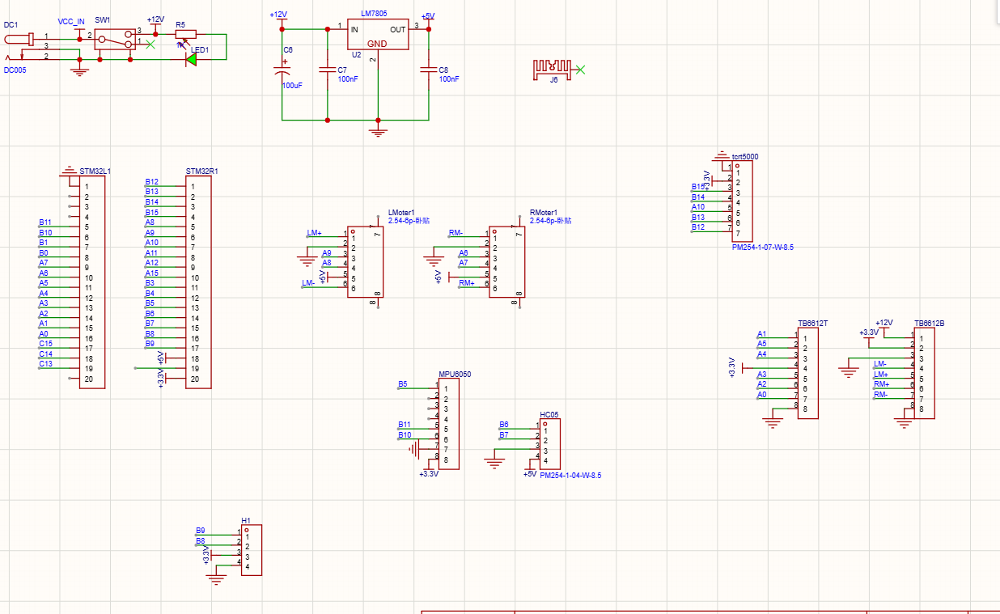
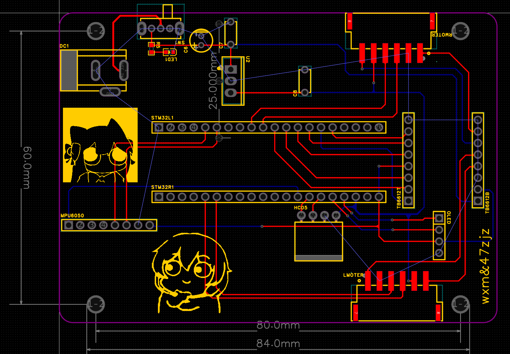

[早期下台阶实录_Bilibili](https://www.bilibili.com/video/BV18S411F75M/?share_source=copy_web&vd_source=9f57ef04c5301dddf0856d1e16269ee7)
</br>
</br>
开源链接：
::github{repo="wxm-aust/wxm_balance_car"}
电路设计部分做的非常简陋，此处就不开源了。



本项目基于 STM32F103C8T6 与 FreeRTOS 设计了两轮自平衡小车，通过三任务架构（控制/显示/蓝牙）实现任务调度，使用 MPU6050 DMP 获取姿态数据并做滤波处理，结合编码器反馈实现三环串级 PID 控制（直立环、速度环、转向环），并针对速度环设计了积分分离、变速积分及积分限幅等多重抗饱和策略，支持蓝牙遥控、航向自动锁定、OLED 实时显示及跌倒自动停机保护。


#### FreeRTOS 任务编排

三个任务之间使用**不同的同步机制**，各取所长：

| 通信路径            | 机制               | 原因            |
| --------------- | ---------------- | ------------- |
| TIM4 中断 → task1 | 任务通知（TaskNotify） | 速度最快，适合高频唤醒   |
| 串口中断 → task3    | 任务通知             | 同上，蓝牙指令响应需低延迟 |
| task1 → task2   | 队列（Queue）        | 缓冲显示数据，避免丢帧   |

---

#### 串级 PID 三环控制架构
本项目的核心控制算法采用**三环串级 PID**，每个环又分为外环和内环两层，形成六级控制链路：
```
直立环：角度外环(P) → 角速度内环(PID) → PWM
速度环：编码器反馈 → PI 控制（带积分分离与变速积分）
转向环：偏航角外环(P) → Z轴角速度内环(PID) → PWM
```
  
**特点**：串级结构相比单环 PID 响应更快、抗干扰更强。外环负责"宏观目标"（角度/偏航角），内环负责"微观跟踪"（角速度），内环响应速度远快于外环，能在扰动出现时迅速抑制。

---

#### 多层防积分饱和策略
速度环 PI 控制器中同时运用了三种抗积分饱和手段：

| 策略       | 实现方式                                      | 解决的问题                     |
| -------- | ----------------------------------------- | ------------------------- |
| **积分分离** | 直立环未收敛（Pitch > 15°）时直接清零积分                | 防止启动/倒地阶段积分剧烈累积           |
| **变速积分** | 偏差大时 `Ki_factor → 0`，偏差小时 `Ki_factor → 1` | 大偏差时减弱积分避免超调，小偏差时加强积分消除静差 |
| **积分限幅** | `Encoder_Integral` 限制在 `±INTEGRAL_MAX`    | 硬性防止积分溢出                  |

**特点**：这三种策略从不同维度协同工作，积分分离处理"全局状态"（是否平衡），变速积分处理"局部状态"（偏差大小），积分限幅作为最后的兜底保护。

---
#### 编码器速度的低通滤波

速度环中对编码器反馈量做了**一阶低通滤波**：

```c

Encoder_bias *= 0.7f;       // 历史权重 70%

Encoder_bias += Encoder_Least * 0.3f;  // 新值权重 30%

```


**特点**：编码器在低速时容易产生量化噪声，直接送入 PID 会放大抖动。通过调整历史/新值的权重（7:3），在响应速度和滤波效果之间取得平衡。

---
#### 跌倒检测与安全停机

在 PWM 输出限幅函数中集成了**角度保护**：

```c

if (abs((int)attitude.Pitch) >= FALLDOWN_ANGLE) OUT = 0;

```

**特点**：将安全保护放在最终的输出限幅函数中，而不是在控制逻辑中判断，保证了无论控制算法输出什么值，只要角度超限就强制停机。