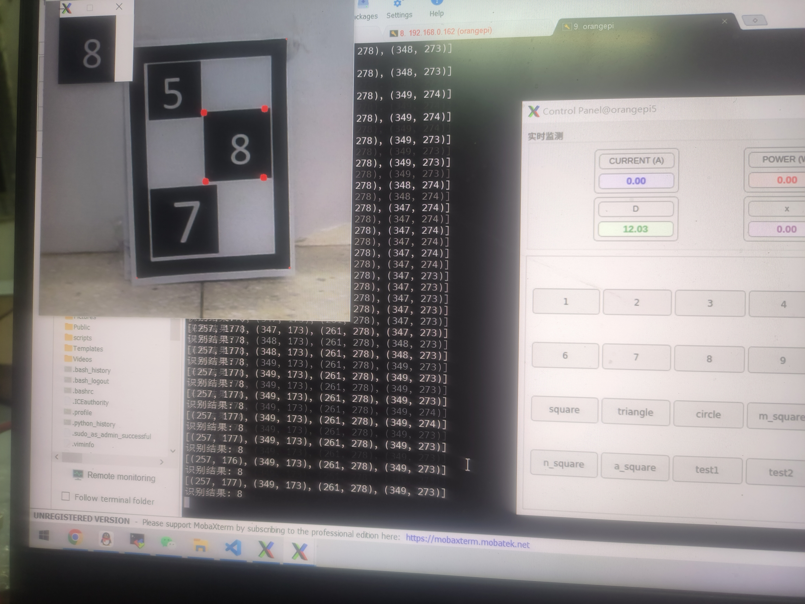

[【25电赛C题】侥幸完赛](https://www.bilibili.com/video/BV14ShPzWEfA/?share_source=copy_web&vd_source=9f57ef04c5301dddf0856d1e16269ee7)
本项目运行于 Orange Pi 开发板，通过单目摄像头实现对 A4 纸张上目标图形的自动检测与尺寸测量。系统支持多种形状识别（正方形、三角形、圆形、重叠正方形、数字正方形等），并利用透视变换和 PnP 算法计算目标物到摄像头的距离及目标物的实际物理尺寸。



## 核心算法流程

1. **图像采集**: 从 USB 摄像头捕获 1920×1080 帧，裁剪为 480×480 中心区域

2. **外框检测**: 使用 OTSU 二值化 + 轮廓检测定位 A4 纸的四个角点

3. **ROI 提取**: 通过透视变换将 A4 纸区域校正为正面视图

4. **形状检测**: 在 ROI 区域内根据当前模式选择对应的检测算法

5. **距离计算**:

   - 正面测距：`D = 88845.79 × 0.01 / side_sum`

   - 倾斜测距：`D = 91251.92 × 0.01 / side_sum`

6. **尺寸计算**:

   - 矩形/正方形：`X = x_pix × D × 0.08080`

   - 三角形/圆形/重叠正方形：`X = x_pix × D × 0.099`

1. **结果发布**: 通过 ROS Topic 发布距离(`d_value`)和尺寸(`x_value`)

---
## qt 包 (GUI 控制面板)

基于 PyQt5 构建的嵌入式控制面板，主要功能：
- **20 个按钮**: 数字键 0-9 用于选择目标数字，功能键用于切换 8 种检测模式
- **实时监测显示**: 显示电流(A)、功率(W)、距离(D)、目标尺寸(x)
- **ROS 集成**: 通过 `/button_clicks` 话题发布按钮事件，订阅 `/current_value`、`/power_value`、`/d_value`、`/x_value` 话题

---
## 实现细节

###  PnP + Homography 双算法冗余测距
同时实现了两种位姿估计方法，互为验证：
- **PnP (Perspective-n-Point)** (`yjm_pnp.py`): 利用已知 3D 世界坐标点与 2D 图像点的对应关系，通过 `cv2.solvePnP` 求解旋转向量和平移向量，直接获取相机到目标的距离。
- **Homography 分解** (`meansere.py`): 通过 `cv2.findHomography` 计算单应性矩阵，再使用 SVD 分解提取旋转矩阵 R 和平移向量 t，反算垂直距离。
两种方法基于不同的数学原理，可在不同场景下互补使用，增强了系统的鲁棒性。

### 透视变换矫正倾斜目标
通过 `transform_to_face()` 函数以及对角点排序将四边形区域透视变换为正面矩形视图。
```python
M = cv2.getPerspectiveTransform(src_pts, dst_pts)
transformed = cv2.warpPerspective(img, M, (res_width, res_height))
```

### OCR 数字识别实现选择性测量
在多数字正方形场景中，使用 ddddocr 深度学习 OCR 引擎识别正方形内的数字：
- 通过透视变换裁剪出正方形 ROI 区域
- 将图像转为字节流送入 ddddocr 识别
- 用户通过 GUI 数字键 0-9 选择目标数字
- 系统仅测量与所选数字匹配的正方形尺寸
以最低成本解决此题
---
## 6. OTSU 自适应阈值 + 形态学去噪
  
针对不同光照环境，采用 **OTSU 大津法** 自动计算最优二值化阈值，避免固定阈值在不同光照下失效：  
```python
_, imgBin = cv2.threshold(imgGray, 0, 255, cv2.THRESH_BINARY + cv2.THRESH_OTSU)

```
配合形态学操作（膨胀 dilate + 腐蚀 erode）去除噪点、连接断裂边缘，提升了轮廓检测的稳定性。同时区分了外框检测（不取反色）和内部形状检测（取反色）两种预处理策略。
  
---
###  PyQt5 实时 GUI
在 Orange Pi 嵌入式平台上运行完整的 PyQt5 图形界面：

- 20 个按钮的网格布局，支持数字选择与功能切换
- 4 个实时监测窗口（电流、功率、距离、尺寸）
- 通过 ROS Timer 在 Qt 事件循环中轮询 ROS 消息，实现 GUI 与 ROS 的深度融合
- 自适应布局，适配小屏幕显示