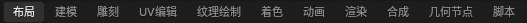
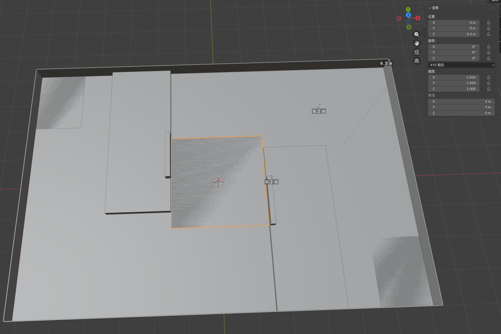
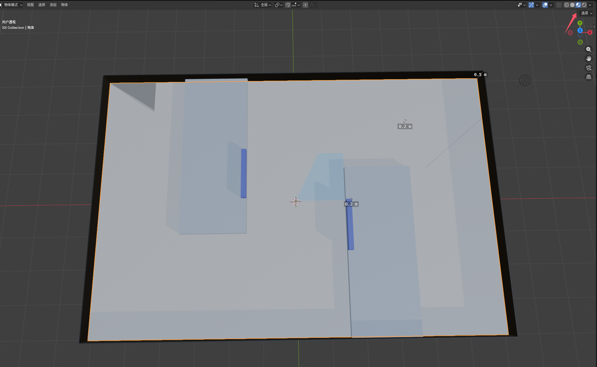
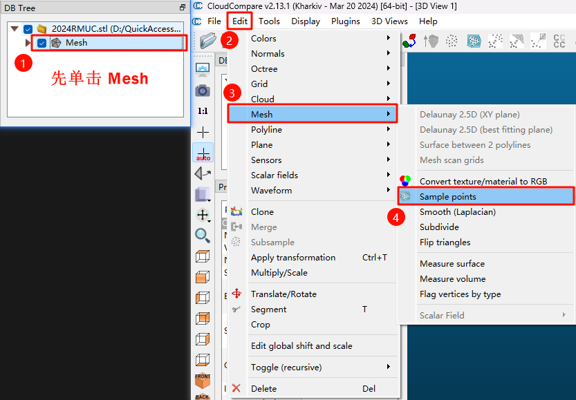

## 给机构的skill

毕竟下载blender挺麻烦，还要学习建模:spoiler[其实是懒]。这里给一份sw建图注意点，期望伟大的机构组能帮我们出图
```markdown
你好！为了确保我们能在 Gazebo 中顺利加载地图并用激光雷达进行 SLAM 建图，请在 SolidWorks 建模和导出时注意以下几点：

### 1. 单位务必使用「米（m）」

SolidWorks 默认单位是毫米（mm），但 Gazebo/ROS 使用国际单位制（米）。

- ✅ 请在文档属性中将单位设为 **米（m）**：  
    工具 → 选项 → 文档属性 → 单位 → 自定义 → 长度单位选“米”
- ❌ 避免用 mm 建模后靠缩放修正——容易出错！

### 2. 所有结构必须是「实体（Solid Body）」

- 台阶、墙体、坡道等必须用 **拉伸凸台/基体** 创建，不能是曲面或零厚度特征。
- 检查 FeatureManager 树，确保所有部件属于 **Solid Bodies**（而非 Surface Bodies）。

### 3. 保留关键几何，简化非必要细节

- 保留影响激光扫描的宏观结构（如台阶高度 ≥ 0.05 m、墙体厚度 ≥ 0.01 m）。
- 可删除螺钉孔、装饰纹理、小倒角等，以降低 STL 面数，提升仿真性能。

### 4. 导出 STL 前：先转为「多实体零件」

如果是装配体（`.sldasm`），请执行：  
插入 → 特征 → 保存实体 → 创建新零件  
然后再从这个新 `.sldprt` 文件导出 STL，避免只导出外轮廓空壳。

### 5. STL 导出设置

- 格式：**二进制（Binary）**
- 分辨率：自定义 → 偏差 `0.001 m`（1 mm），角度 `5°~10°`
- 确保所有部件可见且未被隐藏

### 6. （可选）后续转 DAE 用于带颜色显示

我们会用 Blender 将 STL 转为 `.dae` 并添加区域颜色（如地面绿色、墙体灰色），所以 STL 本身无需贴图，但几何必须完整。
```
## 下载blender及其插件
[blander下载链](https://mp.weixin.qq.com/s?__biz=Mzk4ODQ3MzgzNw==&mid=2247493352&idx=3&sn=aa22cefa40954d49f16d38e53ed6fdf5&chksm=c586166af2f19f7cf748061b95175c71202a8c9355bbd589df0750b24fc823a510c09ac49c83&scene=178&cur_album_id=3997787105366704138&search_click_id=#rd)
还需要自行寻找导入导出STL的插件~~实际上是我丢了~~
## 快速入门

能用到的只有布局和着色，如果希望AI能帮忙，脚本选项给AI提供了写python代码的地方
#### 1.布局
按Shift+A。选择网格--立方体，就能得到一个立方体。然后选中按N键，可以调整尺寸。以很多很多的立方体就能拼出地图的大致模型
理论上场地周围的铁丝网不要建，实际赛场基本扫不到，没有什么参考价值。但是低处的围挡可以使用。

#### 2.着色
着色的目的是为了在gazebo仿真时能看见，可以跳过
选中任意的立方体选择着色，新界面的中间”新建“，然后基础色中可以任意改变此立方体的颜色
返回到布局界面，在右上角开启着色识图，就能看到上色

#### 3.导出
导出为.dae和.stl格式
.dae就可以直接放到gazebo进行仿真了 
.stl还可以继续放入CloudCompare获取点云和栅格地图
#### 4.cc获取点云地图
[CloudCompare下载链接](https://www.cloudcompare.org/)
最好使用Windows，Linux无法导出.pcd文件
打开软件先在左上角File-Open导入.stl文件
按下图步骤生成pcd

然后取消Mesh的勾选，仅勾选Mesh.sampled，点击左上角File-Save.选择保存pcd路径
#### 5.cc获取栅格地图
参考鱼姐的视频[精准空降](https://www.bilibili.com/video/BV1p2spz2EG1?t=253.3)
先在CloudCompare处理点云，获取地图
地图还可以导入到PS进一步处理